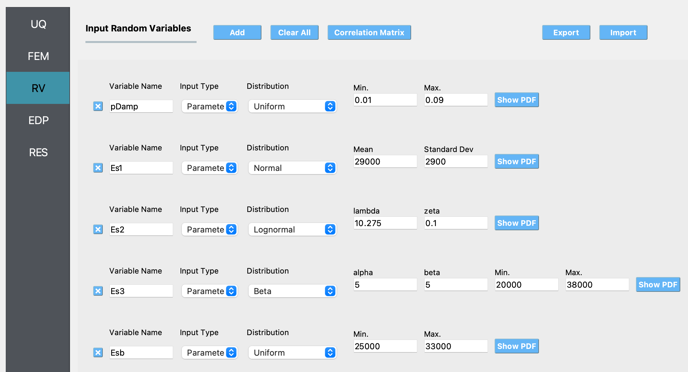
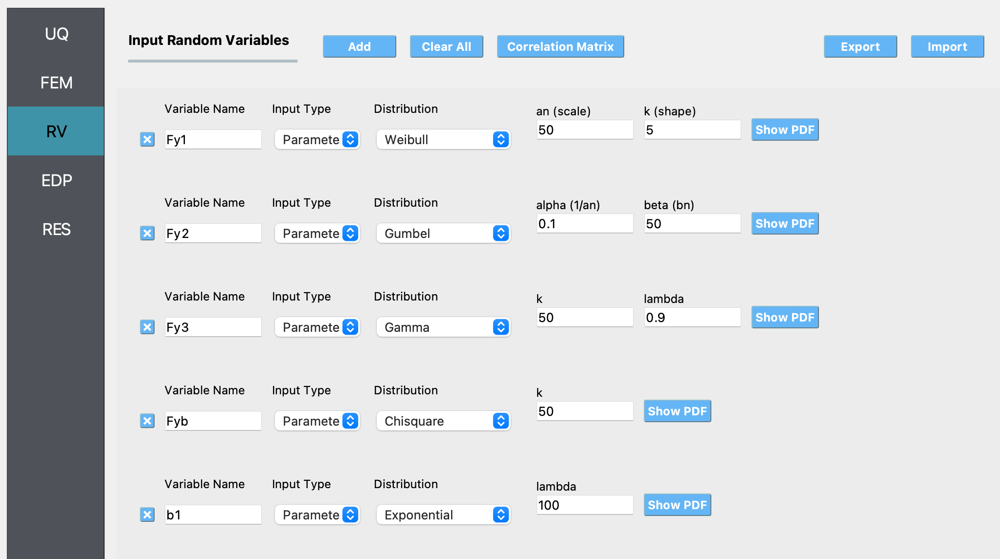

.. _qfem-0000:

Example to test all the supported random variables
==================================================

This example uses all the 11 marginal probability distrbutions that are currently supported in the SimCenterUQ engine. Some of the random variables are correlated with one another. The definitions of the random variables and correlation matrix are as shown in the figures :numref:`fig-RV1`, :numref:`fig-RV2`, :numref:`fig-RV3`, and :numref:`fig-RV4` below:

.. _fig-RV1:

  Random variable definitions.

.. _fig-RV2:

  Random variable definitions (continued).

.. _fig-RV3:

.. figure:: figures/RV3.png
  :align: center
  :figclass: align-center

  Random variable definitions (continued).

.. _fig-RV_corr_matrix:

.. figure:: figures/CorrMatrix.png
  :align: center
  :figclass: align-center

  Correlation matrix definition.
