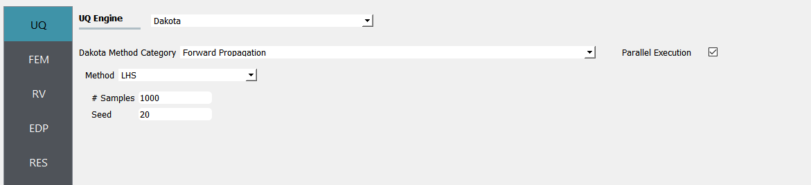
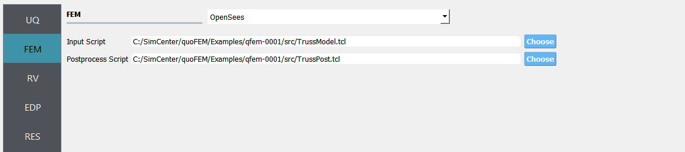
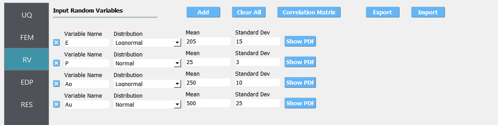
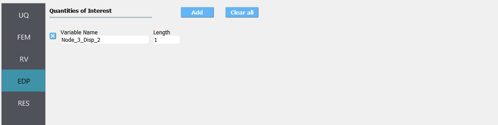
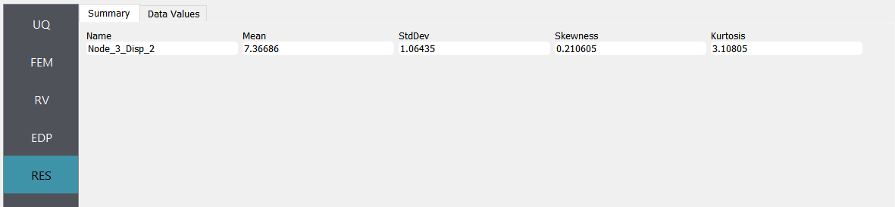
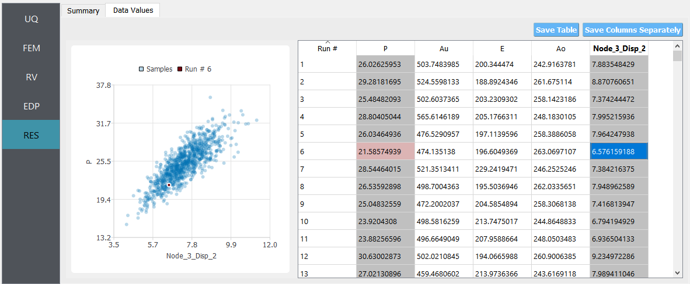
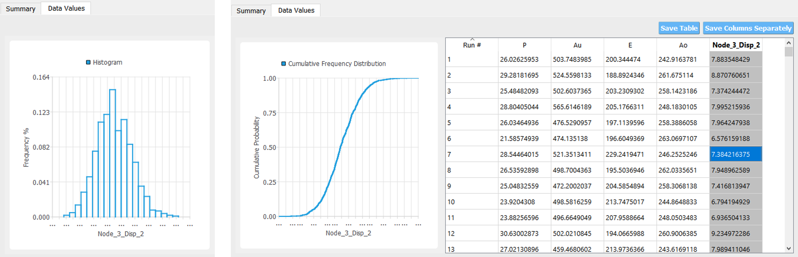
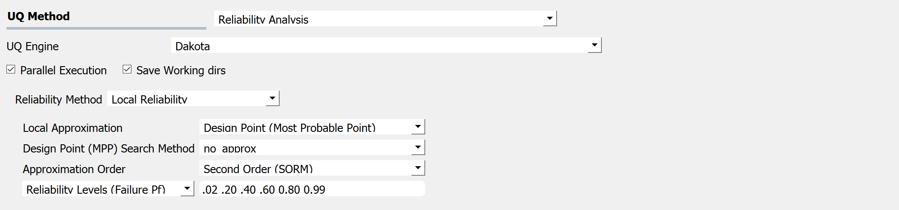
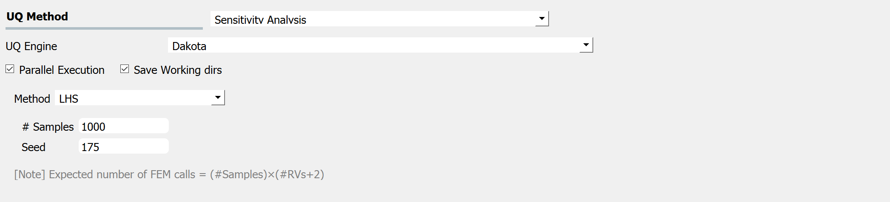
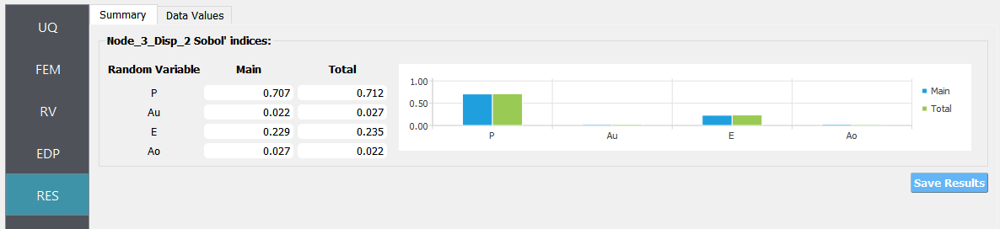

.. _qfem-0001:

Two-Dimensional Truss: Sampling, Reliability and Sensitivity
============================================================

Consider the problem of uncertainty quantification in a two-dimensional truss structure shown in the following figure.

.. figure:: figures/truss.png
   :align: center
   :width: 600

The structure has uncertain properties that all follow normal distribution:

1. Elastic modulus(``E``): mean :math:`\mu_E=205 kN/{mm^2}` and standard deviation :math:`\sigma_E =15 kN/{mm^2}` (COV = 7.3%)
2. Load (``P``): mean :math:`\mu_P =25 kN` and a standard deviation of :math:`\sigma_P = 3 kN`, (COV = 12%).
3. Cross sectional area for the upper three bars (``Au``): mean :math:`\mu_{Au} = 500 mm^2`, and a standard deviation of :math:`\sigma_{Au} = 25mm^2`  (COV = 5%)
4. Cross sectional area for the other six bars (``Ao``): mean :math:`\mu_{Ao} = 250mm^2`, and :math:`\sigma_{Ao} = 10mm^2` (COV = 4%)

The goal of the exercise is to estimate the mean and standard deviation of the vertical displacement at node 3. The exercise requires two files. The user is required to download these files and place them in a **NEW** folder. The two files are: 

1. :qfem-0001:`TrussTemplate.tcl <src/TrussModel.tcl>`

.. literalinclude:: ../qfem-0001/src/TrussModel.tcl
   :language: tcl

.. note::
   
   The first lines containing ``pset`` will be read by the application when the file is selected and the application will autopopulate the Random Variables input panel with these same variable names. It is of course possible to explicitly use Random Variables without the ``pset`` command as is demonstrated in the verification section.

2. :qfem-0001:`TrussPost.tcl <../qfem-0001/src/TrussPost.tcl>`. 

The ``TrussPost.tcl`` script shown below will accept as input any of the 6 nodes in the domain and for each of the two dof directions.

.. literalinclude:: ../qfem-0001/src/TrussPost.tcl
   :language: tcl

.. note::

   The use has the option to provide no post-process script (in which case the main script must create a ``results.out`` file containing a single line with as many space separated numbers as QoI or the user may provide a Python script that also performs the postprocessing. An example of a postprocessing Python script is :quo-01:`TrussPost.py <src/TrussPost.py>`. 

   .. literalinclude:: ../qfem-0001/src/TrussPost.py
      :language: python

.. warning::

   Do not place the files in your root, downloads, or desktop folder as when the application runs it will copy the contents on the directories and subdirectories containing these files multiple times. If you are like us, your root, Downloads or Documents folders contains and awful lot of files and when the backend workflow runs you will slowly find you will run out of disk space!

Sampling Analysis
^^^^^^^^^^^^^^^^^

+----------------+------------------------------------------+
| Problem files  | :github:`Download <Examples/qfem-0001>`  |
+----------------+------------------------------------------+

To perform a sampling or forward propagation uncertainty analysis the user would perform the following steps:

1. Start the application and the UQ Selection will be highlighted. In the panel for the UQ selection, keep the UQ engine as that selected, i.e. Dakota, and the **UQ Method Category** as Forward Propagation, and the Forward Propagation method as LHS (Latin Hypercube). Change the **#samples** to 1000 and the **seed** to 20 as shown in the figure.

2. Next select the **FEM** panel from the input panel. This will default in the OpenSees FEM engine. For the main script copy the path name to ``TrussModel.tcl`` or select **choose** and navigate to the file. For the **post-process script** field, repeat the same procedure for the ``TrussPost.tcl`` script.

3. Next select the **RV** panel from the input panel. This should be pre-populated with four random variables with same names as those having ``pset`` in the tcl script. For each variable, from the drop down menu change them from having a constant distribution to a normal one and then provide the means and standard deviations specified for the problem.

4. Next select the **QoI** tab. Here enter ``Node_3_Disp_2`` for the one variable. 

.. note::   

   The user can add additional QoI by selecting add and then providing additional names. As seen from the post-process script any of the 6 nodes may be specified and for any node either the 1 or 2 DOF direction.

5. Next click on the **Run** button. This will cause the backend application to launch dakota. When done the **RES** panel will be selected and the results will be displayed. The results show the values the mean and standard deviation.

If the user selects the **Data** tab in the results panel, they will be presented with both a graphical plot and a tabular listing of the data.

Various views of the graphical display can be obtained by left and right clicking in the columns of the tabular data. If a singular column of the tabular data is pressed with both right and left buttons a frequency and CDF will be displayed, as shown in figure below.

Reliability Analysis
^^^^^^^^^^^^^^^^^^^^

+----------------+--------------------------------------------+
| Problem files  | :github:`Download <Examples/qfem-0003/>`   |
+----------------+--------------------------------------------+

If one is interested in the probability that a particular response measure will be exceeded, an alternate strategy is to perform a reliability analysis. In order to perform a reliability analysis the steps above would be repeated with the exception that the user would select a reliability analysis method instead of a Forward Propagation method. To obtain reliability results using the Second-Order Reliability Method (SORM) for the truss problem the user would follow the same sequence of steps as previously. The difference would be in the **UQ** panel in which the user would select a Reliability as the Dakota Method Category and then choose Local reliability. In the figure the user is specifying that they are interested in the probability that the displacement will exceed certain response levels.

After the user fills in the rest of the tabs as per the previous section, the user would then press the **RUN** button. The application (after spinning for a while with the wheel of death) will present the user with the results.

.. figure:: figures/trussSORM-RES.png
   :align: center
   :figclass: align-center

Global Sensitivity
^^^^^^^^^^^^^^^^^^

+----------------+------------------------------------------+
| Problem files  | :github:`Download <Examples/qfem-0004/>` |
+----------------+------------------------------------------+

In a global sensitivity analysis the user is wishing to understand what is the influence of the individual random variables on the quantities of interest. This is typically done before the user launches large scale forward uncertainty problems in order to limit the number of random variables used so as to limit the number of simulations performed.

To perform a reliability analysis the steps above would be repeated with the exception that the user would select a reliability analysis method instead of a Forward Propagation method. To obtain reliability results using the Second-Order Reliability Method (SORM) for the truss problem the user would follow the same sequence of steps as previously. The difference would be in the **UQ** tab in which the user would select a Reliability as the Dakota Method Category and then choose Local reliability. In the figure the user is specifying that they are interested in the probability that the displacement will exceed certain response levels.

After the user fills in the rest of the tabs as per the previous section, the user would then press the **RUN** button. The application (after spinning for a while with the wheel of death) will present the user with the results.

