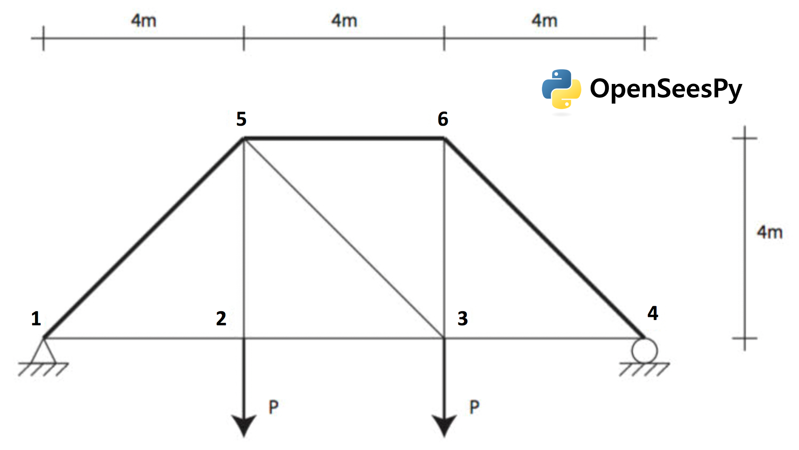

.. _qfem-0002:

Forward Propagation - OpenSeesPy
================================

+-----------------+------------------------------------------+
| Problem files   | :github:`Github <Examples/qfem-0002/>`   |
+-----------------+------------------------------------------+

This example illustrates how quoFEM interacts with OpenSeesPy. A simple
forward propagation procedure is run to estimate the first and second
central moments of a FE model's response, given the marginal
distributions of various random parameters.

Consider the problem of uncertainty quantification in a two-dimensional
truss structure shown in the following figure. Two input scripts are
used to define a forward propagation procedure to be coordinated by
quoFEM which will estimate the mean and standard deviation of the
vertical displacement at node 3 using Latin hypercube sampling. 

The following parameters are defined in the **RV** tab of quoFEM:

1. Elastic modulus, ``E``: **Weibull** distribution with a scale
   parameter :math:`(\lambda)` of :math:`210.0`, shape parameter
   :math:`(k)` of :math:`20.0`,

2. Load magnitude, ``P``: **Beta** distribution with a first shape
   parameter :math:`(\alpha)` of :math:`2.0`, second shape parameter
   :math:`(\beta)` of :math:`2.0`, lower bound :math:`(L_B)` of
   :math:`20.0`, upper bound :math:`(U_B)` of :math:`30.0`,

3. Cross sectional area for the other six bars, ``Ao``: **Lognormal**
   distribution with a mean :math:`(\mu)` of :math:`250.0`, standard
   deviation :math:`(\sigma)` of :math:`50.0`,

4. Cross sectional area for the upper three bars, ``Au``: **Normal**
   distribution with a mean :math:`(\mu)` of :math:`500.0`, standard
   deviation :math:`(\sigma)` of :math:`100.0`,

UQ Workflow
-----------

To define the uncertainty workflow in quoFEM, select **Forward
Propagation** for the **Dakota Method Category**, and enter the
following inputs:

+---------------+-------+
| **Method**    | LHS   |
+---------------+-------+
| **Samples**   | 200   |
+---------------+-------+
| **Seed**      | 949   |
+---------------+-------+

Model Files
-----------

The following files make up the **FEM** model definition.

#. `model.py <https://raw.githubusercontent.com/claudioperez/SimCenterExamples/master/static/truss/model.py>`__:
   This file is a Python script which takes a given realization of the
   problem's random variables, and runs a finite element analysis of the
   truss with OpenSeesPy. It is supplied to the **Input Script** field
   of the **FEM** tab, and obviates the need for supplying a
   **Postprocess Script**. When this script is invoked in the workflow,
   it receives the list of the identifiers supplied in the **QoI** tab
   through the operating system's ``stdout`` variable, and a set of
   random variable realizations by star-importing the **Parameters
   File** from the **FEM** tab.

   .. literalinclude:: src/model.py
      :language: python

#. `params.py <https://raw.githubusercontent.com/claudioperez/SimCenterExamples/master/static/truss/params.py>`__:
   This file is a Python script which defines the problem's random
   variables as objects in the Python runtime. It is supplied to the
   **Parameters File** field of the **FEM** tab. *The literal values
   which are assigned to variables in this file will be varied at
   runtime by the UQ engine.*
   
   .. literalinclude:: src/params.py
      :language: python

Results
-------

The results from this analysis with a maximum of :math:`200` iterations
are as follows:

**Node 3**:

-  :math:`\mu = 7.6986`
-  :math:`\sigma = 1.5666`

**Node 2**:

-  :math:`\mu = 9.3967`
-  :math:`\sigma = 1.8628`

If the user selects **Data** in the **RES** tab, they will be presented
with both a graphical plot and a tabular listing of the data. Various
views of the graphical display can be obtained by left- and
right-clicking the columns of the tabular data. If a singular column of
the tabular data is selected with simultaneous right and left clicks, a
frequency and CDF will be displayed.

