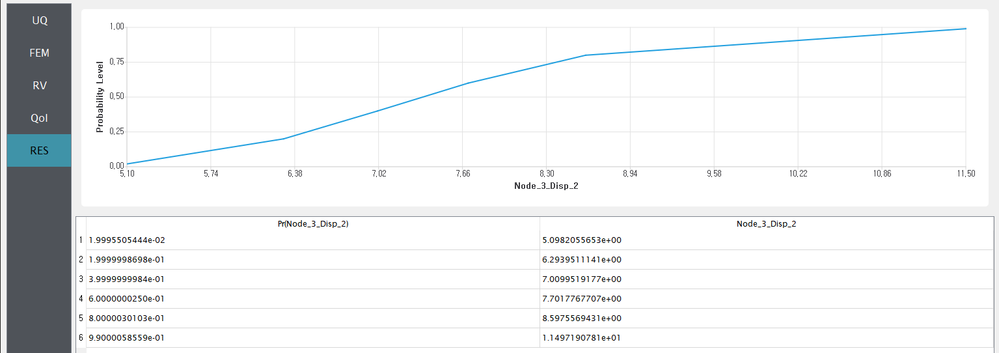
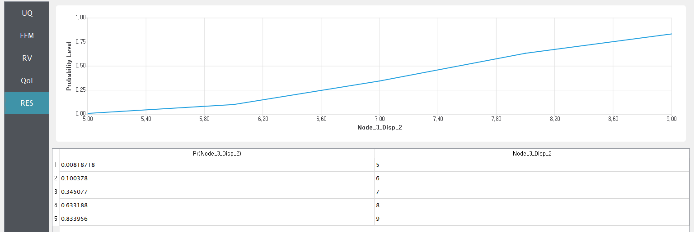
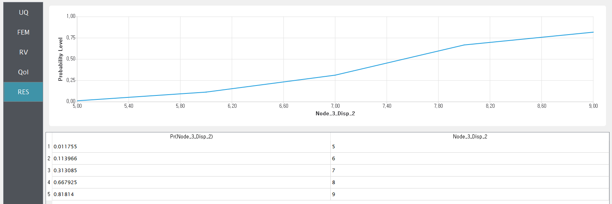

Reliability Analysis
====================

+-----------------+--------------------------------------------+
| Problem files   | :github:`Download <Examples/qfem-0003/>`   |
+-----------------+--------------------------------------------+

This example uses quoFEM to perform a second-order reliability analysis
(SORM) of an OpenSees FE model.

Consider the stochastic response of a two-dimensional truss structure
shown in the following figure with uncertain section dimensions,
material moduli, and loading magnitude. Two input scripts are used to
define a `local reliability </common/user_manual/usage/desktop/DakotaReliability.html>`__
procedure to be coordinated by quoFEM which will estimate response
magnitudes whose probabilities of exceedance are 0.02, 0.2, 0.4, 0.6,
0.8, and 0.99.

.. figure:: qfem-0003.png
   :width: 500px
   :align: center

The following parameters are defined in the **RV** tab of quoFEM:

1. Elastic modulus, ``E``: **Weibull** distribution with a scale
   parameter :math:`(\lambda)` of :math:`210.0`, shape parameter
   :math:`(k)` of :math:`20.0`,

2. Load magnitude, ``P``: **Beta** distribution with a first shape
   parameter :math:`(\alpha)` of :math:`2.0`, second shape parameter
   :math:`(\beta)` of :math:`2.0`, lower bound :math:`(L_B)` of
   :math:`20.0`, upper bound :math:`(U_B)` of :math:`30.0`,

3. Cross sectional area for the other six bars, ``Ao``: **Lognormal**
   distribution with a mean :math:`(\mu)` of :math:`250.0`, standard
   deviation :math:`(\sigma)` of :math:`50.0`,

4. Cross sectional area for the upper three bars, ``Au``: **Normal**
   distribution with a mean :math:`(\mu)` of :math:`500.0`, standard
   deviation :math:`(\sigma)` of :math:`100.0`,

UQ Workflow
-----------

To define the uncertainty workflow in quoFEM, select **Reliability
Analysis** for the **Dakota Method Category**, and enter the following
inputs:

+--------------------------+------------------------------------+
| **Integration Method**   | Second Order                       |
+--------------------------+------------------------------------+
| **Level Type**           | Probability Levels                 |
+--------------------------+------------------------------------+
| **Local Method**         | Most Probable Point                |
+--------------------------+------------------------------------+
| **Reliability Method**   | Local Reliability                  |
+--------------------------+------------------------------------+
| **MPP Search Method**    | no_approx                          |
+--------------------------+------------------------------------+
| **Probability Levels**   | [0.02, 0.2, 0.4, 0.6, 0.8, 0.99]   |
+--------------------------+------------------------------------+

Model Files
-----------

The following files make up the **FEM** model definition.

#. `model.tcl <https://raw.githubusercontent.com/claudioperez/SimCenterExamples/master/static/truss/model.tcl>`__:
   This file is an OpenSees Tcl script that constructs and runs a finite
   element analysis of the truss for a given realization of the
   problem's random variables. It is supplied to the **Input File**
   field of the **FEM** tab.

#. `post.tcl <https://raw.githubusercontent.com/claudioperez/SimCenterExamples/master/static/truss/post.tcl>`__:
   This file is an OpenSees Tcl script that processes the QoI
   identifiers supplied in the **QoI** tab, and writes the relevant
   response quantities to ``results.out`` from an OpenSees process. It
   is supplied to the **Postprocess File** field of the **FEM** tab.

Results
-------

Once the analysis is complete the **RES** tab will be automatically
selected and the results will be displayed as shown in the following
figure:

.. figure:: figures/trussSORM-RES.png

   Reliability analysis (Second order apprximation)

Other reliability methods
-------------------------

**First Order** Integration Method: The user can change only the integration method to get the first order approximation (instead of the second order approximation) results.

+--------------------------+------------------------------------+
| **Integration Method**   | First Order Reliability            |
+--------------------------+------------------------------------+
| **Level Type**           | Probability Levels                 |
+--------------------------+------------------------------------+
| **Local Method**         | Most Probable Point                |
+--------------------------+------------------------------------+
| **Reliability Method**   | Local Reliability                  |
+--------------------------+------------------------------------+
| **MPP Search Method**    | no_approx                          |
+--------------------------+------------------------------------+
| **Probability Levels**   | [0.02, 0.2, 0.4, 0.6, 0.8, 0.99]   |
+--------------------------+------------------------------------+

   Reliability analysis (First order apprximation)

**Global reliability** and **Importance sampling** methods can to identify probability levels corresponding to given response thresholds.

.. note::
   Global reliability and importance sampling cannot read **probability thresholds** as inputs.

Global reliability:

+--------------------------+------------------------------------+
| **GP Approx. Method**    | u-space                            |
+--------------------------+------------------------------------+
| **Response Levels**      | [5.0 6.0 7.0 8.0 9.0]              |
+--------------------------+------------------------------------+

   Global reliability results.

Importance Sampling (IS):

+--------------------------+------------------------------------+
| **# Samples**            | 100                                |
+--------------------------+------------------------------------+
| **Seed**                 | 159                                |
+--------------------------+------------------------------------+
| **IS Method**            | Basic Simulation                   |
+--------------------------+------------------------------------+
| **Response Levels**      | [5.0 6.0 7.0 8.0 9.0]              |
+--------------------------+------------------------------------+

   Importance Sampling (IS) results.
