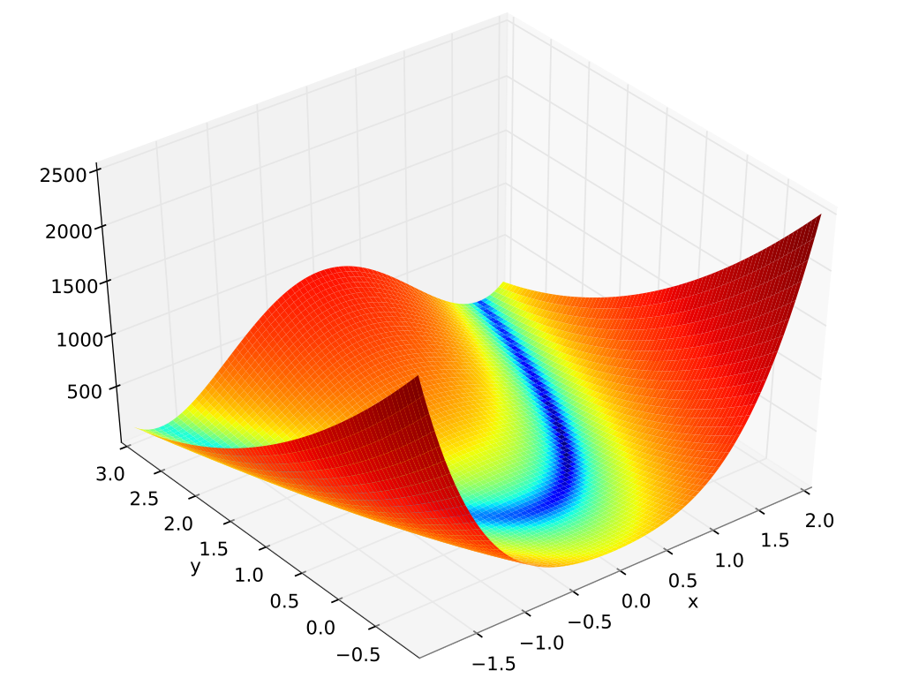

Basic modeling with Python
==========================

+-----------------+--------------------------------------------+
| Problem files   | :github:`Download <Examples/qfem-0005/>`   |
+-----------------+--------------------------------------------+

This example illustrates how Python scripting can be used with quoFEM to
express general mathematical models without the use of a dedicated
finite element analysis engine.

The Rosenbrock function is a *test function* that is often used to
evaluate numerical optimization algorithms. It is given by the following
expression:

.. math::  g(x, y)=(a-x)^{2}+b\left(y-x^{2}\right)^{2} 

A forward propagation analysis will be conducted to numerically
integrate the first and second moments of a random variable whose value
is obtained by applying the Rosenbrock function to the two following
statistically independent random variables:

1. First variable, ``X``: **Uniform** distribution with a lower bound
   :math:`(L_B)` of :math:`-2.0`, upper bound :math:`(U_B)` of
   :math:`2.0`,

2. Second variable, ``Y``: **Uniform** distribution with a lower bound
   :math:`(L_B)` of :math:`1.4`, upper bound :math:`(U_B)` of
   :math:`1.6`,

UQ Workflow
-----------

The objective of this UQ problem is to numerically integrate the
following integrals with a forward propagation routine:

.. math::

   \mu_g = \mathbf{E}[g(X,Y)] = \int^{1.6}_{1.4} \int^{2.0}_{-2.0} g(x,y) f_{XY} (x,y) dx dy

.. math::

   \begin{align}
   \sigma_g^2 &= \mathbf{E}[(g(X,Y)-\mathbf{E}[g(X,Y)])^2] \\
   &= \int^{1.6}_{1.4} \int^{2.0}_{-2.0} (g(x,y)-\mathbf{E}[g(X,Y)])^2f_{XY} (x,y) dx dy
   \end{align}

where :math:`f_{XY}(x,y)` is the joint probability density function of
the random variables :math:`X` and :math:`Y`.

This procedure is implemented with a Latin hypercube sampling routine in
quoFEM by entering the following inputs in the **UQ** tab:

+---------------+-------+
| **Method**    | LHS   |
+---------------+-------+
| **Samples**   | 200   |
+---------------+-------+
| **Seed**      | 949   |
+---------------+-------+

Model Files
-----------

For this forward propagation problem, we need to define a Python script
that will import a set of random variable values, apply them to the
Rosenbrock function, then write the results to a file named
``results.out`` for every random variable realization generated by
Dakota. To this end, we begin by defining our random variables as Python
objects as follows, and supplying this as a ``.py`` script in the
**Parameters File** field of the **FEM** tab:

.. code:: python

    X = 0.0
    Y = 0.0

Although this file will later be used as a Python module, it is
important to note that in the quoFEM workflow, it is NOT handled as a
true Python script. Rather, it can be thought of loosely as analogous to
a C "header file" in that it simply gives us an interface to Dakota from
Python. The values assigned to the variables at this point will not be
used.

    **Note**: The **Parameters File** is not a true Python script; For
    the time being, until further documentation about the tool is
    developed, users should only use line-by-line variable definitions
    in this file. Python assignments like ``X, Y = 0.0, 0.0`` are not
    supported.

We can now implement our model for the **Input File** which will begin
with a star-import from the parameters file we just created. Assuming
that file was named ``params.py``, this import would look like so:

.. code:: python

    from params import *

Next we define the following simple function which evaluates the
Rosenbrock function:

.. code:: python

    def rosenbrock(x, y):
        a = 1.
        b = 100.
        return (a - x)**2.0 + b*(y - x**2.)**2.

Finally, we apply our ``rosenbrock`` function to the variables we
imported from ``params``, and write the results to a file called
``results.out``. Note that throughout the forward propagation routine,
the values assigned to the variables ``X`` and ``Y`` in the ``params``
interface are varied by the workflow application.

.. code:: python

    with open('results.out', 'w') as f:
        result = rosenbrock(X, Y)
        f.write('{:.60g}'.format(result))

The code from these steps is colleted and made available for download in
the following files:

#. `rosenbrock.py <https://raw.githubusercontent.com/claudioperez/SimCenterExamples/master/static/rosenbrock/rosenbrock.py>`_:
   This file is a Python script which implements the Rosenbrock
   function. It is supplied to the **Input Script** field of the **FEM**
   tab. Because this file write directly to ``results.out``, it obviates
   the need for supplying a **Postprocess Script**. When invoked in the
   workflow, the Python routine is supplied a set of random variable
   realizations through the star-import of the script supplied to the
   **Parameters File** field.

#. `params.py <https://raw.githubusercontent.com/claudioperez/SimCenterExamples/master/static/rosenbrock/params.py>`_:
   This file is a Python script which defines the problem's random
   variables as objects in the Python runtime. It is supplied to the
   **Parameters File** field of the **FEM** tab. *The literal values
   which are assigned to variables in this file will be varied at
   runtime by the UQ engine.*

Results
-------

The result for a forward propagation run with a maximum of :math:`200`
iterations is:

.. math::

   \mu_g = 146.519 \\ 
   \sigma_g = 134.01  

