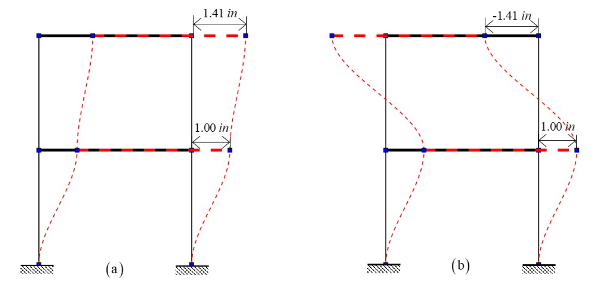
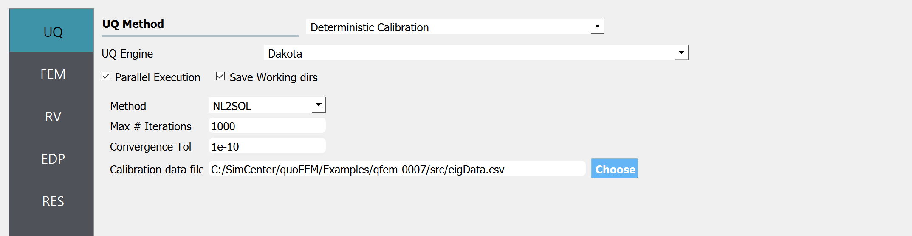
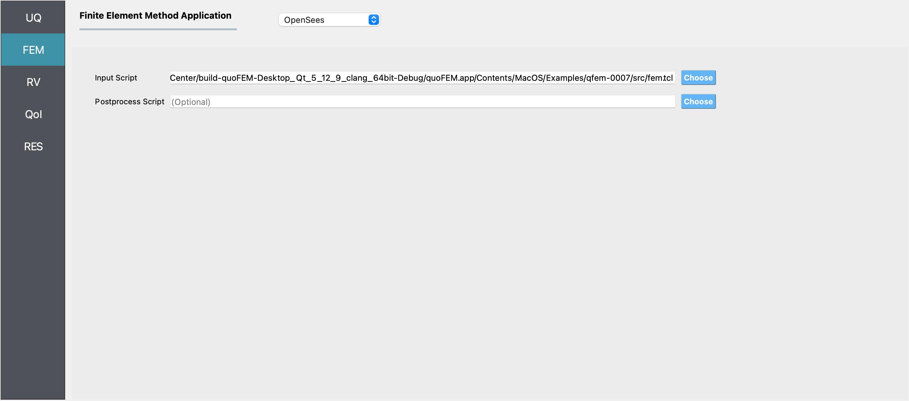
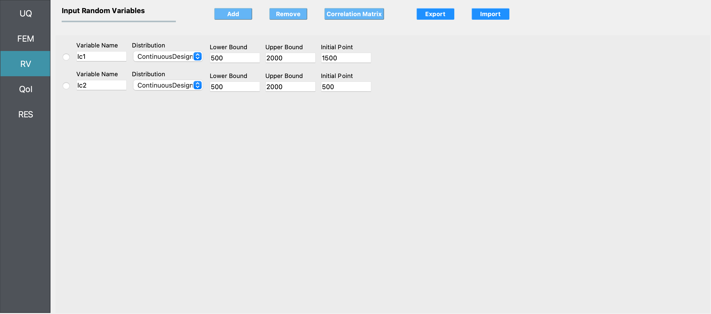
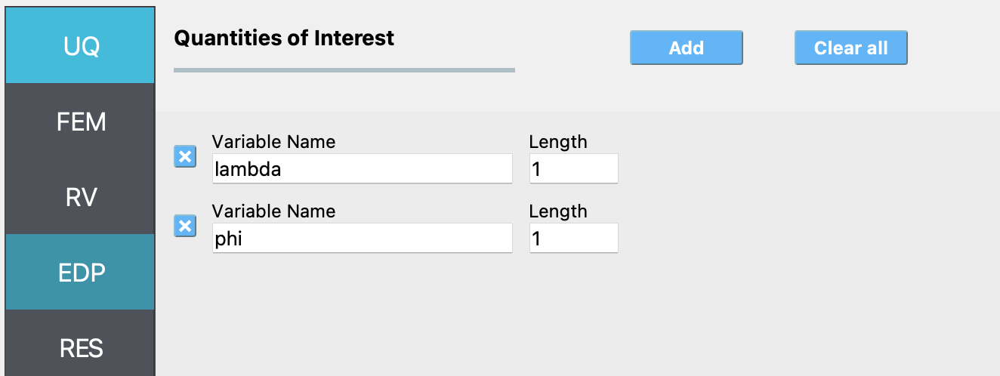
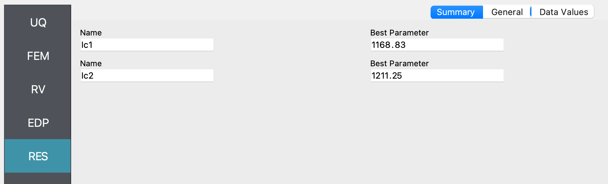
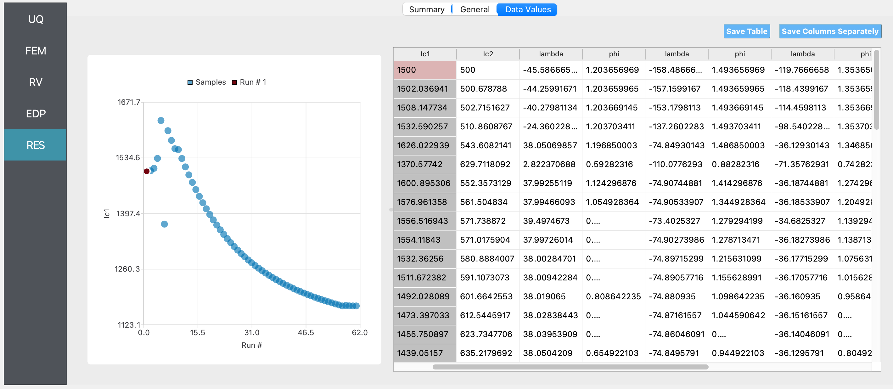

.. _qfem-0007:

Steel Frame: Conventional Calibration
======================================

+---------------+-------------------------------------------+
| Problem files | :github:`Download <Examples/qfem-0007/>`  |
+---------------+-------------------------------------------+

Outline
+++++++
In this example, a parameter estimation routine is used to estimate
column stiffnesses of a simple steel frame, given synthetic data about its mode
shapes and frequencies, by minimizing the sum of the squared errors between the data and the model predictions.

Problem description
+++++++++++++++++++
This example is provided by Professor Joel Conte and his doctoral students Maitreya Kurumbhati and Mukesh Ramancha from UC San Diego.  

Structural system
-----------------
Consider the two-story building structure shown in :numref:`figSteelStructuralSystem`. Each floor slab is made of a composite metal deck and is supported on the steel columns. These four columns are fixed at the base. The story height is :math:`h = 10'`, length of each slab is :math:`33'4''` and :math:`30'` along the X and Y direction, respectively. :math:`m_1 = 0.52 kips-s^2/in` and :math:`m_2 = 0.26 kips-s^2/in` are the total mass of floor 1 and floor 2, respectively. For the steel columns, Young’s modulus is :math:`E_s^{col} = 29000 ksi` and the moment of inertia :math:`I_{yy}^{col} = 1190 in^4`.

.. _figSteelStructuralSystem:

.. figure:: figures/qfem-0007-SteelStructuralSystem.png
   :align: center
   :alt: The image illustrates a three-dimensional structural drawing of a two-story building framework. The structure consists of horizontal slabs and vertical elements that seem to be beams or columns. The drawing includes dimensions: each floor is indicated to be 10 feet high, the building's length is 33 feet 4 inches, and the width is noted as 30 feet. The illustration also marks the X, Y, and Z axes for reference, with the Z-axis pointing upwards, the Y-axis to the right, and the X-axis pointing towards the viewer. The drawing uses shading and perspective to convey depth, and several cross symbols likely represent connection points or load points on the beams. Hatch patterns at the bottoms of the columns suggest foundation or support structures.
   :width: 400
   :figclass: align-center
   
   Steel structural system being studied in this example.

Finite element model
--------------------
In this example, only the response of the system along the X direction is considered. For modeling purposes, the floor diaphragms are assumed rigid both in plane and in flexure, and the columns are assumed axially rigid. The structure is modeled as a two-story 2D shear building model as shown in :numref:`figSteelFrameModel`. The finite element (FE) software framework **OpenSees** is utilized for modeling and analysis of the considered structural system. The developed FE model consists of 6 nodes and 6 elastic beam-column elements. To simulate the flexural rigidity of the floors, the moment of inertia :math:`I_{yy}` of the horizontal elements is set to a very large number. The horizontal degrees of freedom of node 3 and node 4 are constrained to be equal throughout the analysis to mimic the axial rigidity of floor 1. Similar modeling is performed for floor 2. The vertical displacements of nodes 3, 4, 5, and 6 are constrained to be zero to model the axial rigidity of the columns (see roller supports in :numref:`figSteelFrameModel`). After making these modeling assumptions, the only active degrees of freedom of the FE model are the horizontal displacements (translations) of floors 1 and 2, :math:`u_1` and :math:`u_2`, respectively, as shown in :numref:`figSteelFrameModel`.

A translational mass :math:`m_1/2` and :math:`m_2/2` is lumped at the nodes of floor 1 and 2, respectively, along the X direction. The lateral story stiffnesses :math:`k_1` and :math:`k_2` of story 1 and 2, respectively, are equal to :math:`48 E_s^{col} I_{yy}^{col}/{h^3}`.

.. _figSteelFrameModel:

.. figure:: figures/qfem-0007.png
   :align: center
   :alt: "Diagram depicting a structural model with labeled nodes and elements representing a frame. The frame consists of vertical and horizontal members connected at nodes numbered from 1 to 6. Each joint has rotational springs with stiffnesses k1 and k2, indicated by divided rectangles labeled 'k1/2' and 'k2/2'. Two horizontal displacements, u1 and u2, are shown applied to nodes 4 and 6. The model includes X, Y, and Z axes for reference, with dimensions given in feet and inches, such as 'h = 10' and '33' - 4"'. There is an equation in the center that reads 'k1, k2 = 48 E^col I^col / h^3', suggesting a calculation of stiffness coefficients based on column properties and height. The structural elements are marked with double arrows indicating axes of bending."
   :width: 400
   :figclass: align-center
   
   Model of the structural system used in finite element analysis.

Natural vibration frequencies and mode shapes
---------------------------------------------
Since the shear building model shown in :numref:`figSteelFrameModel` has only two degrees of freedom, it has two natural modes of vibration. Let :math:`\lambda_i` and :math:`\phi_i` be the :math:`i^{th}` eigenvalue and its corresponding eigenvector, respectively. The two eigenvalues and eigenvectors are obtained by solving the generalized eigenvalue problem of the considered system in OpenSees. The following two eigenvalues are obtained:

.. math::
	\begin{array}{l}
		\lambda_1 = 1084.06 (rad/s)^2, \quad \lambda_2 = 6318.34 (rad/s)^2
	\end{array}
	:label: eqnEigenValues

The corresponding eigenvectors (see degrees of freedom u1 and u2 in :numref:`figSteelFrameModel`) are given by:

.. math::
	\phi_1 = \begin{pmatrix}\phi_{11} \\ \phi_{12}\end{pmatrix} = \begin{pmatrix}1.00 \\ 1.41\end{pmatrix} in, \qquad \phi_2 = \begin{pmatrix}\phi_{21} \\ \phi_{22}\end{pmatrix} = \begin{pmatrix}1.00 \\ -1.41\end{pmatrix} in
	:label: eqnEigenVectors
	
The eigenvectors in :eq:`eqnEigenVectors` are normalized such that the first component is 1.0. The two vibration mode shapes are shown in :numref:`figNaturalModeShapes`.

.. _figNaturalModeShapes:

me remains in its original shape with dotted red lines indicating the undeformed position and solid black lines with blue squares at the corners representing the deformed position, also labeled with measurements: 1.41 inches diagonally and 1.00 inch on the vertical side. In diagram (b), the frame is significantly deformed into a distorted parallelogram shape with the same labeling. The dotted lines suggest the original square shape and the solid lines show the deformed state, with the top part pushed inward by 1.41 inches and the side remaining at 1.00 inch as indicated by the measurements. The deformation suggests a compressive force applied horizontally to the top of the frame in diagram (b).
   :width: 400
   :figclass: align-center
   
   Natural vibration mode shapes: (a) Mode 1 (b) Mode 2.
   
   
Parameters to be estimated
--------------------------
The FE model of a real structural system often consists of parameters that are unknown to some degree. For example, the parameters related to the mass or stiffness or damping of the system might be unknown. The goal of parameter estimation is to estimate such unknown parameters using some measurement data. The measurement data is obtained by using sensors deployed on the real system. To demonstrate the parameter estimation concept/framework on the considered two-story building system, the first and second story column moment of inertias, :math:`I_{c1}` and :math:`I_{c2}`, are assumed to be unknown while the mass parameters are assumed to be known. In this illustration example, the unknown parameter vector :math:`\mathbf{\theta}=(I_{c1}, I_{c2})^T` is estimated using the first eigenvalue and the first eigenvector data. 

Synthetic data generation
-------------------------
In a real-world application, data on the first eigenvalue and the first eigenvector would consist of system identification results obtained from sensor measurement data. Note that the considered two-story building structure (see :numref:`figSteelStructuralSystem`) is used here as a conceptual/pedagogical example and does not exist in the real world. Therefore, sensor measurement data cannot be collected from the system. As a substitute, measurement data (in the form of estimated first eigenvalue and first eigenvector) are artificially simulated for the purpose of this example, i.e., system identification results for :math:`\lambda_i` and :math:`\phi_i` from multiple ambient vibration datasets are simulated. To simulate these system identification results (i.e., measurement data), an eigenvalue analysis of the system is performed assuming the following true principal moment of inertia of the columns:

.. math:: 
	\mathbf{\theta}^{true} = \left(I_{c1}^{true}, I_{c2}^{true}\right)^T; \quad I_{c1}^{true} = I_{c2}^{true} = 1190 in^4.

The corresponding first eigenvalue and first eigenvector are:

.. math::
	\mathbf{y}^{true} = \left(\lambda_1^{true} = 1084.06 (rad/s)^2, \phi_{12}^{true} = 1.41 in\right)^T
	

To simulate system identification results (measurement data), random estimation errors are added to :math:`\lambda_1^{true}` and :math:`\phi_{12}^{true}`. The random estimation errors for :math:`\lambda_1^{true}` and :math:`\phi_{12}^{true}` are assumed to be statistically independent, zero-mean Gaussian with 5% coefficient of variation (relative to :math:`\lambda_1^{true}` and :math:`\phi_{12}^{true}`). Thus, the standard deviation of the system identification errors for :math:`\lambda_1^{true}` and :math:`\phi_{12}^{true}` are 

.. math::
	\sigma_{\lambda_1}^{true} = 0.05*\lambda_1^{true} = 54.203; \quad \sigma_{\phi_{12}}^{true} = 0.05*\phi_{12}^{true} = 0.0705

Now five independent sets of system identification results (measurement data sets) are simulated as: 

.. math::
   \begin{array}{l}
   \lambda_{1}^{(1)}=1025.21, \quad \lambda_{1}^{(2)}=1138.11, \quad \lambda_{1}^{(3)}=1099.39, \quad \lambda_{1}^{(4)}=1002.41, \quad \lambda_{1}^{(5)}=1052.69 \\
   \phi_{12}^{(1)}=1.53, \quad \phi_{12}^{(2)}=1.24, \quad \phi_{12}^{(3)}=1.38, \quad \phi_{12}^{(4)}=1.50, \quad \phi_{12}^{(5)}=1.35
   \end{array}
   :label: eqnData

Parameter estimation setup
--------------------------
Our goal will be to estimate the column moments of inertia from
the data in :eq:`eqnData` using a conventional calibration procedure (i.e., a method based on non-linear least squares minimization of the sum of the squared errors between the data and the model predictions).

The unknown quantities of interest are the moments of inertia for the
first and second story columns (``Ic1`` and ``Ic2`` respectively), on
which we impose the the following bounds and initial estimates:

1. First story column moment of inertia, ``Ic1``: **ContinuousDesign**
   distribution with an initial point :math:`(X_0)` of :math:`1500.0`,
   lower bound :math:`(L_B)` of :math:`500.0`, upper bound :math:`(U_B)`
   of :math:`2000.0`,

2. Second story column moment of inertia, ``Ic2``: **ContinuousDesign**
   distribution with an initial point :math:`(X_0)` of :math:`500.0`,
   lower bound :math:`(L_B)` of :math:`500.0`, upper bound :math:`(U_B)`
   of :math:`2000.0`,

Files required
++++++++++++++
The exercise requires two files. The user is required to download these file and place them in a **new** folder. 

.. warning::

   Do not place the files in your root, downloads, or desktop folder, as when the application runs it will copy the contents on the directories and subdirectories containing these files multiple times. If you are like us, your root, Downloads or Documents folders contains a lot of files.

The files:
 
1. :qfem-0007:`fem.tcl <src/fem.tcl>`  - an OpenSees script file that builds the FE model described earlier, conducts an FE analysis, and returns the outputs from the model in a file called ``results.out``.

2. :qfem-0007:`eigData.csv <src/eigData.csv>` - the calibration data file, which contains the synthetically generated data in five rows and two columns, the contents of which are shown below. 

.. literalinclude:: src/eigData.csv

.. note::
   Since the tcl script creates a ``results.out`` file when it runs, no postprocessing script is needed. 

UQ workflow
+++++++++++
.. note::
	This is the ``Steel Frame: Deterministic Calibration`` example in the quoFEM Examples menu. Selecting this example from the menu will autopopulate all the input fields required to run this example. 
	The procedure outlined below demonstrates how to manually set up this problem in quoFEM.

1. Start the application and the **UQ** panel will be presented. In the panel for the UQ selection, keep the UQ engine as that selected, i.e. Dakota. In the UQ Method category drop down menu change the category to **Parameters Estimation**, and the method as **NL2SOL**, and enter the fields as shown in the figure below. If manually setting up this problem, choose the path to the file containing the calibration data on your system. 

ed as "NL2SOL," "Max # Iterations" set to 1000, "Convergence Tol" set to 1e-10, and a field to specify a "Calibration data file" with a path provided and a 'Choose' button next to it. On the left side, there's a vertical navigation bar with options "UQ," "FEM," "RV," "EDP," and "RES," with the "UQ" option highlighted.
   :align: center
   :figclass: align-center

2. Next select the **FEM** tab from the input panel selection. This will default to the OpenSees FEM engine. For the main script copy the path name to the ``fem.tcl`` file or select **choose** and navigate to the file. 

 menu set to "OpenSees" and blue "Choose" buttons next to each script field. The interface has a clean, modern design with a gray and blue color scheme.
   :align: center
   :figclass: align-center

.. note::

   As discussed previously, but worth noting again - since the script generates a ``results.out`` file, no postprocessing script is needed for this example. This might not always be the case for some of your problems.

3. Next select the **RV** tab from the input panel. This should be prepopulated with two random variables with same names as those having ``pset`` in the tcl script, i.e. ``Ic1`` and ``Ic2``. For each variable, from the drop down menu change them from having a constant distribution to a continuous design one and then provide the lower bounds, upper bounds and the starting points shown in the figure below.

t fields. Each row corresponds to a variable, labeled "lc1" and "lc2", with fields for "Distribution" (both set to "ContinuousDesign"), "Lower Bound" (both set to "500"), "Upper Bound" (both set to "2000"), and "Initial Point" (set to "1500" for lc1 and "500" for lc2). At the top right, there are buttons for "Add," "Clear All," "Correlation Matrix," "Export," and "Import."
   :align: center
   :figclass: align-center

.. note::
   
   For the Parameter Estimation category of UQ methods, only continuous design distributions may be entered.

4. Next select the **QoI** panel. Here enter **2** variable names for the two quantities output from the model. 

ties of Interest" with two rows labeled "lambda" and "phi" under the column "Variable Name," each having a corresponding "Length" value of 1. Above this section are two buttons: a blue "Add" button and a "Clear all" button.
   :align: center
   :figclass: align-center

.. note::   

   For this particular problem setup in which the user is not using a postprocessing script, the user may specify any names for the QoI variables. They are only being used by Dakota to return information on the results.

5. Next click on the **Run** button. This will cause the backend application to launch Dakota. When done the **RES** tab will be selected and the results will be displayed as shown in the figure below. The figure shows that Dakota estimated the parameters ``Ic1`` and ``Ic2`` as **1168.83** and **1211.25** respectively, for the input data provided. The true value of these parameters, as described in the earlier sections is **1190**.

lc2', each paired with a description "Best Parameter" and numerical values '1168.83' and '1211.25' respectively. Tabs at the top read "Summary", "General", and "Data Values", with "General" tab currently active.
   :align: center
   :figclass: align-center

 #'. On the right, a data table lists numerical values with column headers such as 'lc1', 'lc2', 'lambda', and 'phi'. Above the table, there are two button options: "Save Table" and "Save Columns Separately". A navigation menu on the left side indicates options such as "UQ", "FEM", "RV", "EDP", and the selected option "RES".
   :align: center
   :figclass: align-center

