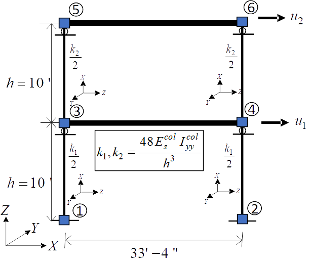

.. _qfem-0008:

Steel Frame Calibration with DREAM
==================================

+-----------------+-----------------------------------------+
| Problem files   | :github:`Github <Examples/qfem-0008>`   |
+-----------------+-----------------------------------------+

In this example, Bayesian estimation is used to estimate column
stiffnesses of a simple steel frame, given data about its mode shapes
and mass distribution.

Provided by Professor Joel Conte and his doctoral students Maitreya
Kurumbhati and Mukesh Ramancha from UC San Diego, this example looks at
the following simplified finite element model of a steel building.

 supports respectively. Displacements u1 and u2 are indicated by arrows at nodes 4 and 6. The diagram includes stiffness coefficients k1 and k2, divided by 2, shown next to the nodes 1, 2, 3, and 4. The distances between nodes are marked as 'h = 10' at two locations vertically, and '33' - 4"' horizontally. There's a central boxed equation, k1, k2 = 48*E*Icol / s^3*Iyycol / h^3, signifying a relation between stiffness coefficients, the modulus of elasticity (E), the second moment of area (I), column length (s), and column height (h). Axis labels for X, Y, and Z are shown in the lower-left corner to indicate the orientation of the structure.
   :align: center

| Each floor slab of the building is made of composite metal deck and is
  supported on four steel columns. The story heights are measured at
  :math:`10'` and in plan the side lengths measure :math:`33'-4"` by
  :math:`30'`. Properties of the steel columns are taken
  deterministically with an elastic modulus of
  :math:`29,000 \mathrm{ksi}`, area of :math:`110 \mathrm{in}^2`, and
  principal moment of inertial (:math:`I_{xx}`) of
  :math:`1190 \mathrm{in}^4`. For modelling purposes, the four columns
  are assumed fixed at the base and the beams connecting them are
  assumed to be rigid. The first two vibration periods of the structure
  are determined to be :math:`0.19 sec` and :math:`0.09 sec`.

Using these properties, the following set of mode shapes and frequencies
are generated by applying random perturbations to the analytic modal
properties in order to simulate field data that might be obtained using
a method for structural system identification.

.. math::

   \begin{array}{l}
   \lambda_{1}^{(1)}=1025.21, \lambda_{1}^{(2)}=1138.11, \quad \lambda_{1}^{(3)}=1099.39, \quad \lambda_{1}^{(4)}=1002.41, \quad \lambda_{1}^{(5)}=1052.69 \\
   \phi_{12}^{(1)}=1.53, \quad \phi_{12}^{(2)}=1.24, \quad \phi_{12}^{(3)}=1.38, \quad \phi_{12}^{(4)}=1.50, \quad \phi_{12}^{(5)}=1.35
   \end{array}

Our goal will be to reobtain the original column moments of inertia from
this data using a Bayesian calibration procedure.

The unknown quantities of interest are the moments of inertia for the
first and second story columns (``Ic1`` and ``Ic2`` respectively). Using
the following bounds and initial estimates, these parameters are defined
as follows in the **RV** tab of quoFEM:

1. First story column moment of inertia, ``Ic1``: **Uniform**
   distribution with a lower bound :math:`(L_B)` of :math:`500.0`, upper
   bound :math:`(U_B)` of :math:`2000.0`,

2. Second story column moment of inertia, ``Ic2``: **Uniform**
   distribution with a lower bound :math:`(L_B)` of :math:`500.0`, upper
   bound :math:`(U_B)` of :math:`2000.0`,

UQ Workflow
-----------

To define the uncertainty workflow in quoFEM, select **Inverse Problem**
for the **Dakota Method Category**, and enter the following inputs:

+---------------------------+---------+
| **No. Burn in Samples**   | 1000    |
+---------------------------+---------+
| **No. Chain Samples**     | 4000    |
+---------------------------+---------+
| **No. Chains**            | 4       |
+---------------------------+---------+
| **Jump Step**             | 5       |
+---------------------------+---------+
| **DREAM**                 | DREAM   |
+---------------------------+---------+
| **Seed**                  | 107     |
+---------------------------+---------+

Model Files
-----------

The following files make up the **FEM** model definition.

#. `fem.tcl <https://raw.githubusercontent.com/claudioperez/SimCenterExamples/master/static/frame/fem.tcl>`__:
   This file is an OpenSees Tcl script that defines a FE model for a
   given realization, runs an analysis, and creates a ``results.out``
   file. As a consequence, no postprocessing script is needed. The
   values placed in ``results.out`` file are the difference between
   computed and observed values. Expressed another way, the function
   ``f(Ic1,Ic2)`` computed and written to the ``results.out`` file is
   ``f(Ic1,Ic2) = ObservedPeriods - ComputedPeriods(Ic1,Ic2)``. The UQ
   algorithm when running is searching for values of the random variable
   parameters (``Ic1`` and ``Ic2``) that minimize this loss function.
   The user must take this fact into account when formulating the output
   from their own scripts for their own problems.

Results
-------

Once the analysis is complete the **RES** tab will be automatically
selected and the results will be displayed.

The resulting estimates for the column stiffnesses with 40 chain samples
are as follows:

-  ``Ic1``: Mean :math:`=1229.1`, Std. Dev :math:`=192.407`.
-  ``Ic2``: Mean :math:`=1404.03`, Std. Dev :math:`=253.584`.

