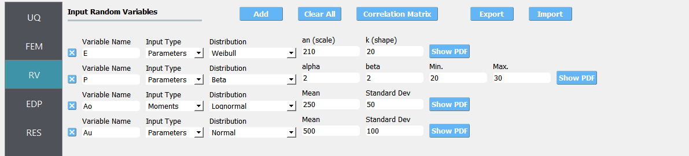
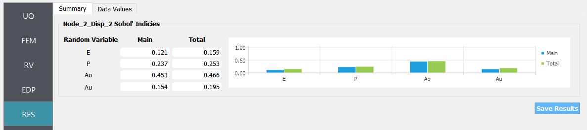
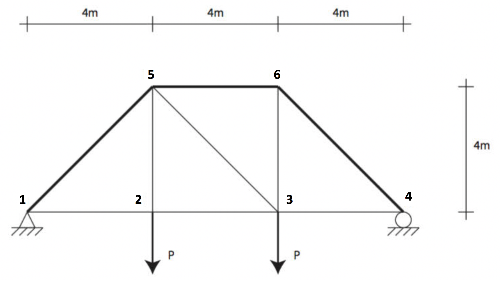
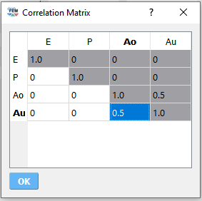
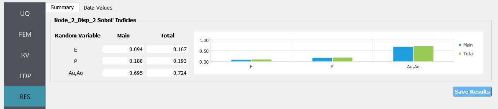

.. _qfem-0009:

Two-Dimensional Truss: Global Sensitivity Analysis using SimCenterUQ Engine
===========================================================================

+----------------+------------------------------------------+
| Problem files  | :github:`Github <Examples/qfem-0009/>`   |
+----------------+------------------------------------------+

This example uses quoFEM to perform a global sensitivity analysis of an
OpenSees FE model.

Consider a stochastic model of a two-dimensional truss structure like
that shown in the following figure. A sensitivity
analysis procedure is coordinated by quoFEM which will estimate the sensitivities
of the response quantities of interest with respect to the problem’s
random variables.

.. figure:: figures/qfem-0009.png
   :align: center
   :alt: A technical drawing of a truss structure with labeled nodes and applied forces. The truss consists of a triangular framework with horizontal top members and diagonal supports. There are dimensions marking the lengths of 4 meters on the top members and between the base and the apex. The base is fixed to the ground at the left-most node and there's a roller support at the bottom right node. Vertical forces marked as P are applied downwards at two of the bottom nodes. The logo for OpenSees, which appears to be a software used for structural analysis, is present at the top right corner.
   :width: 400
   :figclass: align-center

The following parameters are defined in the **RV** tab of quoFEM:

1. Elastic modulus, ``E``: **Weibull** distribution with a scale
   parameter :math:`(\lambda)` of :math:`210.0`, shape parameter
   :math:`(k)` of :math:`20.0`,

2. Load magnitude, ``P``: **Beta** distribution with a first shape
   parameter :math:`(\alpha)` of :math:`2.0`, second shape parameter
   :math:`(\beta)` of :math:`2.0`, lower bound :math:`(L_B)` of
   :math:`20.0`, upper bound :math:`(U_B)` of :math:`30.0`,

3. Cross sectional area for the other six bars, ``Ao``: **Lognormal**
   distribution with a mean :math:`(\mu)` of :math:`250.0`, standard
   deviation :math:`(\sigma)` of :math:`50.0`,

4. Cross sectional area for the upper three bars, ``Au``: **Normal**
   distribution with a mean :math:`(\mu)` of :math:`500.0`, standard
   deviation :math:`(\sigma)` of :math:`100.0`,

s and properties such as input type and distribution parameters. The first variable, labeled 'E', uses Weibull distribution with a scale of 210 and shape of 20, while the second variable 'P' uses Beta distribution with both alpha and beta set to 2, and has defined minimum and maximum values of 20 and 30 respectively. The 'Ao' variable is associated with Lognormal distribution, and 'Au' is set to Normal distribution. There are buttons to 'Add', 'Clear All', 'Correlation Matrix', 'Export', and 'Import', and each variable row has a 'Show PDF' button for probability density function visualization.
   :align: center

   Random variables for simple truss.

.. figure:: figures/trussPDF.png
   :alt: Random variables for simple truss.
   :alt: A graph displaying a probability density function with a bell-shaped curve. The x-axis ranges from approximately 100 to 250, and the y-axis represents probability density, which peaks just below 0.04. The peak of the curve is around 200 on the x-axis. The area under the curve is shaded, suggesting the representation of the probability of a range of outcomes within the curve's span. The window bar at the top of the image indicates that this is a screenshot from the software named "quoFEM".
   :align: center

   Probability density function of E (press Show PDF button)

The vertical displacement at node 2 is considered as a response. It is specified in the **QoI** tab as ``Node_2_Disp_2``.

UQ Workflow
-----------

To define the uncertainty workflow in quoFEM, select the **SimCenterUQ** engine
and specify **Sensitivity Analysis** and **Monte Carlo** for the 
**UQ Method Category** and **Method** combination boxes, respectively.
Finally, enter the following parameters for the remaining inputs.

=========== ====
**Samples** 1000
**Seed**    175
=========== ====

Model Files
-----------

The following files make up the **FEM** model definition.

#. :qfem-0009:`TrussModel.tcl <src/TrussModel.tcl>`:
   This file is an OpenSees Tcl script that constructs and runs a finite
   element analysis of the truss for a given realization of the
   problem’s random variables. It is supplied to the **Input File**
   field of the **FEM** tab.

#. :qfem-0009:`TrussPost.tcl <src/TrussPost.tcl>`:
   This file is an OpenSees Tcl script that processes the QoI
   identifiers supplied in the **QoI** tab, and writes the relevant
   response quantities to ``results.out`` from an OpenSees process. It
   is supplied to the **Postprocess File** field of the **FEM** tab.

Results
-------

Once the analysis is complete the **RES** panel will be automatically
selected and the results will be displayed as shown in the following
figure:

'Total' columns, with values ranging from 0.121 to 0.466. E has the lowest 'Total' index value of 0.159 and Ao the highest with 0.466. The bottom section displays a horizontal bar graph correlating with the numerical values in the table, showing four pairs of bars - one blue labeled 'Main' and one green labeled 'Total' - comparing the significance of each random variable on an outcome. A 'Save Results' button is visible at the bottom right.
   :align: center

   Sensitivity analysis results for simple truss.

Comparison with Dakota engine
-----------------------------

QuoFEM also supports MCS-based sensitivity analysis method offered in Dakota engine. In this section, the sensitivity analysis is conducted using different number of samples, and the results were compared with those from Dakota engine. 

.. list-table:: SimCenterUQ: Sensitivity indices from different number of samples 
   :header-rows: 1
   :align: center

   * - RV
     - N=10
     - N=50
     - N=100
     - N=500
     - N=1000
   * - E
     - 0.18
     - 0.23
     - 0.23
     - 0.12
     - 0.13
   * - P
     - 0.60
     - 0.36
     - 0.29
     - 0.24
     - 0.25
   * - Ao
     - 0.06
     - 0.45
     - 0.42
     - 0.43
     - 0.46
   * - Au
     - 0.26
     - 0.29
     - 0.25
     - 0.18
     - 0.16

.. list-table:: Dakota: Sensitivity indices from different number of samples (the first raw is the user-specified number of samples and the second raw is the actual number of simulation calls)
   :header-rows: 2
   :align: center

   * - RV
     - N=10 
     - N=50
     - N=100
     - N=500
     - N=2000     
   * - 
     - **(60)**
     - **(300)**
     - **(600)**
     - **(3000)**
     - **(12000)**
   * - E
     - 0.06
     - 0.17
     - 0.18
     - 0.12
     - 0.13
   * - P
     - 0.17
     - 0.22
     - 0.20
     - 0.28
     - 0.22
   * - Ao
     - 0.19
     - 0.41
     - 0.52
     - 0.46
     - 0.47
   * - Au
     - 0.03
     - 0.12
     - 0.23
     - 0.20
     - 0.18

In the current example, the probability model (PM) based approximation method in the SimCenterUQ engine converges faster within a smaller number of simulations. However, caution should be taken when using PM-based method. It is noteworthy that while the MCS method in the Dakota engine always converges to exact value when a sufficiently large number of simulations are involved, such asymptotic exactness is not guaranteed for the PM-based method. Still, the sensitivity rank between the variables is relatively robust.

Result with correlated inputs
------------------------------
Consider the case with correlated random variables. For example, below shows correlation matrix where the correlation between the variables ``Au`` and ``Ao`` are :math:`\rho=0.5`.

le at the bottom of the dialog box.
   :align: center

   Correlation matrix

The group-wise Sobol indices for {:math:`Au,Ao`} can be defined at the **QoI** tab.

e white user interface.
   :align: center

   Setting advanced options for group-wise Sobol indices

The results of sensitivity analysis:

r for 'Au,Ao' being significantly longer than the others. Below the chart, there is a "Save Results" button.
   :align: center

   Sensitivity analysis results for simple truss (with correlations)

