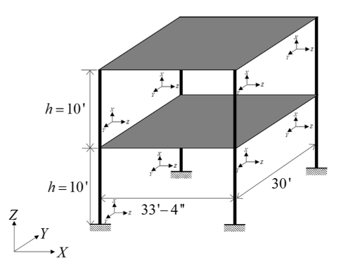
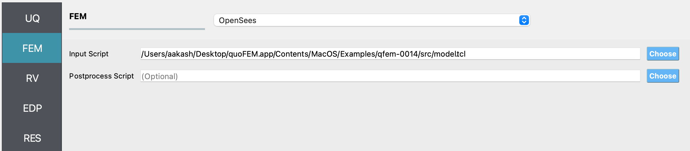
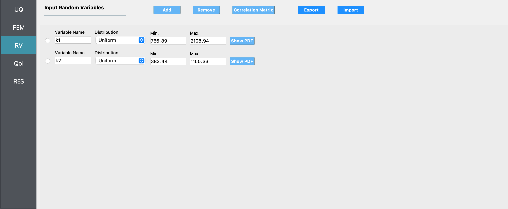
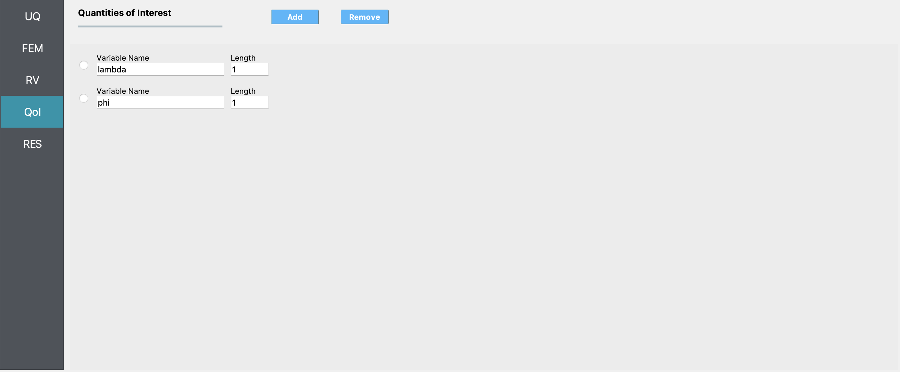
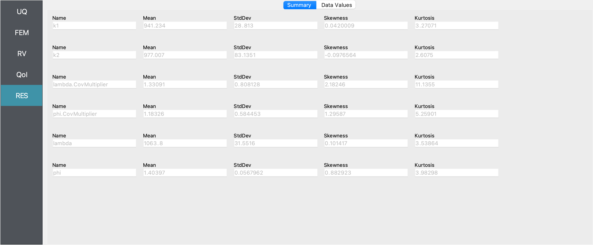
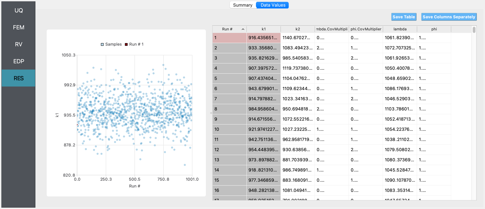
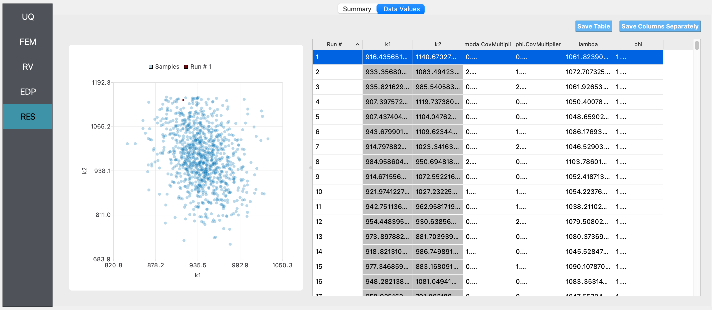
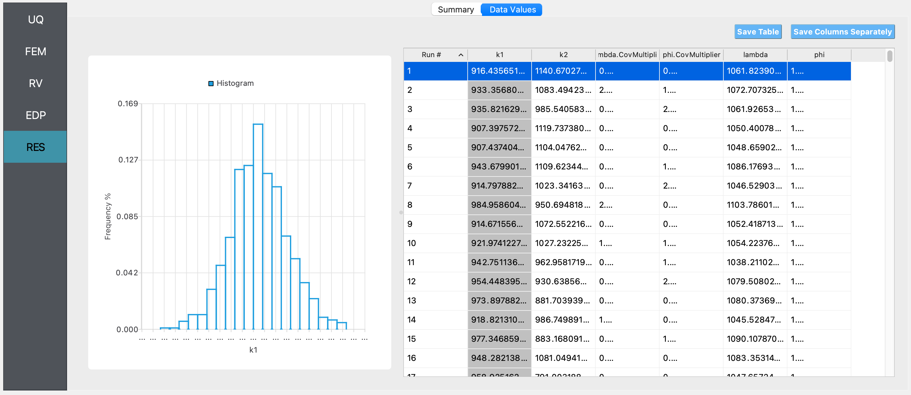
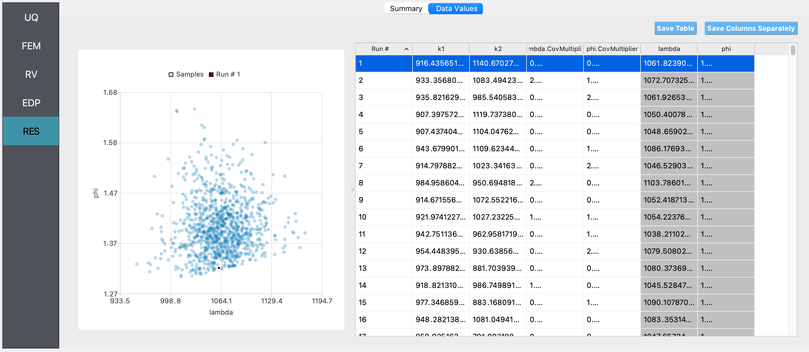
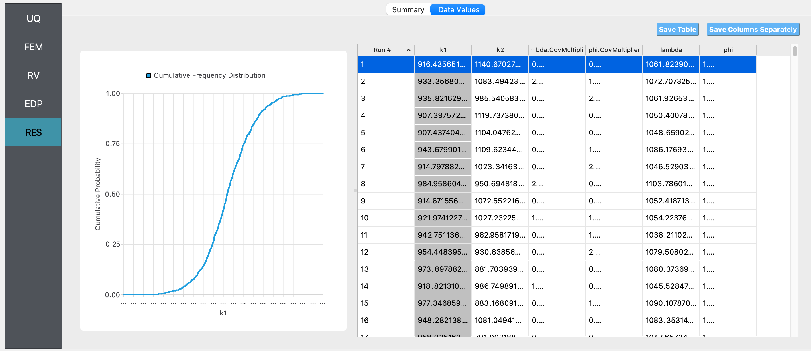

.. _qfem-0014:

Steel Frame: Bayesian Calibration using TMCMC
=============================================

+---------------+----------------------+
| Problem files | :qfem-0014:`/`       |
+---------------+----------------------+

Outline
-------

In this example, Bayesian estimation is used to estimate the lateral story
stiffnesses of the two stories of a simple steel frame, given data about 
its mode shapes and frequencies. The transitional Markov chain Monte Carlo 
algorithm is used to obtain samples from the posterior probability distribution 
of the lateral story stiffnesses.

Problem description
-------------------
This example is provided by Professor Joel Conte and his doctoral students Maitreya Kurumbhati and Mukesh Ramancha from UC San Diego.  

Structural system
+++++++++++++++++
Consider the two-story building structure shown in :numref:`figSteelStructuralSystemBayes`. Each floor slab is made of a composite metal deck and is supported on the steel columns. These four columns are fixed at the base. The story height is :math:`h = 10'`, length of each slab is :math:`33'4''` and :math:`30'` along the X and Y direction, respectively. :math:`m_1 = 0.52 \ \ kips-s^2/in` and :math:`m_2 = 0.26 \ \ kips-s^2/in` are the total mass of floor 1 and floor 2, respectively. For the steel columns, Young’s modulus is :math:`E_s^{col} = 29000 \ \ ksi` and the moment of inertia :math:`I_{yy}^{col} = 1190 \ \ in^4`.

.. _figSteelStructuralSystemBayes:

'-4"" and another side "30'". Coordinate axes labeled X, Y, and Z are shown in the lower left corner to indicate the structure's orientation in space. The drawing includes multiple arrows indicating dimensions and supports at the bottom, designated by hatched areas.
   :width: 400
   :figclass: align-center
   
   Steel structural system being studied in this example.
   
Finite element model
++++++++++++++++++++
In this example, only the response of the system along the X direction is considered. For modeling purposes, the floor diaphragms are assumed rigid both in plane and in flexure, and the columns are assumed axially rigid. The structure is modeled as a two-story 2D shear building model as shown in :numref:`figSteelFrameModelBayes`. The finite element (FE) software framework **OpenSees** is utilized for modeling and analysis of the considered structural system. The developed FE model consists of 6 nodes and 6 elastic beam-column elements. To simulate the flexural rigidity of the floors, the moment of inertia :math:`I_{yy}` of the horizontal elements is set to a very large number. The horizontal degrees of freedom of node 3 and node 4 are constrained to be equal throughout the analysis to mimic the axial rigidity of floor 1. Similar modeling is performed for floor 2. The vertical displacements of nodes 3, 4, 5, and 6 are constrained to be zero to model the axial rigidity of the columns (see roller supports in :numref:`figSteelFrameModelBayes`). After making these modeling assumptions, the only active degrees of freedom of the FE model are the horizontal displacements (translations) of floors 1 and 2, :math:`u_1` and :math:`u_2`, respectively, as shown in :numref:`figSteelFrameModelBayes`.

A translational mass :math:`m_1/2` and :math:`m_2/2` is lumped at the nodes of floor 1 and 2, respectively, along the X direction. The lateral story stiffnesses :math:`k_1` and :math:`k_2` of story 1 and 2, respectively, are equal to :math:`48 E_s^{col} I_{yy}^{col}/{h^3}`. Hence, **the story stiffnesses** 
:math:`k_1` and :math:`k_2` **are both equal to 958.61 kips/in**.

.. _figSteelFrameModelBayes:

.. figure:: figures/qfem-0014.png
   :align: center
   :alt: A schematic illustration of a structural analysis problem, featuring a 2D framework with labeled nodes 1 to 6, and two horizontal members. Vertical members connect the nodes with distances labeled as 'h = 10'' '. Components k1/2 and k2/2 represent rotational spring constants at the connections. The bottom member shows a horizontal length of 33' - 4" with x, y, and z axes defined at the lower left corner. Arrows labeled "u1" and "u2" indicate horizontal deformations at nodes 4 and 6. A central formula box shows "k1, k2 = 48E*Icol / syy*Icol / h^3", suggesting a calculation related to the stiffness of the columns.
   :width: 400
   :figclass: align-center
   
   Model of the structural system used in finite element analysis.

Natural vibration frequencies and mode shapes
+++++++++++++++++++++++++++++++++++++++++++++
Since the shear building model shown in :numref:`figSteelFrameModelBayes` has only two degrees of freedom, it has two natural modes of vibration. Let :math:`\lambda_i` and :math:`\phi_i` be the :math:`i^{th}` eigenvalue and its corresponding eigenvector, respectively. The two eigenvalues and eigenvectors are obtained by solving the generalized eigenvalue problem of the considered system in OpenSees. The following two eigenvalues are obtained:

.. math::
	\begin{array}{l}
		\lambda_1 = 1084.06 (rad/s)^2, \quad \lambda_2 = 6318.34 (rad/s)^2
	\end{array}
	:label: eqnEigenValuesBayes

The corresponding eigenvectors (see degrees of freedom u1 and u2 in :numref:`figSteelFrameModelBayes`) are given by:

.. math::
	\phi_1 = \begin{pmatrix}\phi_{11} \\ \phi_{12}\end{pmatrix} = \begin{pmatrix}1.00 \\ 1.41\end{pmatrix} in, \qquad \phi_2 = \begin{pmatrix}\phi_{21} \\ \phi_{22}\end{pmatrix} = \begin{pmatrix}1.00 \\ -1.41\end{pmatrix} in
	:label: eqnEigenVectorsBayes
	
The eigenvectors in :eq:`eqnEigenVectorsBayes` are normalized such that the first component is 1.0. The two vibration mode shapes are shown in :numref:`figNaturalModeShapesBayes`.

.. _figNaturalModeShapesBayes:

.. figure:: figures/qfem-0014-NaturalModeShapes.png
   :align: center
   :alt: The image shows two diagrams labeled (a) and (b). Both depict mechanical systems with solid black lines representing rigid bars, red dashed lines representing springs, and blue squares indicating pivot points. Each system is anchored at the bottom to a hatched base, suggesting a fixed support. Diagram (a) is a square shape with diagonal springs inside, and measurements indicating a size of "1.41 in" along the diagonal and "1.00 in" on the sides. Diagram (b) has a similar structure but is distorted, with the top bar skewed to the left, resulting in a diagonal measurement of "-1.41 in" and a vertical side labeled "1.00 in." The springs in (b) appear stretched, indicating movement or deformation of the system from its original square shape.
   :width: 400
   :figclass: align-center
   
   Natural vibration mode shapes: (a) Mode 1 (b) Mode 2.
   

Parameters to be estimated
++++++++++++++++++++++++++
The FE model of a real structural system often consists of parameters that are unknown to some degree. For example, the parameters related to the mass or stiffness or damping of the system might be unknown. The goal of parameter estimation is to estimate such unknown parameters using some measurement data. The measurement data is obtained by using sensors deployed on the real system. To demonstrate the parameter estimation concept/framework on the considered two-story building system, the first and second story story stiffnesses, :math:`k_{1}` and :math:`k_{2}`, are assumed to be unknown while the mass parameters are assumed to be known. In this illustration example, the unknown parameter vector :math:`\mathbf{\theta}=(k_{1}, k_{2})^T` is estimated using the first eigenvalue and the first eigenvector data. 

Synthetic data generation
+++++++++++++++++++++++++
In a real-world application, data on the first eigenvalue and the first eigenvector would consist of system identification results obtained from sensor measurement data. Note that the considered two-story building structure (see :numref:`figSteelStructuralSystemBayes`) is used here as a conceptual/pedagogical example and does not exist in the real world. Therefore, sensor measurement data cannot be collected from the system. As a substitute, measurement data (in the form of estimated first eigenvalue and first eigenvector) are artificially simulated for the purpose of this example, i.e., system identification results for :math:`\lambda_i` and :math:`\phi_i` from multiple ambient vibration datasets are simulated. To simulate these system identification results (i.e., measurement data), an eigenvalue analysis of the system is performed assuming the following true principal moment of inertia of the columns:

.. math:: 
	\mathbf{\theta}^{true} = \left(k_{1}^{true}, k_{2}^{true}\right)^T; \quad k_{1}^{true} = k_{2}^{true} = 958.61 \ \ kips/in.

The corresponding first eigenvalue and first eigenvector are:

.. math::
	\mathbf{y}^{true} = \left(\lambda_1^{true} = 1084.06 (rad/s)^2, \phi_{12}^{true} = 1.41 in\right)^T
	

To simulate system identification results (measurement data), random estimation errors are added to :math:`\lambda_1^{true}` and :math:`\phi_{12}^{true}`. The random estimation errors for :math:`\lambda_1^{true}` and :math:`\phi_{12}^{true}` are assumed to be statistically independent, zero-mean Gaussian with 5% coefficient of variation (relative to :math:`\lambda_1^{true}` and :math:`\phi_{12}^{true}`). Thus, the standard deviation of the system identification errors for :math:`\lambda_1^{true}` and :math:`\phi_{12}^{true}` are 

.. math::
	\sigma_{\lambda_1}^{true} = 0.05*\lambda_1^{true} = 54.203; \quad \sigma_{\phi_{12}}^{true} = 0.05*\phi_{12}^{true} = 0.0705

Now five independent sets of system identification results (measurement data sets) are simulated as: 

.. math::
   \begin{array}{l}
   \lambda_{1}^{(1)}=1025.21, \quad \lambda_{1}^{(2)}=1138.11, \quad \lambda_{1}^{(3)}=1099.39, \quad \lambda_{1}^{(4)}=1002.41, \quad \lambda_{1}^{(5)}=1052.69 \\
   \phi_{12}^{(1)}=1.53, \quad \phi_{12}^{(2)}=1.24, \quad \phi_{12}^{(3)}=1.38, \quad \phi_{12}^{(4)}=1.50, \quad \phi_{12}^{(5)}=1.35
   \end{array}
   :label: eqnDataBayes

Parameter estimation setup
++++++++++++++++++++++++++
In this example, it is assumed that the story stiffnesses for the first and second story (:math:`k_{1}` and :math:`k_{2}` respectively) are unknown. The goal is to use the simulated data of eigenvalue and eigenvector measurements to obtain the posterior probability distribution of the story stiffnesses by Bayesian calibration. We will employ the Transitional Markov Chain Monte Carlo (TMCMC) algorithm, to sample from the posterior joint probability distribution of :math:`k_{1}` and :math:`k_{2}`.

We define the following prior probability distributions for the unknown quantities of interest:

1. First story stiffness, ``k1``: **Uniform**
   distribution with a lower bound :math:`(L_B)` of :math:`766.89 \ \mathrm{kips/in}`, and an upper bound :math:`(U_B)`
   of :math:`2108.94 \ \mathrm{kips/in}`,

2. Second story stiffness, ``k2``: **Uniform**
   distribution with a lower bound :math:`(L_B)` of :math:`383.44 \ \mathrm{kips/in}`, and an upper bound :math:`(U_B)`
   of :math:`1150.33 \ \mathrm{kips/in}`.

A Gaussian (a.k.a. Normal) likelihood model is employed by default in quoFEM. This is done by assuming that the errors (i.e. the differences between the finite element prediction of the modal properties and the simulated measurement data) follow a zero-mean Gaussian distribution. The components of the error vector are assumed to be statistically independent. The errors in the prediction of a particular response quantity are assumed to be identically distributed across experiments. Under these assumptions, the standard deviations of the error for each response quantity are the only unknown parameters of the Gaussian distribution employed in the likelihood model, and their values are also estimated from the data. Therefore, in this problem, there are two additional parameters :math:`\sigma_{\lambda_{1}}` and :math:`\sigma_{\phi_{12}}`, which are also estimated. The prior probability distributions for these additional parameters are automatically set by quoFEM. 

Files required
++++++++++++++
The exercise requires two script files. The user should download these files and place them in a **new** folder. 

.. warning::
   Do not place the files in your root, downloads, or desktop folder as when the application runs it will copy the contents on the directories and subdirectories containing these files multiple times. If you are like us, your root, Downloads or Documents folders contains a lot of files.
   

1. :qfem-0014:`model.tcl <src/model.tcl>` - This is an OpenSees script written in tcl which builds the finite element model and conducts the analysis. This script creates a file called ``results.out`` when it runs. This file contains the first eigenvalue and the second component of the first eigenvector obtained from finite element analysis of the structure. 

2. :qfem-0014:`eigData.csv <src/eigData.csv>` - This is the calibration data file, which contains the synthetically generated data in five rows and two columns, the contents of which are shown below. 

.. literalinclude:: src/eigData.csv

.. note::
   Since the tcl script creates a ``results.out`` file when it runs, no postprocessing script is needed. 
  

UQ workflow
-----------
.. note::
	Selecting the ``Steel Frame: Bayesian Calibration using TMCMC`` example in the quoFEM Examples menu will autopopulate all the input fields required to run this example. 
	The procedure outlined below demonstrates how to manually set up this problem in quoFEM.

The steps involved are as follows:

1. Start the application and the **UQ** panel will be highlighted. In the **UQ Engine** drop down menu, select the **UCSD_UQ** engine. In the **Method** category drop down menu the **Transitional Markov chain Monte Carlo** option will be highlighted. Enter the values in this panel as shown in the figure below. If manually setting up this problem, choose the path to the file containing the calibration data on your system. 

.. figure:: figures/qfem-0014-UQ.png
   :width: 600
   :alt: The image displays a graphical user interface for a software application with a focus on uncertainty quantification settings. On the left side, there is a vertical navigation menu with the items UQ, FEM, RV, EDP, RES highlighted, and UQ is currently selected. The main area contains input fields and dropdown menus for the UQ Method, which is set to 'Bayesian Calibration', and the UQ Engine, which is set to 'UCSD-UQ'. Further settings include input fields for Sample Size ('200'), Seed ('0'), Calibration Data File (path provided), and an optional Log Likelihood Script. Two 'Choose' buttons are present next to the file paths, suggesting a browsing option for the user to select files. The settings seem to be part of a computational framework for uncertainty quantification in engineering simulations or analyses.
   :align: center
   :figclass: align-center

2. Next select the **FEM** panel from the input panel selection. This will default to the **OpenSees** FEM engine. In the **Input Script** field, enter the path to the ``model.tcl`` file or select **Choose** and navigate to the file. 

tion, set to "OpenSees," and below it, fields to input the directory paths for an Input Script and an optional Postprocess Script. The Input Script field is populated with a file path leading to a 'model.tcl' file. Two blue 'Choose' buttons are available to browse for the respective script files.
   :figclass: align-center
   :width: 600

3. Next select the **RV** tab from the input panel. This panel should be pre-populated with two random variables named ``k1`` and ``k2``. If not, press the **Add** button twice to create two fields to define the input random variables. Enter the same variable names (``k1`` and ``k2``), as required in the ``model.tcl`` script. 

For each variable, specify the prior probability distribution - from the **Distribution** drop down menu, select **Uniform** and then provide the lower bounds and upper bounds shown in the figure below. 

puts, showing the probability density function (PDF), and options to export or import settings. A sidebar to the left lists categories: UQ, FEM, RV (highlighted), EDP, and RES.
   :figclass: align-center
   :width: 600

4. In the **QoI** panel, enter **2** variable names for the two quantities output from the model. 

ength value of '1' beside an input field. Two buttons labeled 'Add' and 'Clear all' are positioned above the listed variables.
   :align: center
   :figclass: align-center

.. note::   

   For this particular problem setup in which the user is not using a postprocessing script, the user may specify any names for the QoI variables. They are only being used by the UCSD_UQ engine to return information on the results.

5. Next click on the **Run** button. This will cause the backend application to launch the **UCSD_UQ** engine, which performs Bayesian calibration using the TMCMC algorithm. When done, the **RES** tab will be selected and the results will be displayed as shown in the figure below. The results show the first four moments of the posterior marginal probability distribution of :math:`k_1` and :math:`k_2`. The true value of both :math:`k_1` and :math:`k_2` is **958.61  kips/in**.
Also shown are the moments of the estimated aditional error parameters per response quantity and finally, the moments of the outputs corresponding to the samples from the posterior probability distribution of the parameters. 

1.118326 to 1063.8 for the mean, 0.0567962 to 83.1351 for standard deviation, -0.0976564 to 2.18246 for skewness, and 2.6075 to 11.1355 for kurtosis. The table is part of an interface with tabs named "Summary" and "Data Values", and sections labeled UQ, FEM, RV, EDP, with a highlighted RES section.
   :figclass: align-center
   :width: 600

If the user selects the **Data Values** tab in the results panel, they will be presented with both a graphical plot and a tabular listing of the data.

includes options labeled "UQ," "FEM," "RV," "EDP," with "RES" highlighted in blue. On the right, a data table includes columns such as "Run #," "k1," "k2," "mbda.CovMultiplier," "phi.CovMultiplier," "lambda," and "phi," with numerical values for multiple runs listed. The interface includes buttons for "Summary," "Data Values," "Save Table," and "Save Columns Separately."
   :figclass: align-center
   :width: 600

Various views of the graphical display can be obtained by left and right clicking in the columns of the tabular data. 

hlight a specific data point within the cluster. On the right side of the screen is a data table with columns titled "Run #," "k1," "k2," "mbda.CovMultiplier," "phi.CovMultiplier," "lambda," and "phi," displaying a list of numerical values corresponding to different runs of an analysis or simulation. At the top right, there are tabs for "Summary" and "Data Values" as well as options to "Save Table" and "Save Columns Separately."
   :figclass: align-center
   :width: 600

", "k2", "mbda.CovMultiplier", "phi.CovMultiplier", "lambda", and "phi", showing various numerical values for each run. The table options include "Save Table" and "Save Columns Separately".
   :figclass: align-center
   :width: 600

If a single column of the tabular data is pressed with both right and left buttons a histogram and CDF will be displayed, as shown in the figures below.

able shows numerical values with columns labeled 'Run #,' 'k1,' 'k2,' 'mbda.CovMultiplier,' 'phi.CovMultiplier,' 'lambda,' and 'phi.' Some interface buttons like 'Save Table' and 'Save Columns Separately' are visible on top. At the very left, there is a vertical navigation bar with highlighted options such as 'UQ,' 'FEM,' 'RV,' 'EDP,' and 'RES.'
   :figclass: align-center
   :width: 600
 
s and a variable labeled "k1" on the x-axis. The right section shows a tabbed interface with tabs labeled "Summary" and "Data Values"; the visible "Data Values" tab includes a table with numerical data and columns labeled "Run #," "k1," "k2," "mbda.CovMultiplier," "phi.CovMultiplier," "lambda," and "phi." There are buttons above the table for "Save Table" and "Save Columns Separately."
   :figclass: align-center
   :width: 600
