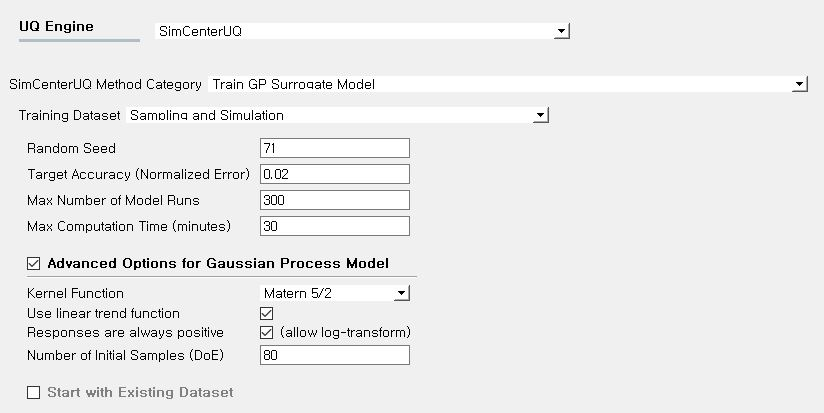

1 Story Building: Surrogate modeling
=============================================

+---------------+----------------------+
| Problem files | :qfem-0015:`/`       |
+---------------+----------------------+

Outline
-------

In this example constructs a surrogate model for a building structure with 14 parameters.

Problem description
-------------------

