.. _qfem-0015:

Surrogate Modeling for One Story Building Earthquake Response
===============================================================

+----------------+------------------------------------------+
| Problem files  | :github:`Github <Examples/qfem-0015/>`   |
+----------------+------------------------------------------+

.. note::
   This example may run up to 20 minutes depending on the computer performance. For a quick test run, the user may want to reduce the **Max Computation Time** or **Max Number of model Runs**.

Outline
-------

This example constructs a Gaussian process-based surrogate model for the response of a building structure given a ground motion time history. We are interested in the maximum inter-story drift/acceleration response determined in 14 structural parameters. 

.. figure:: figures/SUR-Concept.PNG
   :align: center
   :figclass: align-center
   :width: 600

   Conceptual illustration of surrogate modeling

The building model based on the work described in [Zou2020]_.

.. [Zou2020]
   Zou, J., Welch, D. P., Zsarnoczay, A., Taflanidis, A., & Deierlein, G. G. (2020). Surrogate Modeling for the Seismic Response Estimation of Residential Wood Frame Structures. In Proceedings of the 17th World Conference on Earthquake Engineering, Japan. [`link <https://www.researchgate.net/publication/344803660_Surrogate_Modeling_for_the_Seismic_Response_Estimation_of_Residential_Wood_Frame_Structures>`_]

Problem description
-------------------

The structure (:qfem-0015:`single story building with a cripple wall <src/CWH.py>`) has the following uncertain properties:

================== ============ =========
Random Variable    lower bound  upper bound
					      
================== ============ =========
Material Quality   0.2          1.0
Plan Area          1200          2400
Aspect Ratio       0.4          0.8
Damping            0.02         0.1
external Density_x 0.5          0.8
external Density_y 0.5          0.8
intternal Density  0.06         0.08
extEcc_x           0.0          0.5
extEcc_z           0.0          0.5
intEcc_x           0.0          0.5
intEcc_z           0.0          0.5
floor1 Weight      10.0         15.5
flower2 Weight     10.0         15.5
roof Weight        10.0         15.5
================== ============ =========

Below is the time history of the ground motion excitation.

.. figure:: figures/SUR-GM.PNG
   :align: center
   :figclass: align-center
   :width: 600

Input files
-------------
Once the user selects OpenSeesPy as FEM applications, below three fields are requested.

1. **Input Script** - ``CWH.py``: This file is the main Python script that builds the model and runs the analysis. It is supplied to the Input Script field of the FEM tab. Because this file writes directly to results.out, it obviates the need for supplying a post-process script.
2. **Postprocess Script (Optional)** - None: This optional script is not required.
3. **Parameters File** - ``params.py``: This file is a Python script that defines the problem’s random variables. The **RV tab** will be auto-populated when this file is loaded. The literal values which are assigned to variables in this file will be varied at runtime by the UQ engine.

**The other subsidiary scripts (including ground motion time history) are stored in the same directory of the main input script.**

UQ Workflow
-------------

1. Start the application, and the **UQ** Selection will be highlighted. Change the UQ Engine to **SimCenterUQ** and the Method Category to **Training GP Surrogate Model**. Since the model is provided, the Training Dataset will be obtained by **Sampling and Simulation**. Default settings are used for the advanced options.

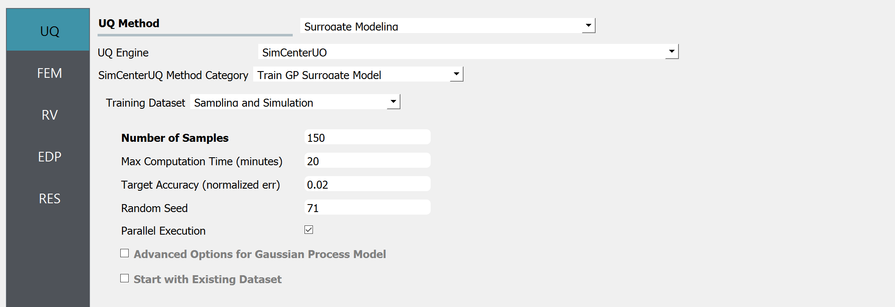

2. Select the **FEM** tab from the input panel. Choose the engine to be OpenSeesPy. For the main script, copy the path to ``CWH.py`` or click choose and navigate to the file. Post-process script field can remain empty and ``params.py`` file is called in the Parameters File field.

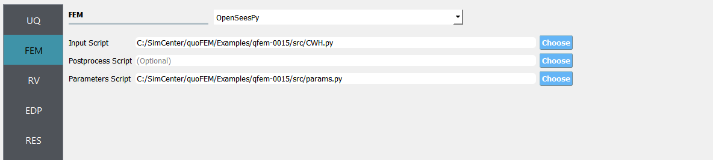

3. Select the **RV** tab from the input panel. This should be pre-populated with 14 random variables once ``params.py`` is imported. For each variable, distribution is fixed to be **Uniform** and only the lower and upper bounds should be specified by users. 

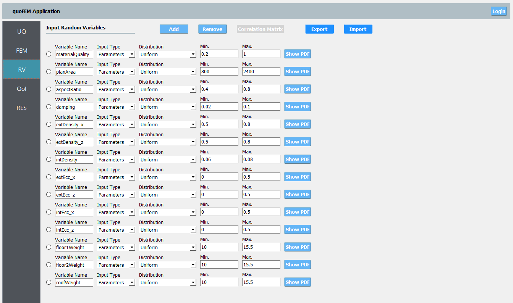

.. note::
   When user need to manually specify random variables with **add** button, eg. when using a custom FEM application, the user should use drop-down menu to set the distribution as Uniform.

4. Select the **QoI** tab. Here, enter two output names as ``InterstoryDrift_x`` and ``Accel_Roof_x``. 

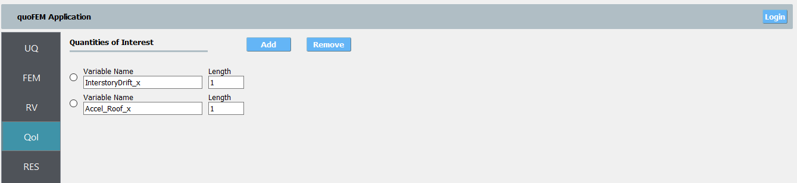

5. Click on the **Run** button. This will cause the back-end application to run SimCenterUQ Engine.

6. When done, the **RES** tab will be selected and the results will be displayed.

* Summary of Results:

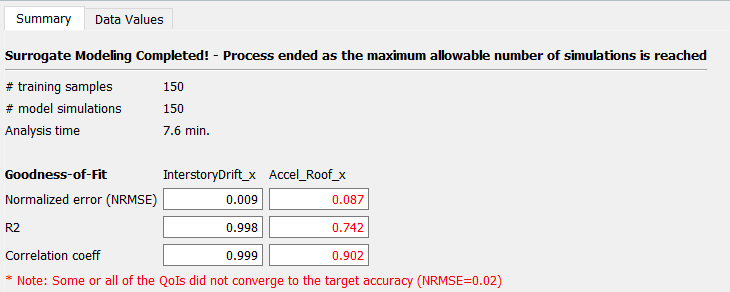

* Leave-one-out cross-validation (LOOCV) predictions:

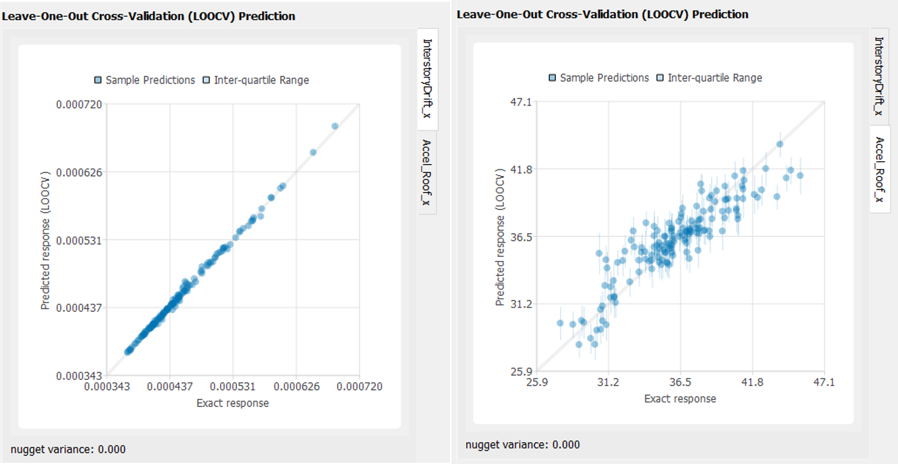

Well-trained model will form a clear diagonal line while poorly trained model are more scattered around. The detailed parameter values of the trained Gaussian process model can be found by clicking **Save GP Info** button below the scatter plot.

7.  **Continue Analysis**: If the users are not satisfied with the convergence status, they can continue training by saving the current sample points by clicking **RV Data** and **QoI Data** buttons. Then the user may go back to **UQ tab** and activate **Start with Existing Dataset** option. The user can directly import the sample tables generated by quoFEM.

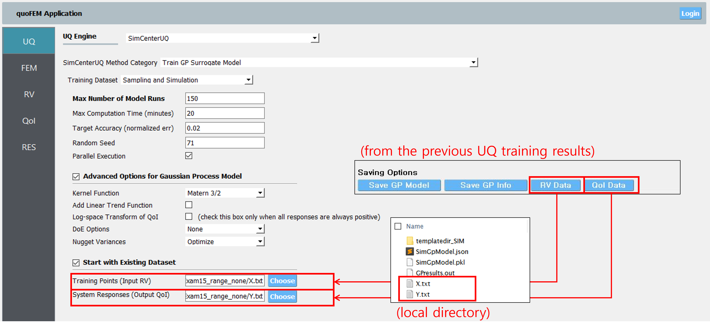

| Click on the **Run** button, and surrogate model training will be continued. Followings are the results after 150 more simulations.

* Summary:

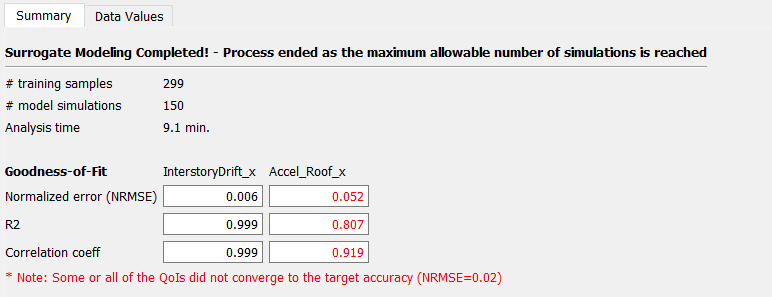

.. note::
   Note that in the second training period, 150 initial samples were provided from the data files and 150 more simulations were conducted. However, the number of total samples used to train the surrogate model is displayed as 299 since one simulation is consumed to check the consistency between the user provided model (in the **FEM tab**) and the dataset (in the **UQ tab**).

* Leave-one-out cross-validation (LOOCV) predictions:

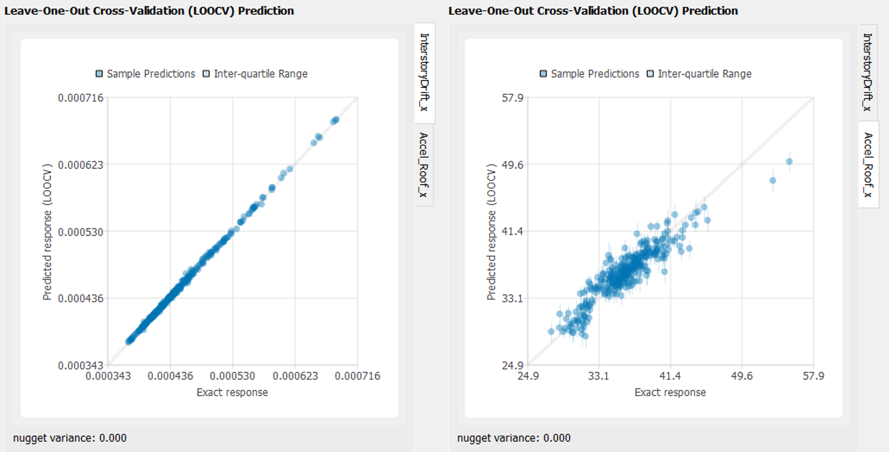
   
Users may want to perform additional simulations in a similar way.

Verification of the Surrogate model
-----------------------------------

Once surrogate model is constructed, it can be used for various UQ/optimization applications. Here we perform a simple forward analysis to verify the constructed surrogate model. 

1. The constructed surrogate model can be saved by **Save GP Model** button. Two files and a folder will be saved which are **SurroateGP Info File** (default name: ``SimGpModel.json``), **SurroateGP model file** (default name: ``SimGpModel.pkl``) and **Simulation template directory** which contains the simulation model information (``templatedir_SIM``).

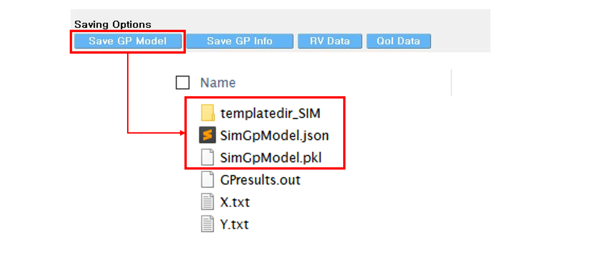

.. note::
   * Do not change the name of ``templatedir_SIM``. **SurrogateGP Info and model** file names may be changed.
   * When location of the files are changed, ``templatedir_SIM`` should be always located in the directory same to the **SurroateGP Info file**.
   
.. warning::

   Do not place above surrogate model files in your root, downloads, or desktop folder as when the application runs it will copy the contents on the directories and subdirectories containing these files multiple times. If you are like us, your root, Downloads or Documents folders contains and awful lot of files and when the backend workflow runs you will slowly find you will run out of disk space!

2. Restart the quoFEM (or press **UQ tab**) and select Dakota Forward Propagation method.

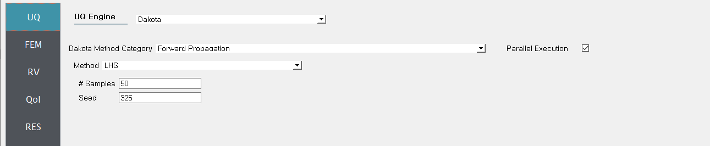

3. Select the **FEM tab**  from the input panel and choose **SurrogateGP** application. For the **SurrogateGP Info** field, copy the path to the ``SimGpModel.json`` or click choose and navigate to the file. Similarly, the  **SurroateGP Model field** calls ``SimGpModel.pkl`` file. Once the first file is imported, additional options will be visible. Here, the user can specify the Maximum Allowable Normalized Variance level. The exceedance percentage is provided to help users decision along with the pre-informed accuracy of the surrogate model obtained right after the training session. In this example, we would like to compare two cases: **(CASE 1)** (Ignore the precision tolerance and) **Continue** analysis, **(CASE 2)** **Run Exact FEM simulation** for those samples prediction variance is high. The Maximum Allowable Normalized Variance level is set as 0.15.

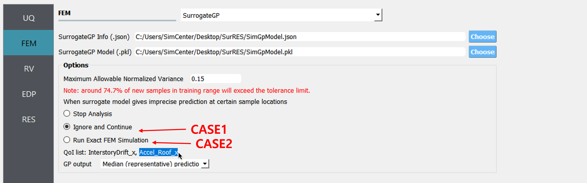

4. Once the SurrogateGP Info field in the **FEM** tab is entered, the **RV tab** is automatically populated. The user can select the distribution and its parameters. This example applied the following conditions.

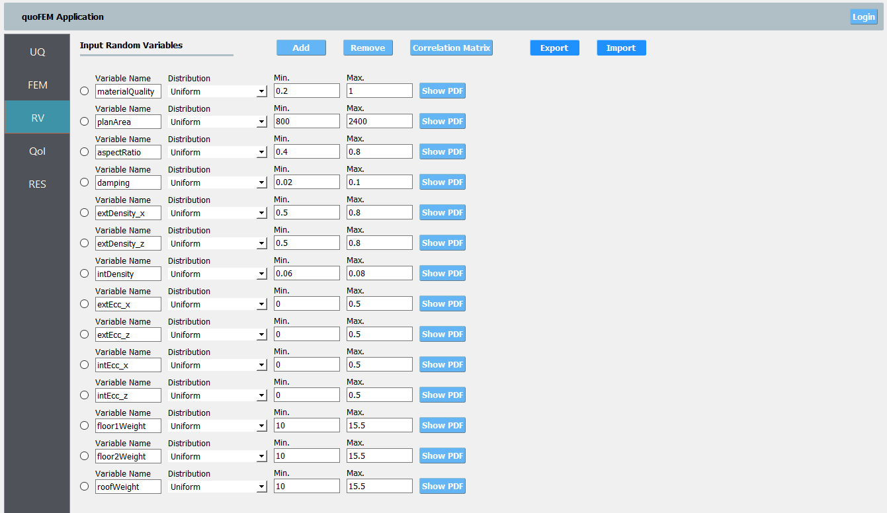

5. Users need to manually fill in the **QoI tab**. Users do not need to include here all the QoIs used for the training, but the users may not add new QoIs or modify the names of existing QoIs. [Tip] List of the trained QoI names can be found and copied in the **FEM tab**.

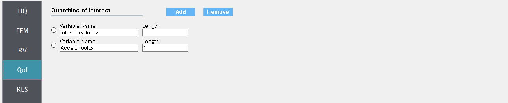

5. Click on the **Run** button. This will cause the back-end application to launch dakota.

6. When done, the **RES** tab will be selected and the results will be displayed. Below tables compare the results from the two cases.

* InterstoryDrift_x

================== ============================== ======================== ======================================
Prob. Moments      Reference (only simulation)    CASE1 (only surrogate)   CASE2 (surrogate and simulation)					     
================== ============================== ======================== ======================================
Mean               4.54e-4                        4.53e-4                  4.54e-4
StdDev             6.01e-5                        5.99e-5                  6.01e-5
Skewness           2.59                           2.53                     2.58
Kurtosis           13.49                          13.16                    13.49
================== ============================== ======================== ======================================

* Accel_Roof_x

================== ============================== ======================== ======================================
Prob. Moments      Reference (only simulation)    CASE1 (only surrogate)   CASE2 (surrogate and simulation)		
================== ============================== ======================== ======================================
Mean               35.84                          36.2                     35.79
StdDev             3.20                           3.63                     3.10
Skewness           0.46                           1.36                     0.31
Kurtosis           4.86                           9.76                     5.38
================== ============================== ======================== ======================================

* CASE1:

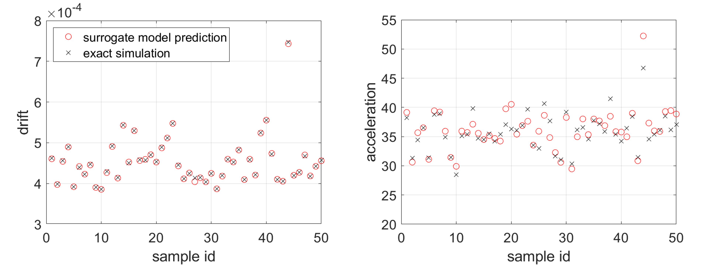

* CASE2: 

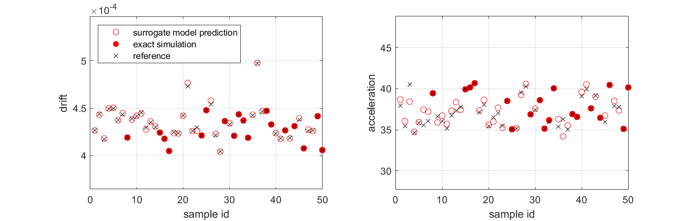

The peak drifts are well-predicted with the surrogate model (CASE1), while the acceleration predictions are improved by alternating between the surrogate and simulation model (CASE2).

.. note::
   If the user wants to inspect the simulation status or check error/warning messages related to the surrogate model, they can refer to the messages written at: ``{Local Jobs Directory}/tmp.SimCenter/surrogateLog.err``. (Note: ``{Local Jobs Directory}`` is specified from the file-preference in the menu bar.)