Surrogate Modeling to Predict Mean and Variance of Earthquake Response
======================================================================

+----------------+------------------------------------------+
| Problem files  | :github:`Github <Examples/qfem-0016/>`   |
+----------------+------------------------------------------+

.. note::
   This example may run up to 20 minutes depending on the computer performance. For a quick test run, the user may want to reduce the **Max Computation Time** or **Max Number of model Runs**.

Outline
-------

This example constructs a Gaussian process-based surrogate model for mean and standard deviation of a building structure given ten ground motion set. 

Problem description
-------------------

The structure (:qfem-0016:`three story nonlinear building stick model <src/ShearBuilding_NL.py>`) has the following uncertain properties:

============================= ============ =========
Random Variable               lower bound  upper bound			      
============================= ============ =========
weight (w)                    0.0          1.0
roof weight (wR)              800          2400
initial stiffness (k)         0.4          0.8
post-yield stiff. ratio (alp) 0.02         0.1
yield strength (Fy)           0.5          0.8
============================= ============ =========

The goal is to make a surrogate model that predicts mean and standard deviation of the peak displacement at node 1.

.. figure:: figures/SUR2-sturcture.PNG
   :align: center
   :figclass: align-center
   :width: 600

Input files
-------------
Once the user selects OpenSeesPy as FEM applications, the below two fields are requested.

1. Input Script - ``ShearBuilding_NL.tcl``: This file is the main OpenSees input script that implements builds the model, reads ground motion time histories, and runs the analysis repeatedly. It is supplied to the Input Script field of the FEM tab. 

2. Postprocess Script (Optional) - ``postprocess.tcl``: This file is a postprocess script that connects the QoI name to the output value. According to this postprocess file, the QoI should be entered as either in the format of ``Node_i_Disp_j_Mean`` or ``Node_i_Disp_j_Std``, where i and j respectively denote the node number and degree of freedom.

**The other subsidiary scripts (including ground motion time histories) are stored in the same directory of the main input script.**

UQ Workflow
-------------

1. Since the model is provided, Training Dataset can be obtained by **Sampling and Simulation**. Since it is known that the mean and variance of peak drift are always positive, log-transform is introduced. Since a trend is expected, a linear trend function is introduced. The number of Initial Design of Experiments are set as 10.

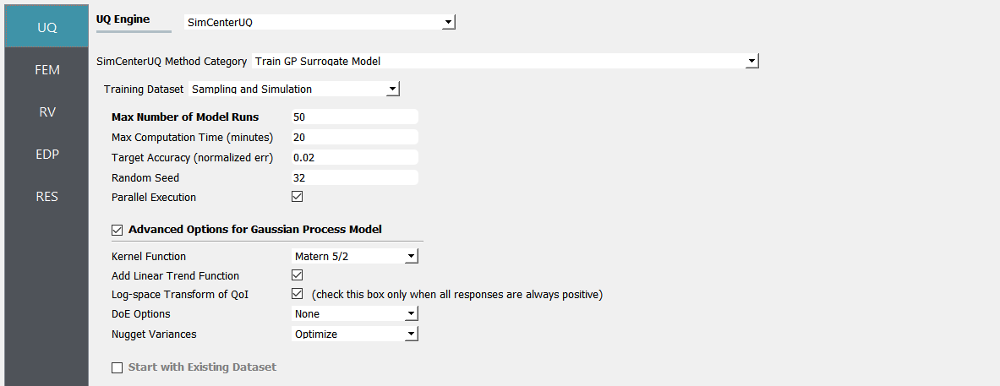

2. Select the **FEM** tab from the input panel. Choose the engine to be OpenSeesPy. For the main script copy the path name to ``ShearBuilding_NL.tcl`` or click choose and navigate to the file. For the postprocess script field, repeat the same procedure for the ``postprocess.tcl`` script.

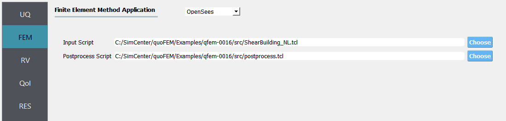

3. Select the **RV** tab from the input panel. This should be pre-populated with 5 random variables by detecting ``pset`` command in ``ShearBuilding_NL.tcl``. For each variable, the distribution option is fixed to be **Uniform**, and only the lower and upper bounds need to be specified as given in the table.

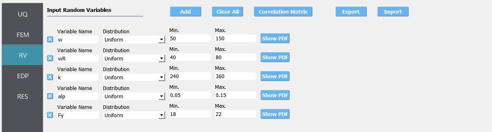

.. note::
When the user needs to manually add random variables with **add** button, eg. when using a custom FEM application, the user should set the distribution to be **Uniform** using the drop-down menu.

4. Select the **QoI** tab. Here enter two output names as ``Node_2_Disp_1_Mean`` and ``Node_2_Disp_1_Std``. Note that Node_2_Disp_1 means x-direction displacement of second story floor. 

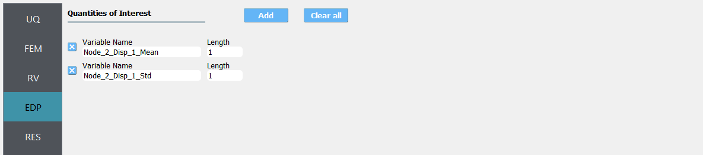

5. Click on the **Run** button. This will cause the back-end application to run SimCenterUQ Engine.

6. When done, the **RES** tab will be selected and the results will be displayed.

* Summary of Results:

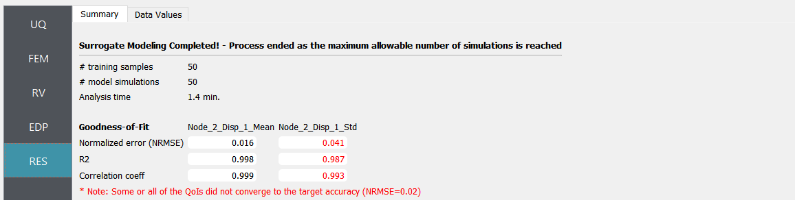

* Leave-one-out cross-validation (LOOCV) predictions:

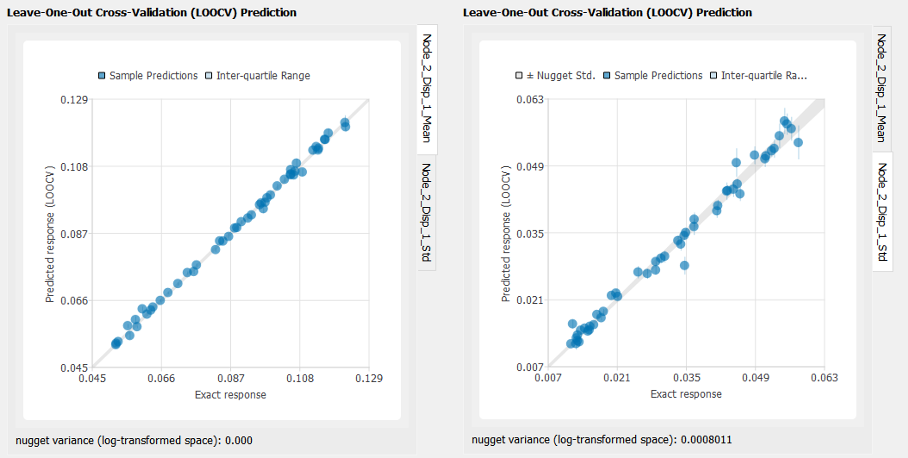

7. Save the surrogate model by clicking ``Save GP Surrogate``

Sensitivity analysis using the Surrogate model
-----------------------------------------------

Once the surrogate model is trained, it can be used for various UQ/optimization applications. Here we perform a sensitivity analysis and compare it with the results from simulation model.

1. The constructed surrogate model can be saved by **Save GP Model** button. Two files and a folder will be saved which are **SurroateGP Info File** (default name: ``SimGpModel.json``), **SurroateGP model file** (default name: ``SimGpModel.pkl``) and **Simulation template directory** which contains the simulation model information (``templatedir_SIM``).

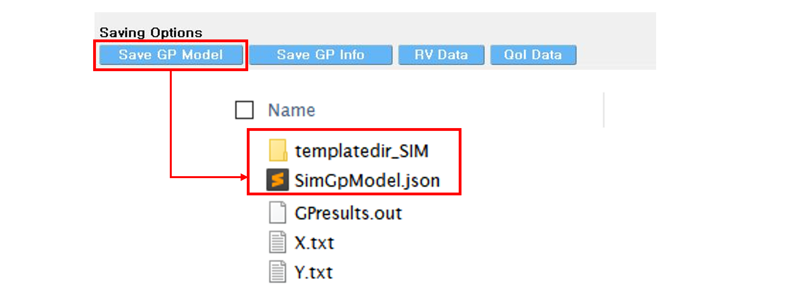

.. note::
   * Do not change the name of ``templatedir_SIM``. **SurrogateGP Info and model** file names may be changed.
   * When location of the files are changed, ``templatedir_SIM`` should be always located in the directory same to the **SurroateGP Info file**.

2. Restart the quoFEM (or press **UQ tab**) and select Dakota sensitivity analysis method.

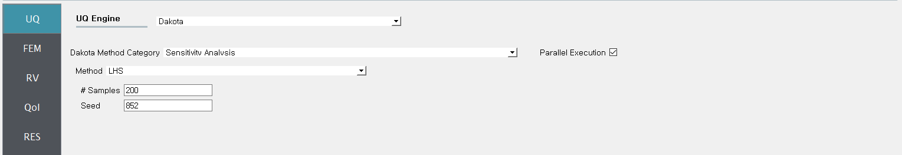

3. Select the **FEM tab**  from the input panel and choose **SurrogateGP** application. For the **SurrogateGP Info field**, copy the path to ``SimGpModel.json`` or click choose and navigate to the file. Similarly, the  **SurroateGP Model field** calls ``SimGpModel.pkl`` file. Once the first file is imported, additional options will be displayed. Here, the user can specify the Maximum Allowable Normalized Variance level. The exceedance percentage is provided to help the user's decision along with the pre-informed accuracy of the surrogate model obtained after the training session. Select continue to use only surrogate model predictions.

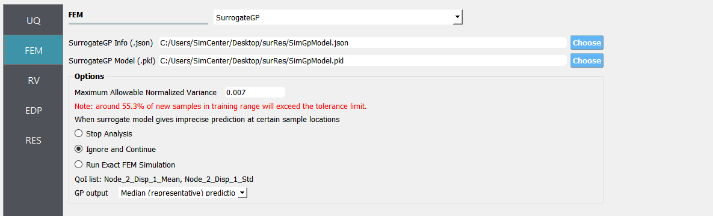

.. note::
	The **Continue** option should be used only when users are familiar with the process and potential issues.

4. Once the SurrogateGP Info field in the **FEM** tab is entered, the **RV tab** is automatically populated. The user can select the distribution and its parameters. This example applied the following distributions.

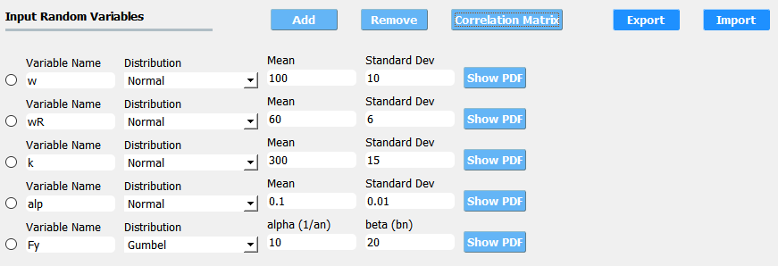

Also correlation between the floor weight and roof weight is assumed to be 0.3.

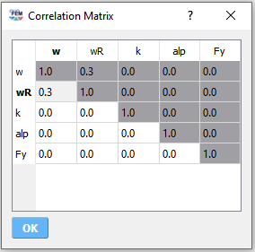

5. Users need to manually fill in the **QoI tab**. Users do not need to include here all the QoIs used for the training, but the users may not add new QoIs or modify the names of existing QoIs. [Tip] List of the trained QoI names can be found and copied in the **FEM tab**.

6. Click on the **Run** button. This will cause the back-end application to launch dakota.

7. When done, the **RES** tab will be selected and the results will be displayed. 

* Surrogate model prediction

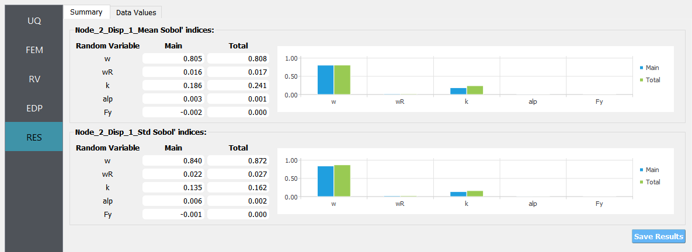

| **Surrogate model training time**: 14.6 min. (number of simulation model runs: 300)
| **Analysis time**: 11.8 min. (number of surrogate model evaluations: 1400)

* Reference simulation model results

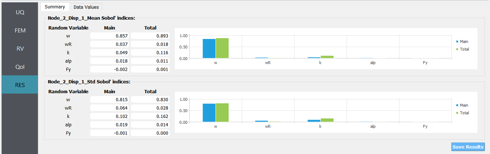

| **Analysis time**: 83.7 min. (number of simulation model runs: 1400)