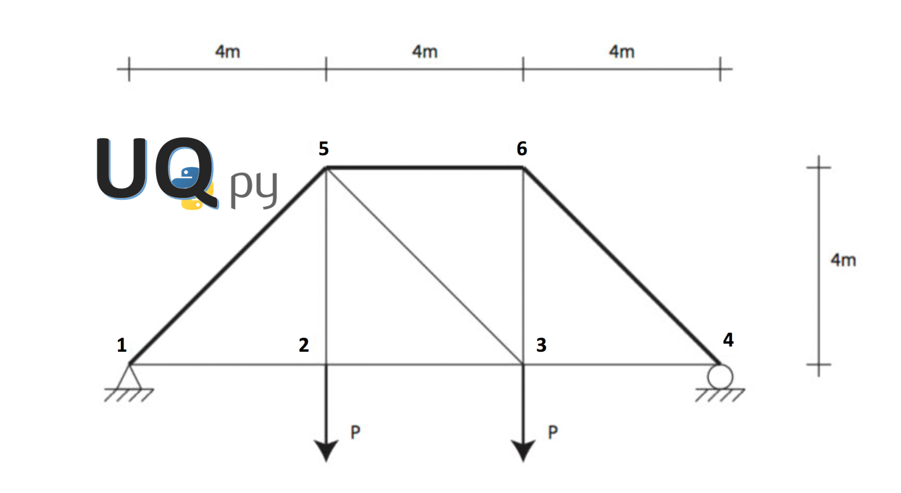
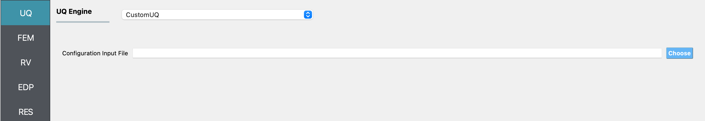
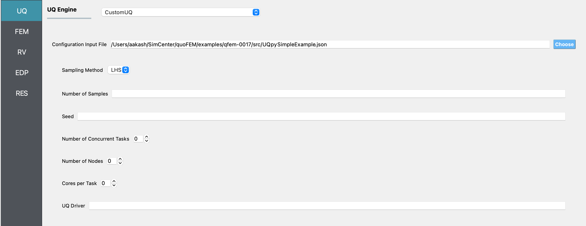
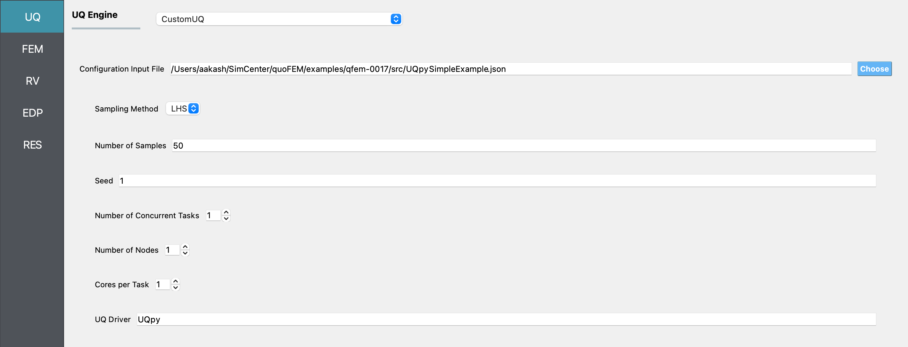
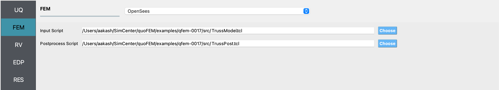
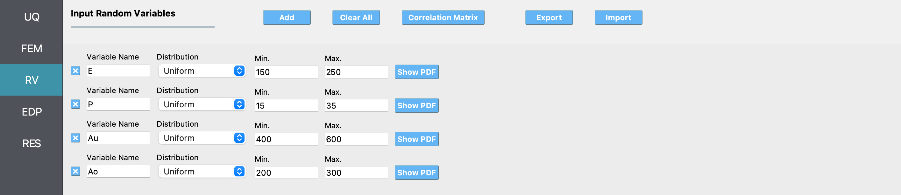
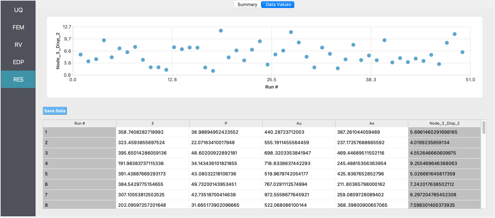

.. _qfem-0017:

Custom UQ for UQpy
=============================================

+----------------+------------------------------------------+
| Problem files  | :github:`Github <Examples/qfem-0017/>`   |
+----------------+------------------------------------------+

This example illustrates how quoFEM can interface a custom UQ engine. A simple forward propagation is conducted using UQpy_, a python package for general uncertainty quantification problems. 

.. _UQpy: https://sites.google.com/site/jhusurg/UQpy

Consider a two-dimensional truss structure that has uncertain properties that all follow uniform distribution:

================================================ ============ =========
Random Variable                                  lower bound  upper bound
================================================ ============ =========
Elastic modulus, E                               150          200
Load, P                                          15           35
Cross sectional area of the upper three bars, Au 400          600
Cross sectional area of the other six bars, Ao   200          300
================================================ ============ =========

The goal of the exercise is to implement UQpy as a **custom UQ engine** and estimate the mean and standard deviation of the vertical displacement at node 3.

.. note::
   The UQpy_ python package is required to be installed to run this example, e.g. pip install UQpy

UQ Workflow
-------------

1. Start the application and the **UQ** Selection will be highlighted. In the panel for the UQ selection, change the UQ Engine to **CustomUQ**. 

Next, provide the configuration input file path.  In the configuration file, users specify the interface for the parameters (type, name, values of each parameters) required for the custom UQ analysis. The provided script will generate 1 combo box to define sample types, 2 line edit fields to define the number of samples and seed, 3 spin boxes to define number of concurrent tasks, nodes, and cores per task, and 1 line edit field to specify the UQ Driver.

.. literalinclude:: src/UQpySimpleExample.json
   :language: json
   :caption: UQpySimpleExample.json

Note that configuration input file specifies the front-end interfaces while the back-end interface should be modified in the backend directory (Refer the :ref:`Configuring CustomUQ Engine <lblCustomUQ>` section for details). As an example, UQpy has been already implemented in the customized backend where users can find at ``{Backend Applications Directory}/applications/performUQ/other``, where the ``{Backend Applications Directory}`` is specified from the file-preference in the menu bar). Once the ``UQpySimpleExample.json`` is called, the following customized user interface will appear in UQ panel.

Let us sample 50 samples by Latin hypercube sampling (LHS). The UQ Driver field must be filled in as **UQpy**, as shown in the following figure.

2. Select the **FEM** tab from the input panel. For the main script copy the path to the ``TrussModel.tcl`` or select choose and navigate to the file. For the post-process script field, repeat the same procedure for the ``TrussPost.tcl script``. (See example :ref:`Two-Dimensional Truss: Sampling, Reliability and Sensitivity <qfem-0001>` for the model details)

3. Select the **RV** tab from the input panel. This should be pre-populated with four random variables with same names as those having ``pset`` in the tcl script. For each variable, from the drop down menu change them to uniform and provide the lower and upper bounds specified for the problem.

.. note::
   Only **uniform distribution** is supported in this preliminary example.

4. Next select the **QoI** tab. Here enter ``Node_3_Disp_2`` for the one variable.

.. figure:: figures/CUS_QoItab.png
   :align: center
   :figclass: align-center

5.  Next click on the **Run** button. This will cause the backend application to launch the CustomUQ engine which will run UQpy.

6.  When done the **RES** panel will be selected and the results will be displayed. The results show the values the mean and standard deviation.

Summary:

* Mean = 5.77619
* Std = 2.4664
* Skewness = 0.456808
* Kurtosis = 2.7146

Data Table:

