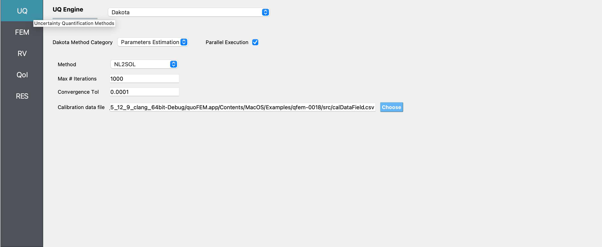
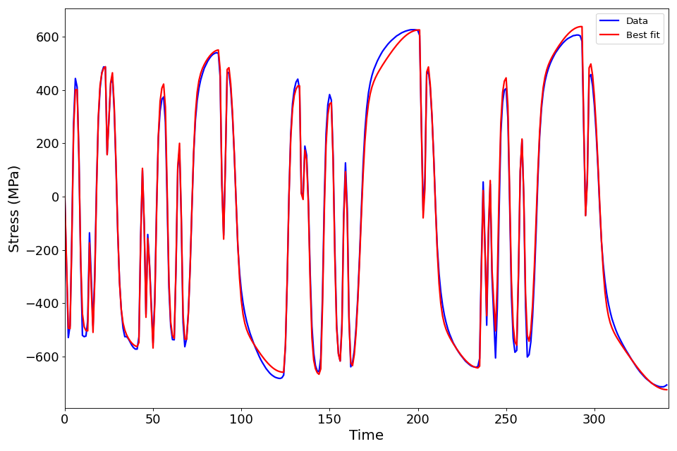

.. _qfem-0018:

Deterministic Calibration of Material Model Parameters
======================================================

+---------------+----------------------------------------------+
| Problem files | :github:`Github <Examples/qfem-0018/>`       |
+---------------+----------------------------------------------+

Outline
-------

In this example, the parameters of the STEEL02 material model in OpenSees
are calibrated using non-linear least squares optimization. Experimental data is
passed in to quoFEM from an external file, and the output is the time-history of
stress.

Problem description
-------------------

The STEEL02 material model in OpenSees can take a total of 11 parameters as input, as described in the `documentation <https://opensees.berkeley.edu/wiki/index.php/Steel02_Material_--_Giuffré-Menegotto-Pinto_Model_with_Isotropic_Strain_Hardening>`_. Of these 11 parameters, the value of 7 of these parameters will be calibrated in this example. 

==========================================================  =========== =========== =============
Variable                                                    lower bound upper bound initial point
==========================================================  =========== =========== =============
Yield strength :math:`f_y`                                  300		    700			500
Initial elastic tangent :math:`E`                           100000	    300000		200000
Strain hardening ratio :math:`b`                            1e-6        1			0.5
Elastic-plastic transition parameter 1 :math:`cR_1`    	    1e-6        2			1
Elastic-plastic transition parameter 2 :math:`cR_2`         1e-6    	2			1
Isotropic hardening parameter for compression :math:`a_1`   1e-6    	0.5			0.25
Isotropic hardening parameter for tension :math:`a_3`       1e-6    	0.5			0.25
==========================================================  =========== =========== =============

The value of the other four parameters are kept fixed at:

==========================================================  =====
Variable                                                    Value
==========================================================  =====
Elastic-plastic transition parameter :math:`R_0`            20
Isotropic hardening parameter for compression :math:`a_2`   1
Isotropic hardening parameter for tension :math:`a_4`       1
Initial stress value :math:`sigInit`                        0
==========================================================  =====

 

In order to calibrate the material model, the stress data measured experimentally is provided in a separate file. The strain history corresponding to the experiment where the stress is measured is shown in the figure below:

.. figure:: figures/qf-0018-StrainHistory.png
   :align: center
   :alt: A line graph displaying a blue line with a dotted pattern, illustrating fluctuations in strain over time. The x-axis is labeled "Timestep" and ranges from 0 to 300, while the y-axis is labeled "Strain" and ranges from 0.02 to -0.05. The graph exhibits a periodic pattern with peaks and troughs appearing at regular intervals.
   :figclass: align-center

Files required
--------------
.. warning::
   Do not place the files in your root, downloads, or desktop folder as when the application runs it will copy the contents on the directories and subdirectories containing these files multiple times. If you are like us, your root, Downloads or Documents folders contains a lot of files.
The exercise requires two script files. The user should download these file and place it in a **new** folder. 

1. :qfem-0018:`matTestAllParams.tcl <src/matTestAllParams.tcl>` - This is an OpenSees script written in tcl which builds a single element FE model and conducts the analysis. This script creates a file called ``results.out`` when it runs. This file contains the stress response corresponding to the strain history input to the material model. 
   

2. :qfem-0018:`calDataField.csv <src/calDataField.csv>` - This is csv file that contains the stress data. There is one row of data, which implies that the data is obtained from one experiment. If additinal data is available from multiple experiments, then the data from each experiment must be passed in on each line.

UQ workflow
-----------

The steps involved are as follows:

1. Start the application and the **UQ** panel will be highlighted. In the **UQ Engine** drop down menu, select the **Dakota** engine. In the **Dakota Method Category** drop down menu the **Parameters Estimation** option must be selected. In the **Calibration data file** field, enter the path to the file which containes the calibration data, or select **Choose** and navigate to the file. Enter the maximum number of iterations, the convergence tolerance, and the scaling factors, if any in the corresponding fields.

gory "Parameters Estimation," with options for "Method," "Max # Iterations," "Convergence Tol," and "Calibration data file" filled out with specific values and a file path. There are also checkboxes for "Parallel Execution" and other options, with a blue download or settings icon at the top right. On the left side, a vertical menu includes options such as "FEM," "RV," "QoI," and "RES." No personal or sensitive information is shown.
   :figclass: align-center

2. Next select the **FEM** panel from the input panel selection. This will default to the **OpenSees** FEM engine. In the **Input Script** field, enter the path to the ``model.tcl`` file or select **Choose** and navigate to the file. 

.. figure:: figures/qf-0018-FEM.png
   :align: center
   :alt: Screenshot of a software interface labeled "Finite Element Method Application" with a menu bar on the left with options for UQ, FEM, RV, QoI, and RES highlighted. The main window shows fields for "Input Script" and "Postprocess Script" with file paths entered and 'Choose' buttons next to each field. The 'OpenSees' option is selected from a drop-down menu in the upper right corner.
   :figclass: align-center

3. Next select the **RV** tab from the input panel. This panel should be pre-populated with seven random variables. If not, press the **Add** button to create new fields to define the input random variables. Enter the same variable names, as required in the model script. 

For each variable, specify the lower bounds, upper bounds and initial point from where the optimization will be started, as shown in the figure below. 

.. figure:: figures/qf-0018-RV.png
   :align: center
   :alt: Screenshot of a software interface with a section titled "Input Random Variables". It includes a list of variables (fy, E, b, cR1, cR2, a1, a3) with their respective distributions (ContinuousDesign) and three columns specifying their Lower Bound, Upper Bound, and Initial Point. The variables have numerical bounds set with input fields for modifications. On the top right of the interface, buttons labeled 'Add', 'Remove', 'Correlation Matrix', 'Export', and 'Import' are visible. The left side of the interface has a vertical menu with options FEM, RV, QoI, and RES highlighted in blue.
   :figclass: align-center

4. In the **QoI** panel denote that the variable named ``stress`` is not a scalar response variable, but has a length of 342.

.. figure:: figures/qf-0018-QOI.png
   :align: center
   :alt: Screenshot of a user interface from a software application with a navigation menu on the left side showing items labeled as "UQ," "FEM," "RV," "QoI," and "RES," with "QoI" highlighted in blue. The main content area titled "Quantities of Interest" contains a table with a header row listing "Variable Name" and "Length," with one entry below labeled "stress" and a corresponding length value "342." Two buttons labeled "Add" and "Remove" are visible above the table. The overall color scheme is shades of blue and grey.
   :figclass: align-center

5. Next click on the **Run** button. This will cause the backend application to launch the **Dakota** engine, which performs calibration using the selected algorithm in the **UQ** panel. When done the **RES** tab will be selected and the results will be displayed as shown in the figure below. The results show a summary of the best-fit values of each parameters.

.. figure:: figures/qf-0018-RES1.png
   :align: center
   :alt: Screenshot of a software interface with a list of parameters and their respective 'Best Parameter' values. The categories listed on the left side are 'UQ', 'FEM', 'RV', 'QoI', with 'RES' highlighted in blue. Each category has sub-items listed as 'Name' with corresponding numerical values on the right. Tabs labeled 'Summary', 'General', and 'Data Values' are visible across the top of the interface.
   :figclass: align-center

If the user selects the **Data Values** tab in the results panel, they will be presented with both a graphical plot and a tabular listing of the data.

.. figure:: figures/qf-0018-RES2.png
   :align: center
   :alt: Screenshot of a computer interface with a scatter plot graph and a data table. The graph, labeled "Stress vs. Run #," displays a series of blue dots representing stress values across different runs plotted on the Y-axis, with run numbers on the X-axis. The data table below the graph contains columns with headers such as "Run #," "fy," "E," "b," "cR1," "cR2," "a1," "a3," "stress_1," "stress_2," "stress_3," "stress_4," and other parameters, with numerical values listed for each column corresponding to eight runs. There are tabs labeled "Summary," "General," and "Data Values" above the graph, indicating different views or data categories within the software. The sidebar on the left includes buttons for "UQ," "FEM," "RV," "QoI," and a selected "RES" tab, suggesting different modules or sections of the application. The interface indicates functionalities like saving data with a "Save Data" button visible.
   :figclass: align-center

The best-fit obtained is shown in the figures below:

.
   :figclass: align-center

.. figure:: figures/qf-0018-DeterministicCalibrationResults.png
   :align: center
   :alt: A graph displaying a cyclic stress-strain curve with stress in megapascals (MPa) on the y-axis ranging from -600 to 600 MPa and strain on the x-axis ranging from -0.05 to 0.02. There are multiple overlapping loops in the graph indicating the material's response to repeated loading and unloading cycles. The graph features two sets of data shown in dashed blue lines and solid red lines with markers, indicating possibly two different material conditions or testing sets.
   :figclass: align-center
   