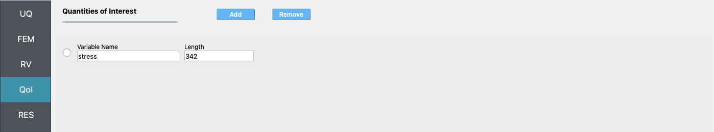

Bayesian Calibration of Material Model Parameters
=================================================

+---------------+----------------------------------------------+
| Problem files | :github:`Github <Examples/qfem-0019/>`       |
+---------------+----------------------------------------------+

Outline
-------

In this example, the parameters of the STEEL02 material model in OpenSees
are calibrated using Bayesian inference. Experimental data is
passed in to quoFEM from an external file, and the output is the time-history of
stress - a non-scalar response quantity.

Problem description
-------------------

The STEEL02 material model in OpenSees can take a total of 11 parameters as input, as described in the OpenSees documentation, linked here_. Of these 11 parameters, the value of 7 of these parameters will be calibrated in this example. 

==========================================================  =========== ===========
Variable                                                    lower bound upper bound
==========================================================  =========== ===========
Yield strength :math:`f_y`                                  300		    700
Initial elastic tangent :math:`E`                           100000	    300000
Strain hardening ratio :math:`b`                            1e-6        1
Elastic-plastic transition parameter 1 :math:`cR_1`    	    1e-6        2
Elastic-plastic transition parameter 2 :math:`cR_2`         1e-6    	2
Isotropic hardening parameter for compression :math:`a_1`   1e-6    	0.5
Isotropic hardening parameter for tension :math:`a_3`       1e-6    	0.5
==========================================================  =========== ===========

The value of the other four parameters are kept fixed at:

==========================================================  =========== 
Variable                                                    Value
==========================================================  =========== 
Elastic-plastic transition parameter :math:`R_0`            20
Isotropic hardening parameter for compression :math:`a_2`   1
Isotropic hardening parameter for tension :math:`a_4`       1
Initial stress value :math:`sigInit`                        0
==========================================================  =========== 

.. _here: https://opensees.berkeley.edu/wiki/index.php/Steel02_Material_--_Giuffré-Menegotto-Pinto_Model_with_Isotropic_Strain_Hardening
 

In order to calibrate the material model, the stress data measured experimentally is provided in a separate file. The strain history corresponding to the experiment where the stress is measured is shown in the figure below:

.. figure:: figures/StrainHistory.png
   :align: center
   :figclass: align-center

.. For modelling purposes, the four columns are assumed fixed at the base and the beams connecting
.. them are assumed to be rigid. From eigenvalue analysis, the first two vibration periods of the
.. structure are determined to be :math:`0.19 \ \mathrm{sec}` and :math:`0.09 \ \mathrm{sec}`.
.. The first eigenvalue :math:`\lambda_{1}` is :math:`1084.06 \ \mathrm{rad/{s^2}}` and the second
.. component of the first eigenvector :math:`\phi_{12}` is :math:`1.41 \ \mathrm{inch}`, where the
.. eigenvector is normalized so that the first component :math:`\phi_{11} = 1`.
.. Using these properties, the following set of mode shapes and frequencies
.. are generated by applying random perturbations to the analytic modal
.. properties in order to simulate field data that might be obtained using
.. a method for structural system identification:

.. .. math::
..
..    \begin{array}{l}
..    \lambda_{1}^{(1)}=1025.21, \quad &\lambda_{1}^{(2)}=1138.11, \quad &\lambda_{1}^{(3)}=1099.39, \quad &\lambda_{1}^{(4)}=1002.41, \quad &\lambda_{1}^{(5)}=1052.69 \\
..    \phi_{12}^{(1)}=1.53, \quad &\phi_{12}^{(2)}=1.24, \quad &\phi_{12}^{(3)}=1.38, \quad &\phi_{12}^{(4)}=1.50, \quad &\phi_{12}^{(5)}=1.35
..    \end{array}

.. 
.. In this example, it is assumed that the story stiffnesses for the first and second story (``k1`` and ``k2`` respectively) are unknown. The goal is to use the simulated data of eigenvalue and eigenvector measurements to obtain the posterior probability distribution of the story stiffnesses by Bayesian calibration. We will employ the Transitional Markov Chain Monte Carlo (TMCMC) algorithm, which is also known as Sequential Monte Carlo, to sample from the posterior joint probability distribution of ``k1`` and ``k2``.
..
.. We define the following prior probability distributions for the unknown quantities of interest:
..
.. 1. First story stiffness, ``k1``: **Uniform**
..    distribution with a lower bound :math:`(L_B)` of :math:`766.89 \ \mathrm{kips/in}`, and an upper bound :math:`(U_B)`
..    of :math:`2108.94 \ \mathrm{kips/in}`,
..
.. 2. Second story stiffness, ``k2``: **Uniform**
..    distribution with a lower bound :math:`(L_B)` of :math:`383.44 \ \mathrm{kips/in}`, and an upper bound :math:`(U_B)`
..    of :math:`1150.33 \ \mathrm{kips/in}`.
..
..
.. A Gaussian likelihood model is employed. This is done by assuming that the error between the finite element prediction of the modal properties and the simulated measurement data follows a bivariate Normal/Gaussian distribution with independent components. Here, the standard deviation of the error is assumed to be known, and equal to :math:`5\%` of the true eigenvalue and eigenvector values. The components of the error vector are assumed to be statistically independent and identically distributed.

The best-fit obtained is shown in the figures below:

.. figure:: figures/StressResults.png
   :align: center
   
   .. :figclass: align-center

.. figure:: figures/DeterministicCalibrationResults.png
   :align: center
   
   .. :figclass: align-center
   

Files required
--------------
The exercise requires two script files. The user should download these file and place it in a *new* folder. 

1. :qfem-0018:`matTestAllParams.tcl <src/matTestAllParams.tcl>` - This is an OpenSees script written in tcl which builds a single element FE model and conducts the analysis. This script creates a file called ``results.out`` when it runs. This file contains the stress response corresponding to the strain history input to the material model. 

2. :qfem-0018:`calDataField.csv <src/calDataField.csv>` - This is csv file that contains the stress data. There is one row of data, which implies that the data is obtained from one experiment. If additinal data is available from multiple experiments, then the data from each experiment must be passed in on each line.

Solving the problem using quoFEM
--------------------------------

The steps involved are as follows:

1. Start the application and the **UQ** panel will be highlighted. In the **UQ Engine** drop down menu, select the **Dakota** engine. In the **Dakota Method Category** drop down menu the **Inverse Problem** option must be selected. In the **Calibration data file** field, enter the path to the file which containes the calibration data, or select **Choose** and navigate to the file. Enter the maximum number of iterations, the convergence tolerance, and the scaling factors, if any in the corresponding fields.

.. figure:: figures/UQ.png
   :align: center
   :figclass: align-center

2. Next select the **FEM** panel from the input panel selection. This will default to the **OpenSees** FEM engine. In the **Input Script** field, enter the path to the ``model.tcl`` file or select **Choose** and navigate to the file. 

.. figure:: figures/FEM.png
   :align: center
   :figclass: align-center

3. Next select the **RV** tab from the input panel. This panel should be pre-populated with seven random variables. If not, press the **Add** button to create new fields to define the input random variables. Enter the same variable names, as required in the model script. 

For each variable, specify the lower bounds, upper bounds and initial point from where the optimization will be started, as shown in the figure below. 

.. figure:: figures/RV.png
   :align: center
   :figclass: align-center

4. In the **QoI** panel denote that the variable named ``stress`` is not a scalar response variable, but has a length of 342.

5. Next click on the **Run** button. This will cause the backend application to launch the **Dakota** engine, which performs calibration using the selected algorithm in the **UQ** panel. When done the **RES** tab will be selected and the results will be displayed as shown in the figure below. The results show a summary of the best-fit values of each parameters.

.. figure:: figures/RES1.png
   :align: center
   :figclass: align-center

If the user selects the **Data Values** tab in the results panel, they will be presented with both a graphical plot and a tabular listing of the data.

.. figure:: figures/RES2.png
   :align: center
   :figclass: align-center

.. Various views of the graphical display can be obtained by left and right clicking in the columns of the tabular data.
..
.. .. figure:: figures/quo-14-RES-DataValues2.png
..    :align: center
..    :figclass: align-center
..
..
.. If a singular column of the tabular data is pressed with both right and left buttons a histogram and CDF will be displayed, as shown in figure below.
..
.. .. figure:: ../qfem-0014/figures/quo-14-RES-DataValues3.png
..    :align: center
..    :figclass: align-center
..
.. .. figure:: ../qfem-0014/figures/quo-14-RES-DataValues4.png
..    :align: center
..    :figclass: align-center
