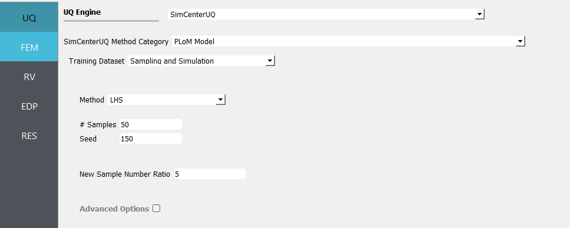
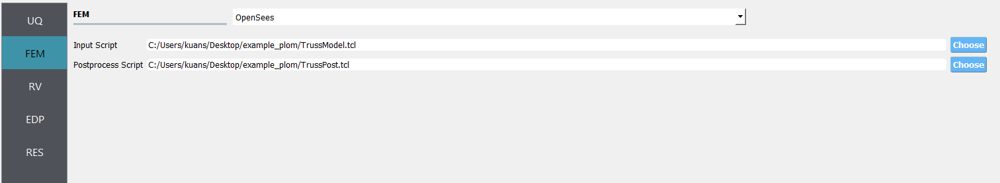
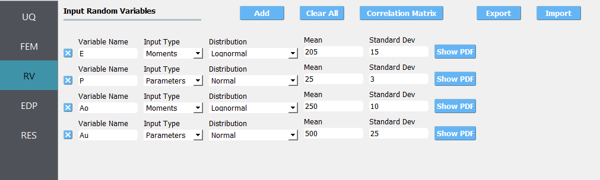
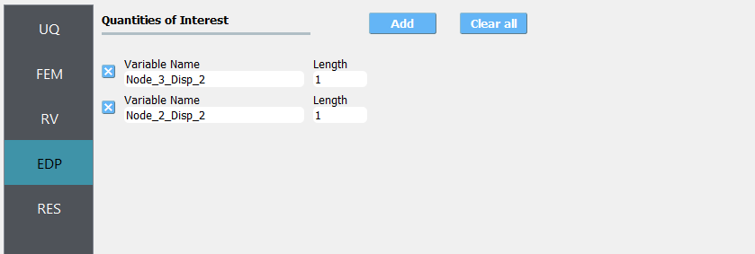
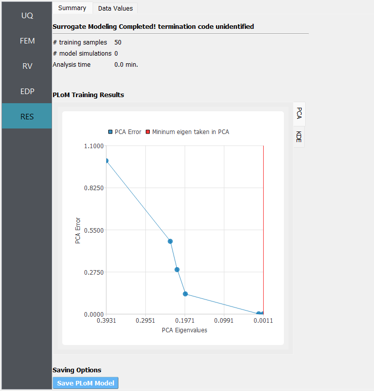
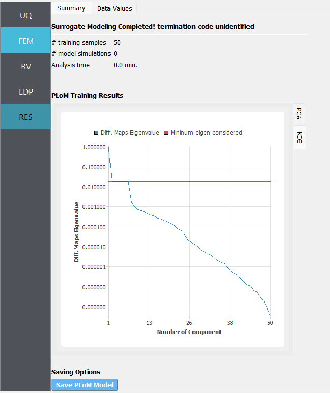
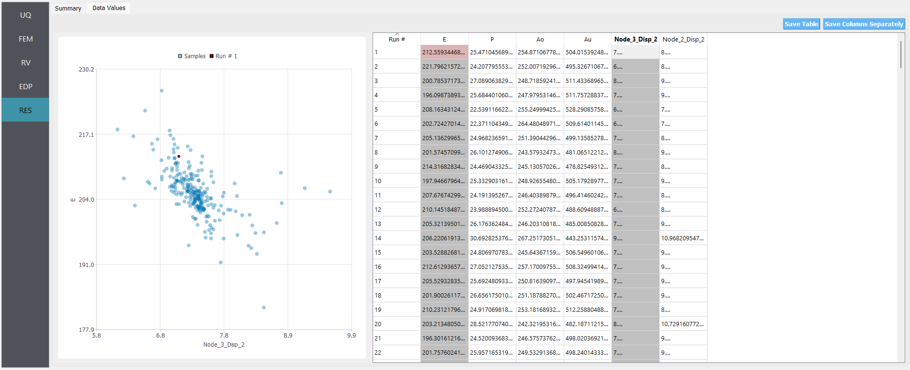
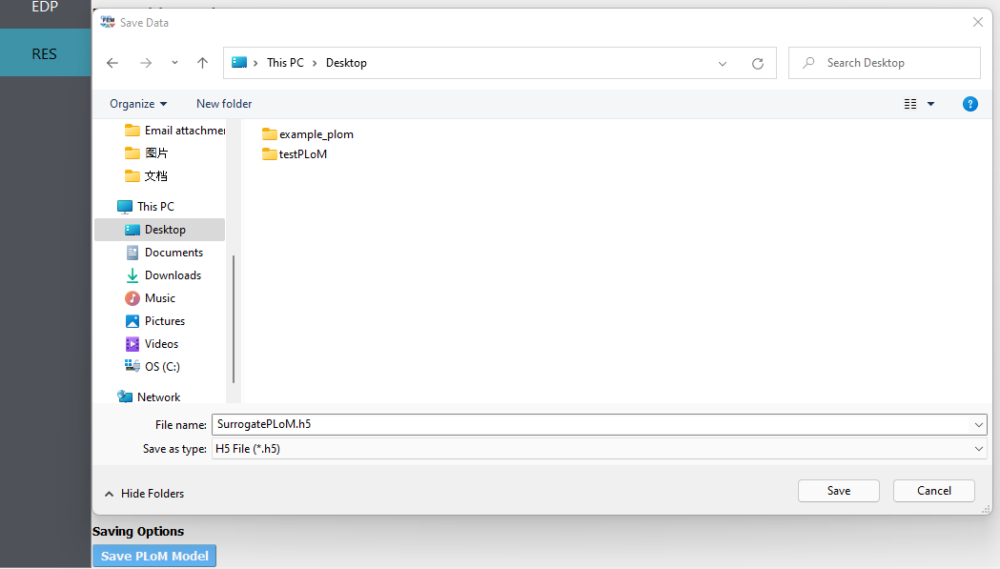

.. _qfem-0022:

Two-Dimensional Truss: PLoM Modeling and Simulation
=====================================================

+----------------+------------------------------------------+
| Problem files  | :github:`Download <Examples/qfem-0022/>`  |
+----------------+------------------------------------------+

About PLoM
^^^^^^^^^^^^

**PLoM** is an open source python package that implements the algorithm of **Probabilistic 
Learning on Manifolds** with and without constraints ([SoizeGhanem2016]_, [SoizeGhanem2020]_) 
for *generating realizations of a random vector in a finite Euclidean space that are 
statistically consistent with a given dataset of that vector*. 

PLoM functionality in SimCenter tools is built upon `PLoM <https://github.com/sanjayg0/PLoM>`_ 
package (available under MIT license), an opensource python package for Probabilistic 
Learning on Manifolds [ZhongGualGovindjee2021]_. The package mainly consists of python 
modules and invokes a dynamic library for more efficiently computing the gradient of 
the potential, and can be imported and run on Linux, macOS, and Windows platform. 

Problem Statement
^^^^^^^^^^^^^^^^^^^

Consider the problem simulating response of a two-dimensional truss structure with uncertain material properties shown in the following figure.
The goal of the exercise is to demonstrate the use of ``PLoM model`` method under ``SimCenterUQ``.

.. figure:: figures/truss.png
   :align: center
   :alt: A technical drawing represents a structural analysis model of a truss with node labels 1 through 6 and element labels 1 through 9. The truss is composed of straight members connected at their ends, forming a series of triangles to achieve stability. There are two applied vertical loads labeled 'P' at nodes 2 and 3. Each member of the truss is annotated with a length of '4m', indicating equal member lengths. Above the truss, the OpenSees logo, which is associated with the Open System for Earthquake Engineering Simulation software, is visible.
   :width: 600

1. Elastic modulus(``E``): mean :math:`\mu_E=205 kN/{mm^2}` and standard deviation :math:`\sigma_E =15 kN/{mm^2}` (COV = 7.3%)
2. Load (``P``): mean :math:`\mu_P =25 kN` and a standard deviation of :math:`\sigma_P = 3 kN`, (COV = 12%).
3. Cross sectional area for the upper three bars (``Au``): mean :math:`\mu_{Au} = 500 mm^2`, and a standard deviation of :math:`\sigma_{Au} = 25mm^2`  (COV = 5%)
4. Cross sectional area for the other six bars (``Ao``): mean :math:`\mu_{Ao} = 250mm^2`, and :math:`\sigma_{Ao} = 10mm^2` (COV = 4%)

The exercise requires two files: 

1. :qfem-0022:`TrussTemplate.tcl <src/TrussModel.tcl>`

.. literalinclude:: src/TrussModel.tcl
   :language: tcl

2. :qfem-0001:`TrussPost.tcl </src/TrussPost.tcl>`. 

The ``TrussPost.tcl`` script shown below will accept as input any of the 6 nodes in the domain and for each of the two dof directions.

.. literalinclude:: src/TrussPost.tcl
   :language: tcl

PLoM Modeling
^^^^^^^^^^^^^^^^^

1. Start the application and the UQ Selection will be highlighted. In the panel for the UQ selection, select ``SimCenterUQ`` as the UQ engine. 
   Select ``PLoM Model`` for the UQ method, and use ``Sampling and Simulation`` as the Training Dataset.
   For sampling method, select ``LHS`` with 50 initial simulations for generating training data (with a random seed specified).
   For the new sample number ratio, input 5 by which 250 new realizations will be created from the trained PLoM model.

tings for "UQ Engine" with "SimCenterUQ" selected, "SimCenterUQ Method Category" with "PLoM Model" selected, a drop-down for "Training Dataset" set to "Sampling and Simulation," settings for "Method" with "LHS" (Latin Hypercube Sampling) selected, "# Samples" set to 50, and a "Seed" of 150. There's also an entry for "New Sample Number Ratio" with a value of 5, and a checkbox for "Advanced Options" that is unchecked. The interface has a clean, modern design with a monochromatic color scheme.
   :figclass: align-center

2. Next select the **FEM** panel from the input panel. This will default in the ``OpenSees`` engine. For the main script copy the path name to ``TrussModel.tcl`` or select **choose** and navigate to the file. For the **post-process script** field, repeat the same procedure for the ``TrussPost.tcl`` script.

nd 'Postprocess Script'. It includes a field labeled 'OpenSees', and 'Choose' buttons next to the file paths. The design is minimalist with a color scheme of blues, whites, and greys.
   :figclass: align-center

3. Next select the **RV** panel from the input panel. This should be pre-populated with four random variables with same names as those having ``pset`` in the tcl script. For each variable, from the drop down menu change them from having a constant distribution to a normal one and then provide the means and standard deviations specified for the problem.

fferent types of distributions (Lognormal, Normal) and parameters for mean and standard deviation, with an option to 'Show PDF' for each. On the upper right side, there are buttons for 'Add', 'Clear All', 'Correlation Matrix', 'Export', and 'Import'. To the left of the interface, there are four vertical tabs labeled UQ, FEM, RV, EDP, and RES, with RV (Random Variables) currently selected.
   :figclass: align-center

4. Next select the **EDP** tab. Here two response variables ``Node_2_Disp_2`` and ``Node_3_Disp_2`` are defined, which should be consistent with the post-process script. 

n blue.
   :figclass: align-center

.. note::   

   The user can add extra EDP by selecting add and then providing additional names. As seen from the post-process script any of the 6 nodes may be specified and for any node either the 1 or 2 DOF direction.

5. Next click on the **Run** button. This will cause the backend application to launch the job. When done the **RES** panel will be selected and the results will be displayed. 
   The landing page of **RES** will show summarize the training information including training sampling number along with two PLoM model trucation plots for PCA and KDE.

a line plot depicting PCA Error (Principal Component Analysis) versus PCA Eigenvalues, where the line shows a decreasing trend in error with lower eigenvalues. Points on the graph indicate both the PCA Error and the Minimum eigen taken in PCA. A red vertical line marks the boundary on the right side of the graph. There is a 'Save PLOM Model' option below the graph.
   :figclass: align-center

   PCA representation error versus the PCA eigenvalues overlapped by the truncating PCA eigenvalue used in training

owed by a graph titled "PLoM Training Results". The graph plots "Diff. Maps Eigenvalue" against the "Number of Component" on a logarithmic scale, showing a rapidly decreasing curve starting at 1.0 eigenvalue for the first component and approaching zero by the 50th component. The graph includes a horizontal line indicating the minimum eigen considered. At the bottom of the image, a button is visible labeled "Save PLoM Model", indicating an option to save the model results.
   :figclass: align-center

   Diffusion map eigenvalue by components overlapped by the truncating eigenvalue used in training

If the user selects the **Data** tab in the results panel, they will be presented with both a graphical plot and a tabular listing of the data.
Various views of the graphical display can be obtained by left and right clicking in the columns of the tabular data. If a singular column of 
the tabular data is pressed with both right and left buttons a frequency and CDF will be displayed, as shown in figure below.

of the image shows options such as UQ, FEM, RV, EDP, and RES with the last option highlighted. The table on the right side lists columns labeled Run #, E, P, Ao, Au, Node_3_Disp_2, Node_2_Disp_2, and has multiple rows of numerical data. Two buttons labeled "Save Table" and "Save Columns Separately" are located at the top of the data table section.
   :figclass: align-center

The PLoM model can be saved and be loaded back for future use. The ``Save PLoM Model`` button at the bottom of Summary 
page would bring up a dialogue window for saving the model file to a user-defined directory.

.. [SoizeGhanem2016]
    Soize, C., & Ghanem, R. (2016). Data-driven probability concentration and sampling on manifold. Journal of Computational Physics, 321, 242-258.

.. [SoizeGhanem2020]
    Soize, C., & Ghanem, R. (2020). Physics-constrained non-Gaussian probabilistic learning on manifolds. International Journal for Numerical Methods in Engineering, 121(1), 110-145.

.. [ZhongGualGovindjee2021] 
    Zhong, K., Gual, J., and Govindjee, S., PLoM python package v1.0, https://github.com/sanjayg0/PLoM (2021).
