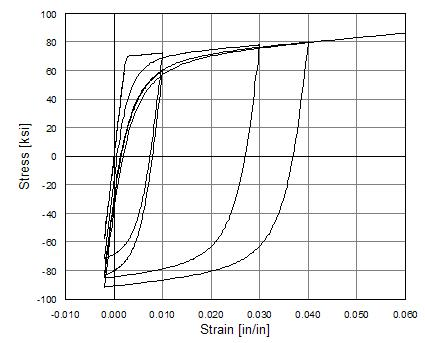
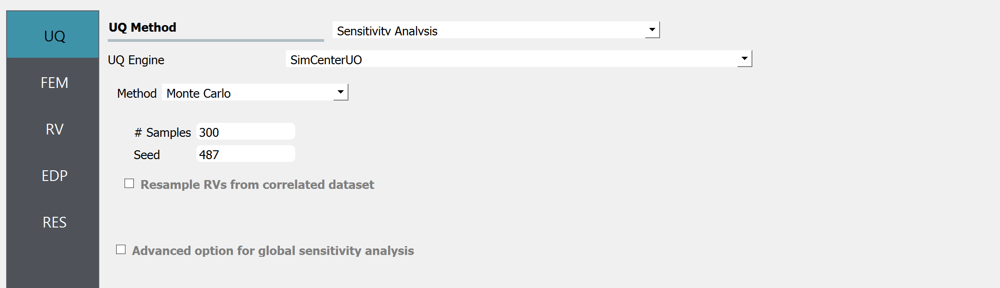
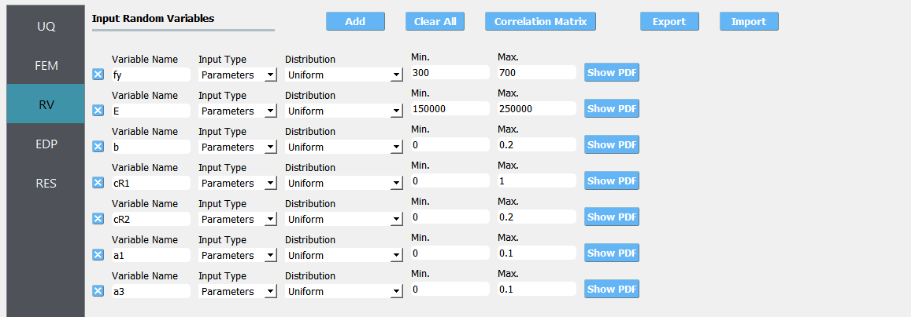
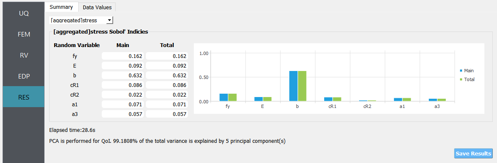
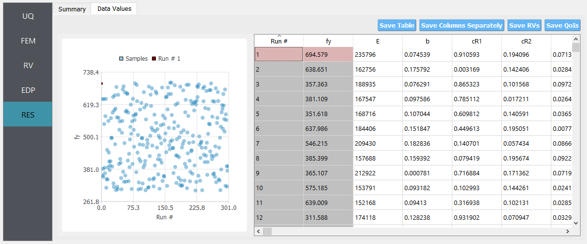
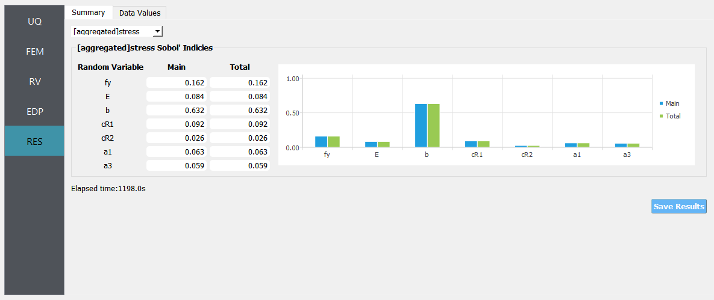

.. _qfem-0023:

Global Sensitivity Analysis for Field QoI
=================================================

+---------------+----------------------------------------------+
| Problem files | :github:`Github <Examples/qfem-0023/>`       |
+---------------+----------------------------------------------+

Outline
-------
In this example, we investigate how much each parameter affects multiple outputs of a model. In particular, influence of different martial model parameters to the resulting stress time history under cyclic load setting will be compared via global sensitivity analysis. To gain efficiency dealing with such high-dimensional outputs, 'principal component analysis and probability model-based global sensitivity analysis (PCA-PSA)' method is used in the analysis.

Video Resources 
------------------
Global Senstivity Analysis for Multiple outputs?  (from 7:24 to 20:15)

.. raw:: html

   

      <iframe src="https://www.youtube.com/embed/Z0BqspO7yuE?start=444" width="560" height="315" frameborder="5" allowfullscreen="allowfullscreen"></iframe>
   

 
.. raw:: html

   
 Click to replay the video from <a href="javascript:window.location.reload(true);">7:24</a>. Please note there were minor changes in the user interface since it is recorded.

Problem description
-------------------

.. _figSteel02:

   
   Steel02 Material -- Hysteretic Behavior of Model with Isotropic Hardening in Compression

Consider STEEL02 material model in OpenSees that describes cyclic stress-strain response of the steel reinforcing bar in finite element simulations. The STEEL02 material model in OpenSees can take up to 11 parameters as input, as described in the `documentation <https://opensees.berkeley.edu/wiki/index.php/Steel02_Material_--_Giuffré-Menegotto-Pinto_Model_with_Isotropic_Strain_Hardening>`_. Of these 11 parameters, 7 parameters shown in `Table 1`_ will be considered.

.. _Table 1:

Table 1: Parameters of the STEEL02 material model

==========================================================  =========== ===========
Variable                                                    lower bound upper bound
==========================================================  =========== ===========
Yield strength :math:`f_y`                                  300		    700
Initial elastic tangent :math:`E`                           150000	    250000
Strain hardening ratio :math:`b`                            0	        0.2
Elastic-plastic transition parameter 1 :math:`cR_1`    	    0	        1
Elastic-plastic transition parameter 2 :math:`cR_2`         0	    	0.2
Isotropic hardening parameter for compression :math:`a_1`   0	    	0.1
Isotropic hardening parameter for tension :math:`a_3`       0		   	0.1
==========================================================  =========== ===========
	 

The other four parameters are kept fixed value at:

==========================================================  =========== 
Variable                                                    Value
==========================================================  =========== 
Elastic-plastic transition parameter :math:`R_0`            20
Isotropic hardening parameter for compression :math:`a_2`   1
Isotropic hardening parameter for tension :math:`a_4`       1
Initial stress value :math:`\sigma_{init}`                        0
==========================================================  =========== 
 
Files required
--------------
The exercise requires one main script file and one supplementary file. The user should download these files and place them in a **NEW** folder. 

.. warning::
   Do NOT place the files in your root, downloads, or desktop folder as when the application runs it will copy the contents on the directories and subdirectories containing these files multiple times. If you are like us, your root, Downloads or Documents folders contains a lot of files.

1. :qfem-0023:`matTestAllParamsReadStrain.tcl <src/matTestAllParamsReadStrain.tcl>` - This is an OpenSees script written in tcl which simulates a material test and writes the stress response (in a file called ``results.out``) when subjected to the chosen strain history, for a given value of the parameters of the material model. Note that the random variables are using ``pset`` command while the other deterministic variables are defined by ``set`` command. 

2. :qfem-0023:`stress.1.coords <src/stress.1.coords>` - This file contains the cyclic strain history that is used as input during the finite element simulation of the material response. The strain values stored in this file are read in by the tcl script performing the OpenSees analysis. **Place this file to the same directory as** :qfem-0023:`matTestAllParamsReadStrain.tcl <src/matTestAllParamsReadStrain.tcl>` **such that this file is automatically copied to the working directory of quoFEM.** Since quoFEM copies all the files in the directory, it does not require to explicitly specify the supplementary files (other than the main analysis script) individually.

.. note::
   Since the tcl script creates a ``results.out`` file when it runs, no postprocessing script is needed. 

.. _figExperimentalDataSteelCouponStrain:

.. figure:: figures/qf-0023-StrainHistory.png
   :align: center
   :alt: Image showing error in description
   :width: 400
   :figclass: align-center
   
   Strain history in 'stress.1.coords'.

UQ workflow
-----------
.. note::
	Selecting the ``Global Sensitivity Analysis for Field QoI`` example in the quoFEM Examples menu will autopopulate all the input fields required to run this example. 
	The procedure outlined below demonstrates how to manually set up this problem in quoFEM.

The steps involved are as follows:

1. Start the application and the **UQ** panel will be highlighted. In the **UQ Engine** drop down menu, select the **SimCenterUQ** engine. In the **Method** select **Sensitivity Analysis** option. Enter the values in this panel as shown in the figure below. 

If the total number of QoI components exceeds 15, quoFEM will automatically run 'principal component analysis and probability model-based sensitivity analysis (PCA-PSA)' [Jung2023]_ to gain efficiency.
Because this example have 342 QoI components representing stress values of discretized time series, PCA will be performed for the QoI vector by default to gain efficiency.

2. Next select the **FEM** panel from the input panel selection. This will default to the **OpenSees** FEM engine. In the **Input Script** field, enter the path to the ``matTestAllParamsReadStrain.tcl`` file or select **Choose** and navigate to the file. 

.. figure:: figures/qf-0023-FEM.png
   :align: center
   :alt: Image showing error in description
   :figclass: align-center

.. note::
   Since the tcl script creates a ``results.out`` file when it runs, no postprocessing script is needed. 

3. Select the **RV** tab from the input panel. This panel should be pre-populated with seven random variables. If not, press the **Add** button to create new fields to define the input random variables. Enter the same variable names, as required in the model script. 

For each variable, specify the probability distribution and its parameters, as shown in the figure below. 

.. note::
   The results of sensitivity analysis will depend on the the choice of distribution types and parameters. Higher uncertainty leads to higher influece on the response. 

4. In the **QoI** panel denote that the variable named ``stress`` is not a scalar response variable, but has a length of 342.

.. figure:: figures/qf-0023-QOI.png
   :align: center
   :alt: Image showing error in description
   :figclass: align-center

**Note that the aggregated sensitivity indices will also be provided for the field QoIs. The aggregated sensitivity indices is obtained by weighted sum of the component sensitivity indices, where the weight is proportional to the variance of each QoI component. If multiple of field QoIs are defined, aggregated sensitivity indices will be provided for each of them.**

5. Click on the **Run** button. This will cause the backend application to launch the **SimCenterUQ** engine, which performs Global Sensitivity Analysis. When done, the **RES** tab will be selected and the results will be displayed as shown in the figure below.

The results show the sensitivity indices (Sobol indices) for each QoIs. The results tab first shows the aggregated sensitivity indices for the fields QoIs. Using the drop down menu, the user can also inspect individual sensitivity indices. See `here <../../../../technical_manual/desktop/SimCenterUQTechnical.html>`_ to learn about the difference between the main and total indices. The analysis took around 28.5 seconds and 5 principal components are used to reduce the dimension during the analysis.

If the user selects the **Data Values** tab in the results panel, they will be presented with both a graphical plot and a tabular listing of the data.

Comparison with the results without PCA
--------------------------------------------------
Using the same configuration but without PCA (with ``No`` option selected for 'Perform PCA with QoI' in the UQ panel), the analysis took 1198 seconds on the same computer used to run the case above with PCA. The below figure shows the aggregated sensitivity indices which appears to be similar to the previous results.

.. [Jung2023]
   Jung, W.H., & Taflanidis, A.A. (2023). Efficient global sensitivity analysis for high-dimensional outputs combining data-driven probability models and dimensionality reduction. Reliability Engineering & System Safety, Volume 231, 108805.
