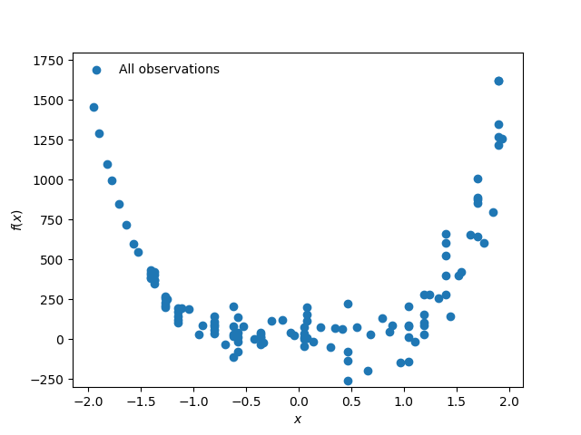
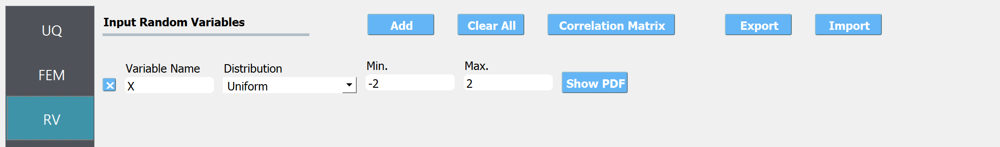
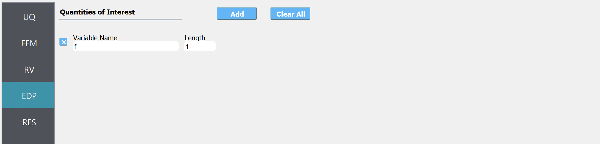
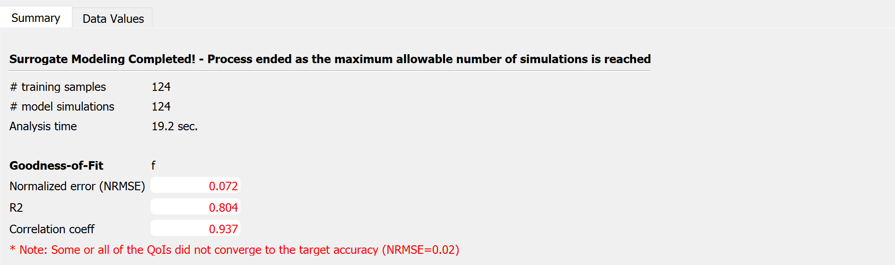
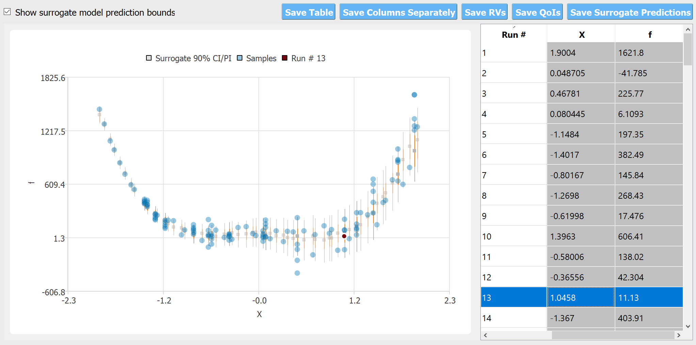

.. _qfem-0025:

Heteroscedastic Gaussian Process modeling
=================================================

+---------------+----------------------------------------------+
| Problem files | :github:`Github <Examples/qfem-0025/>`       |
+---------------+----------------------------------------------+

Outline
-------
In this example, demonstrates the heteroscedastic Gaussian process model for surrogating noisy response.

Problem description
-------------------

Let us consider the basic python model in :ref:`this example<qfem-0005>` with fixed :math:`y=0`. 

.. math::  
   g(x)=(a-x)^{2}+bx^{4}+\varepsilon

where :math:`\varepsilon` is an additive Gaussian noise that represent the variability in the output response surface. Let us assume :math:`\varepsilon` has zero mean and non-homogeneous variance of :math:`\sigma(x)^2 = (x+2.0)^2`. 

.. _figObservations:

nd y=-250, and the arms of the parabola extending upwards to the left and right. The density of points is higher near the vertex, indicating more observations in that region.
   :width: 400
   :figclass: align-center
   
   Observation dataset

We would like to create a surrogate model of this function for the input range of :math:`x\in[-2,2]`

 
Files required
--------------
The exercise requires one main script file and one supplementary file. The user should download these files and place them in a **NEW** folder. 

.. warning::
   Do NOT place the files in your root, downloads, or desktop folder as when the application runs it will copy the contents on the directories and subdirectories containing these files multiple times. If you are like us, your root, Downloads or Documents folders contains a lot of files.

1. :qfem-0025:`rosenbrock.py <src/rosenbrock.py>` - This is a python script that computes the model. The script is based on :ref:`this example<qfem-0005>`, but with :math:`y=0`. Further,  :math:`\varepsilon(x)` is generated using numpy random sampler.

   .. literalinclude:: src/rosenbrock.py
            :language: py
            :caption: rosenbrock.py

2. :qfem-0025:`params.py <src/params.py>`- This file defines the input variable(s) that the surrogate model will take

      
   .. literalinclude:: src/params.py
            :language: py
            :caption: params.py

.. note::
   Since the python script creates a ``results.out`` file when it runs, no postprocessing script is needed. 

UQ workflow
-----------

The steps involved are as follows:

1. Start the application and the **UQ** panel will be highlighted. In the **UQ Engine** drop down menu, select the **SimCenterUQ** engine. In the **Method** select **Train GP Surrogate** option. Enter the values in this panel as shown in the figure below. 

.. figure:: figures/qf-0025-UQ.png
   :align: center
   :alt: Screenshot of a software interface for uncertainty quantification (UQ) modeling. The selected UQ Method is "Surrogate Modeling" with the UQ Engine as "SimCenterUQ". Under the "SimCenterUQ Method Category," an option "Train GP Surrogate Model" is selected. Parameters such as "Number of Samples" set to 60, "Max Computation Time" also set to 60 minutes, and "Target Accuracy (normalized err)" set to 0.02 are visible. There is an "Advanced Options for Gaussian Process Model" section with settings like "Kernel Function" set to "Matern 5/2" and other options visible. The bottom right corner indicates "With the replications, the expected number of simulations is 132". The interface also includes navigation on the left side with options like UQ, FEM, RV, EDP, and RES, suggesting a comprehensive engineering or scientific analysis tool.
   :figclass: align-center
   :width: 1200

2. Next in the **FEM** panel , select **Python** FEM engine. Enter the paths to the ``rosenbrock.py`` and ``params.py`` or select **Choose** and navigate to the files. 

elds under the headings "Variable Name" and "Length", with the variable name "f" entered and a length of "1" specified. To the right, there are buttons labeled "Add" and "Clear All". The overall theme of the interface is a light color scheme with blue accents.
   :figclass: align-center
   :width: 1200

.. note::
   Since the python script creates a ``results.out`` file when it runs, no postprocessing script is needed. 

3. Select the **RV** tab from the input panel. This panel should be pre-populated with :math:`x`. If not, press the **Add** button to create a new field to define the input random variable. Enter the same variable name, as required in the model script. Specify the input range of interest

uttons for 'Add', 'Clear All', 'Correlation Matrix', 'Export', and 'Import' are visible, with an additional 'Show PDF' button next to the variable settings. On the left sidebar, tabs labeled 'UQ', 'FEM', and 'RV' are partially visible, with 'RV' highlighted.
   :figclass: align-center
   :width: 1200

4. In the **QoI** panel enter a variable named ``f`` with length 1.

lds. On the left side, there is a vertical navigation bar with the options "UQ", "FEM", "RV", "EDP" highlighted, and "RES". The user interface has a clean, minimalist design with a color palette of grays and blues.
   :figclass: align-center
   :width: 1200

5. Click on the **Run** button. This will cause the backed application to launch the **SimCenterUQ** engine, which performs the surrogate training. 

6. When done, the **RES** tab will be selected and the results will be displayed.

* Summary of Results:

each), the analysis time (19.2 seconds), and the Goodness-of-Fit metrics: Normalized error (NRMSE) at 0.072, R2 value at 0.804, and Correlation coefficient at 0.937. A note at the bottom mentions that some or all of the QoIs did not converge to the target accuracy (NRMSE=0.02).
   :figclass: align-center
   :width: 1200

* Leave-one-out cross-validation (LOOCV) predictions:

.. figure:: figures/qf-0025-RES2.png
   :align: center
   :alt: A scatter plot titled "Leave-One-Out Cross-Validation (LOOCV) Prediction" showing the relationship between 'Exact response' on the x-axis and 'Predicted response LOOCV' on the y-axis. The plot showcases various data points with confidence intervals indicated by error bars, suggesting variability in the predictions. The density of points is greater towards the lower end of both axes and becomes sparser towards the higher values. The text "Heteroscedastic nugget variance" appears below the plot, indicating a potential analysis or characteristic of the data.
   :figclass: align-center
   :width: 600

Note that the goodness-of-fit measures above do not perfectly capture *goodness* as it is evaluated assuming aleatory variability (or the measurement noise) zero. However, the cross-validation plot with bounds provides a rough estimate of whether the observation data safely lies on the GP prediction bounds. A better validation measure for the case with high nugget variance will be included in the next release. 

n # 13" and has an option checkbox labeled "Show surrogate model prediction bounds." The associated data table on the right lists 'Run #' with integers 1 to 14, 'X' values as decimal numbers, and 'f' values as decimal numbers, with the 13th row highlighted, corresponding to the highlighted point on the graph. Various buttons for saving the table, columns, random variables (RVs), quality of outputs (QoTs), and surrogate predictions are present above the table.
   :figclass: align-center
   :width: 1200

The scatter plot compares the observation data with the predicted mean and variance obtained by cross-validations. The confidence interval (CI, shown in red) is the bounds for the 'mean' of the response function, while the prediction interval (PI, shown in gray) shows those of the observations (i.e. by adding the range of the measurement noise)