.. _qfem-0027:

Forward propagation of uncertainty with multiple simulation models
==================================================================

+---------------+----------------------------------------------+
| Problem files | :github:`Github <Examples/qfem-0027/>`       |
+---------------+----------------------------------------------+

Outline
-------
In this example, two models of a 6-story structure are used to predict the maximum base shear by conducting a nonlinear time history analysis of the structure subjected to seismic excitation. The beliefs represent the uncertainty about which of these two models are the best model to be used in the analysis, and in this example, equal belief is placed in the two models.

The structure is modeled as having flexible columns and stiff elastic beams. The structure is subjected to an earthquake excitation at the base which is strong enough to result in nonlinear response. 

Model 1 uses Steel01 material to represent the behavior of the columns while model 2 uses Steel02. There are three random variables in each model which correspond to three parameters in the uniaxial material models Steel01 and Steel02: the initial elastic stiffness of the columns (k), the yield strength of the columns (Fy), and the strain hardening ratio of the columns (alp), i.e., the ratio between the post-yield stiffness and the initial elastic stiffness. For Steel02, R0 is set to 15, and cR1 and cR2 are set to their recommended values of 0.925 and 0.15, respectively.

Material used in Model 1:

.. literalinclude:: create_model_1.tcl
   :language: tcl
   :lines: 24

Material used in Model 2:

.. literalinclude:: create_model_2.tcl
   :language: tcl
   :lines: 24

The output quantity of interest (QoI) is the amplitude of the maximum base shear.

 
Files required
--------------
The exercise uses two finite element models of a structure. The required files to run each model are collected into separate directories per model. In each directory, the following files are required: one main tcl script file, two supplementary tcl scripts used to build the model and run the analysis, one supplementary file that contains the ground motion, and a tcl script to postprocess the output created during the OpenSees analysis and create the quantity of interest which is the maximum absolute value of the base shear. The user should download the required directories and files and place them in a **NEW** folder. 

.. warning::
   Do NOT place the files in your root, downloads, or desktop folder as when the application runs it will copy the contents on the directories and subdirectories containing these files multiple times. If you are like us, your root, Downloads or Documents folders contains a lot of files.

The following files are needed to evaluate Model 1. Evaluating Model 2 also requires a set of 5 files with the first two files in the following list replaced by the corresponding ones for Model 2.

1. :qfem-0027:`ShearBuilding_NL_1.tcl <src/model1/ShearBuilding_NL_1.tcl>` - This is a tcl script that evaluates the model and generates a file containing the time history of the element forces for element 1. The horizontal component of the element forces (the second column in the file) corresponds to the base shear experienced by this model of the structure. 

2. :qfem-0027:`create_model_1.tcl <src/model1/create_model_1.tcl>`- This file contains tcl and OpenSees commands that create the nodes, materials, and elements that make up the finite element model of the structure.

3. :qfem-0027:`run_analysis.tcl <src/model1/run_analysis.tcl>` - This file contains tcl and OpenSees commands to create the load, record the output, and perform a time history analysis of the structural response to the applied earthquake excitation.

4. :qfem-0027:`R331.dat <src/model1/R331.dat>` - This text file contains the time history of the earthquake acceleration applied to the base of the model.

5. :qfem-0027:`postprocess.tcl <src/model1/postprocess.tcl>` - This file contains tcl commands to read the time history of the base shear from the file created during the analysis, and to compute the maximum absolute value of the base shear experienced by the model.

UQ workflow
-----------

The steps involved are as follows:

1. Start the application and the **UQ** panel will be highlighted. In the **UQ Method** drop down menu, select the **Forward Propagation** option. In the **UQ Engine** dropdown menu select **Dakota** option. Enter the values in this panel as shown in the figure below. 

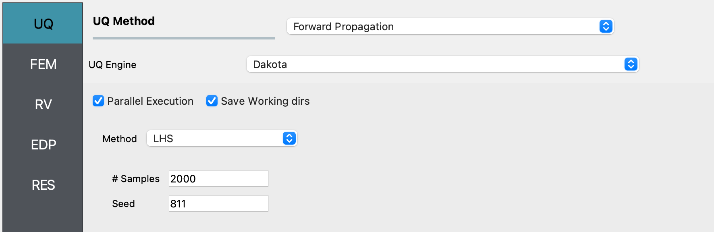

2. Next in the **FEM** panel , select **Multi Model** FEM engine. Use the **Add** or **Remove** option as needed to have two tabs, one for each of the two models being used in this example, and enter the values shown in the following figures:

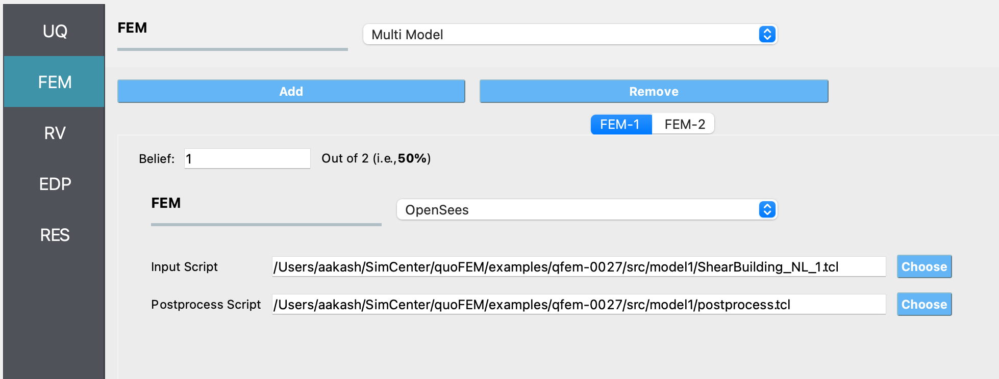

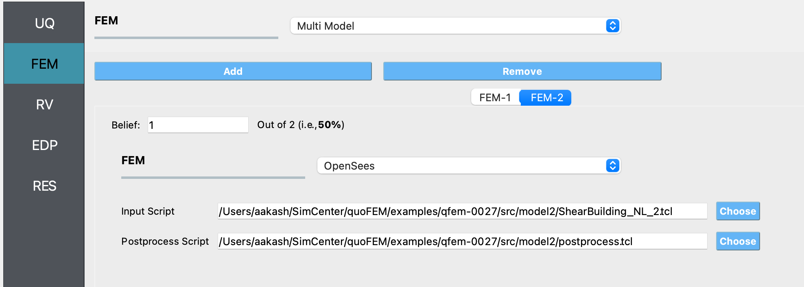

3. Select the **RV** tab from the input panel. This panel should be pre-populated with the names of the variables that were defined in the model scripts. If not, press the **Add** button to create a new field to define the input random variable. Enter the same variable name, as required in the model script. For this example, choose the Uniform probability distribution for all the random variabels and enter the Min. and Max. values for each distribution as shown in the figure below:

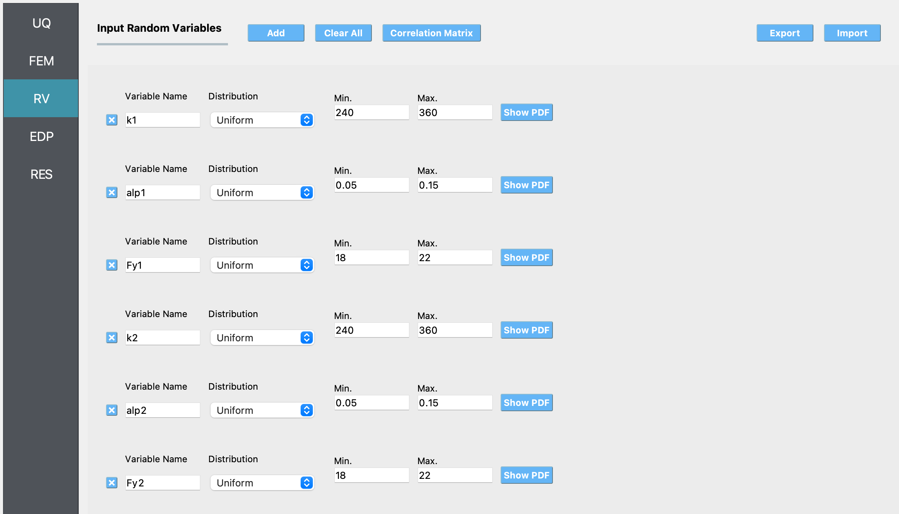

4. In the **EDP** panel create an output quantity of length 1 with a descriptive name.

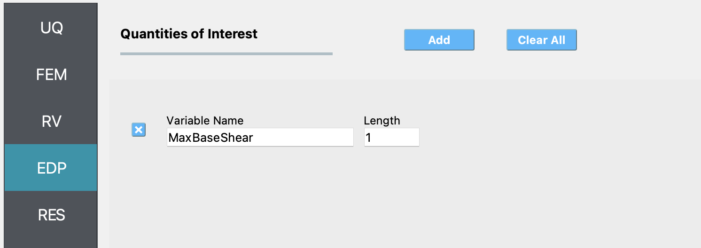

5. Click on the **Run** button. This will create the necessary input files to perform a forward propagation analysis with Dakota, run the analysis, and display the results when the analysis is completed.

When we plot the QoI vs MultiModel-FEM, we see a systematic difference in the range of the predicted QoIs - model 2 predicts lower max base shear values than model 1. The example runs in < 1 minute on my Mac, for 100 samples.

* Summary of results obtained by using the two models:

.. figure:: figures/RES1.png
   :align: center
   :figclass: align-center
   :width: 1200

* Maximum base shear vs model index:

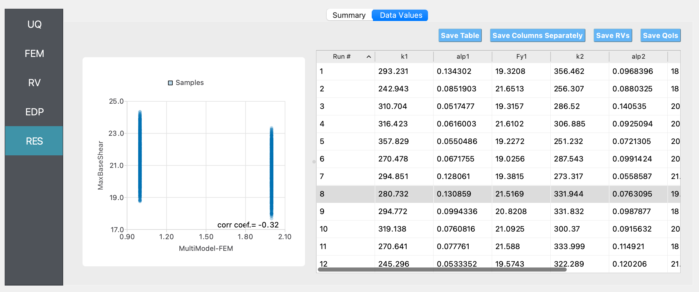

This scatter plot shows that the maximum base shear predicted by Model 1 is higher than that predicted by Model 2.

* Histogram of maximum base shear:

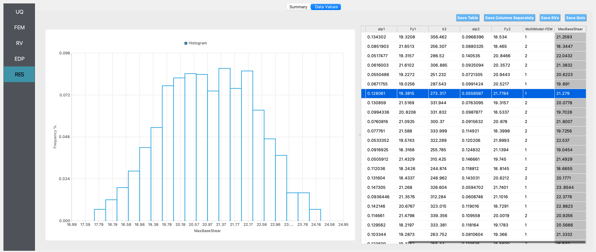

If only Model 1 was used:

* Summary of results:

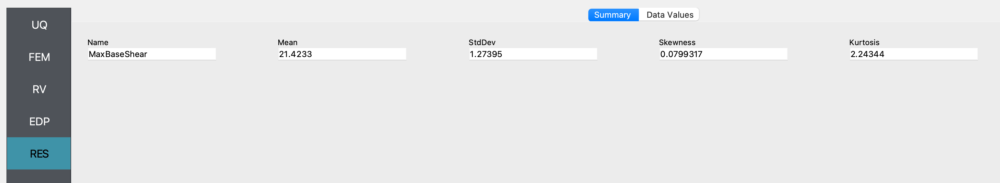

* Histogram of maximum base shear:

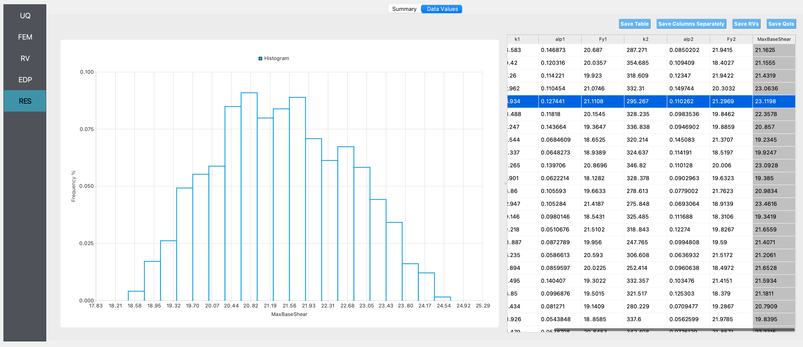

If only Model 2 was used:

* Summary of results:

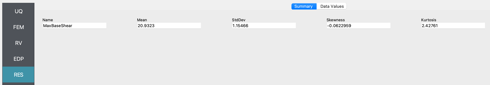

* Histogram of maximum base shear:

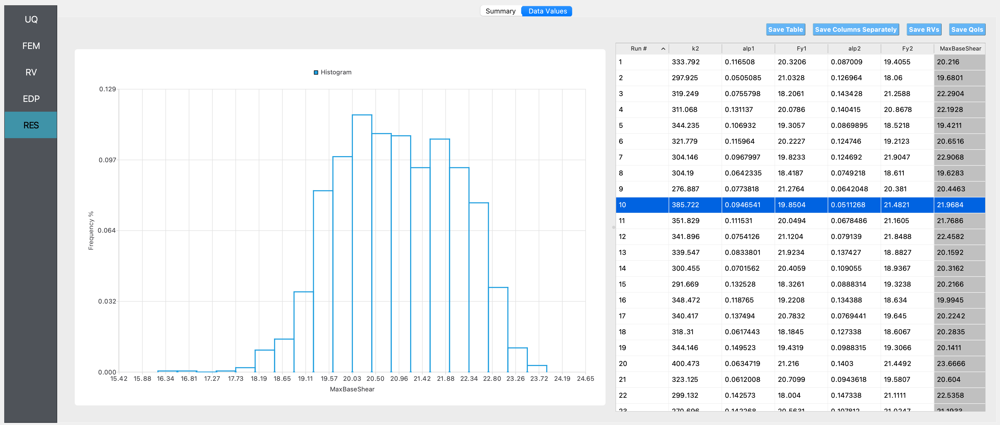

We observe from the summary statistics and the histograms that if it is not known which of the two models considered is the best model to be used to represent the behavior of the structure, the predicted range of the maximum base shear is larger (i.e., the standard deviation of the maximum base shear is higher when using the two models than in the case when either of the two models are used on their own). The mean value of the base shear predicted in this case will be the mean of the maximum base shear predicted by the two models when used on their own (here we numerically estimate the mean by sampling values of the inputs from the specified distribution, hence there is sampling variablity in the estimate of the mean). 
