.. _qfem-0028:

Bayesian calibration of hierarchical models
===========================================

+---------------+----------------------------------------------+
| Problem files | :github:`Github <Examples/qfem-0028/>`       |
+---------------+----------------------------------------------+

Outline
-------
In this example, the focus is on employing the UCSD_UQ engine to calibrate a hierarchical model. This model is designed to capture the inherent variability, known as aleatory uncertainty, in the parameters of a numerical model, in this case, the Steel02 material model in OpenSees. The calibration process involves fitting the Steel02 model to each of several datasets containing cyclic stress-strain data from multiple experiments on coupons of Grade 60 steel, and simultaneously estimating the parameters of the distribution of the estimated parameters of the Steel02 model.

Data
----
The dataset used for the inference presented in this example originates from experimental tests conducted on reinforcing steel specimens, commonly referred to as coupons, at the University of California, San Diego, in 2013. Refer Carreño et al. [Carreño2020]_ for details.

This dataset comprises cyclic stress-strain tests performed on thirty-six coupons. These coupons were sourced from three distinct steel manufacturing mills and adhered to two different manufacturing standards of Grade 60 steel. Specifically, each mill provided two straight #4 bars, each measuring 4.6 meters in length. One bar from each mill complied with Grade 60 A615 manufacturing standards, while the other adhered to Grade 60 A706 standards. From each bar, six coupons were extracted, and each coupon underwent cyclic strain tests with varying input strain histories.

Consequently, a total of 36 coupons were tested, derived from the combination of 3 mills, 2 bars per mill, and 6 coupons per bar. To ensure uniformity in specimen cross-sections, each coupon underwent machining, as illustrated in :numref:`figCoupon`. Machining was employed to maintain a length-to-diameter ratio of 2 in the machined portion of the bars, thereby minimizing the effects of nonlinear geometry, such as partial buckling, in the stress-strain response.

.. _figCoupon:

   
   Test coupon

The experiments involved six distinct random cyclic strain histories, as depicted in :numref:`figStrainHistories`. These strain histories include strain reversals of various amplitudes, along with overall drifts towards positive or negative strains. Notably, the amplitude of these drifts was constrained within :math:`\pm 5\%`, a limit representative of the strain range typically experienced by reinforcing bars during seismic events.

.. _figStrainHistories:

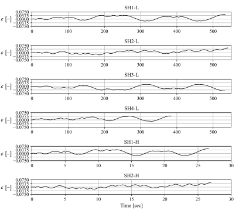conds, and a vertical axis on the left indicating varying numerical scales. The lines on the graphs show fluctuations over time with different magnitudes and frequencies.
   :figclass: align-center
   
   Strain histories

Model
-----
The Giuffré-Menegotto-Pinto (GMP) material model is a widely adopted uniaxial material model applicable to both reinforcing and structural steel. It is based on the original formulation of Menegotto and Pinto, later extended by Filippou et al. to incorporate isotropic strain hardening and implemented in OpenSees as the Steel02 material model. This model predicts the evolution of stress as a function of an input strain history.

This model is characterized by ten parameters:
- Young’s modulus :math:`E_0`for elastic behavior,
- Initial yield stress and strain hardening ratio :math:`(f_y, b)` for plastic behavior,
- Parameters :math:`(R_0, cR_1, cR_2)` governing the Bauschinger effect,
- Parameters :math:`(a_1, a_2, a_3, a_4)` for isotropic hardening.

Out of these 10 parameters, in this example, the value of :math:`R_0` is set to 20, the value most commonly recommended for this parameter, and the value of :math:`a_2` and :math:`a_4` are set to 1. Thus, the 7 parameters of the Steel02 material model that are inferred in this example are: :math:`\theta = \{f_y, E, b, cR_1, cR_2, a_1, a_3\}`. 

Hierarchical Bayesian Inference
-------------------------------
Based on the provided dataset and the described material model, the inference process aims to estimate the material model parameters :math:`\theta_i` for each dataset, the variance of the prediction error :math:`\sigma_i^2` for each dataset, as well as the mean :math:`\mu_{\theta}` and covariance :math:`\Sigma_{\theta}` of the distribution of the material model parameter estimates.

The hierarchical model utilized for this inference process is outlined in the :ref:`Technical Manual <lbluqUCSD_hierarchical>`. This model is designed to handle uncertainties in the parameter estimates effectively. The inputs required from the user in quoFEM are kept to a minimum, simplifying the inference process.

For more detailed information on the hierarchical model and the inference procedure, please refer to the :ref:`Technical Manual <lbluqUCSD_hierarchical>`.
 
Files required
--------------

.. warning::
   Do NOT place the files in your root, downloads, or desktop folder as when the application runs it will copy the contents on the directories and subdirectories containing these files multiple times. If you are like us, your root, Downloads or Documents folders contain a lot of files.

As depicted in Figure :numref:`figDataAndModel`, the required files for executing this example are organized in two distinct directories. 

The first directory contains the model scripts, which remain consistent across various experiments. The second directory contains the data files. These data files vary from one experiment to another and are further organized into subdirectories corresponding to each experiment, as elaborated below.

.. _figDataAndModel:

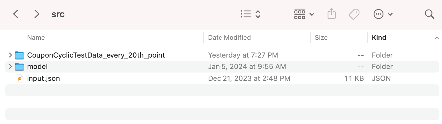
   
   Model files directory and data files directory

1. In this example, a total of 36 datasets comprising cyclic stress-strain measurements are utilized. Each dataset consists of two files. These datasets are organized within subdirectories under the directory named :qfem-0028:`CouponCyclicTestData_every_20th_point <src/CouponCyclicTestData_every_20th_point>`.

When using the hierarchical Bayesian calibration approach, each dataset must be placed in its own dedicated subdirectory. The layout of the data files used in this example is illustrated in Figures :numref:`figDataDirectory` and :numref:`figDatasetSubdirectories`.

Within each experiment's subdirectory, the strain values measured are stored in files named ``input_data.txt``, while the corresponding stress measurements are found in files named ``output_data.txt``.

.. _figDataDirectory:

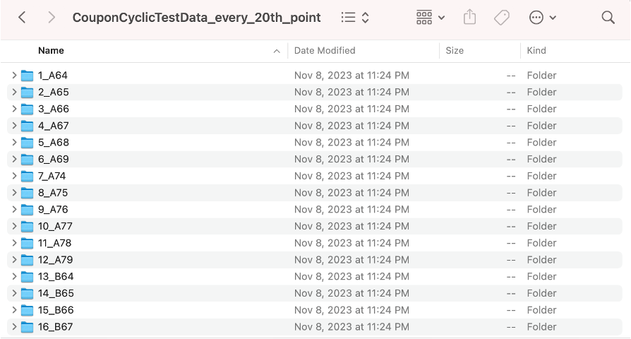
   
   Directory with calibration datasets in subdirectories

.. _figDatasetSubdirectories:

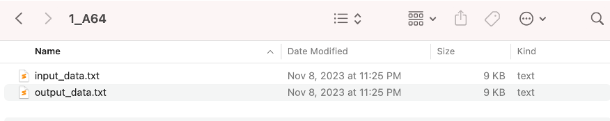
   
   Subdirectory containing data from one experiment

2. :qfem-0028:`matTestAllParamsReadStrain.tcl <src/model/matTestAllParamsReadStrain.tcl>`: This tcl script is designed to read the strain history from a file labeled input_data.txt, conduct a stress-strain simulation, and subsequently generate predicted stress values using the Steel02 model. These predicted stress values are then written into a file named ``results.out``.

.. _figModelFiles:

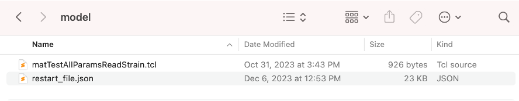file.
   :figclass: align-center
   :width: 400
   
   Model files

3. :qfem-0028:`restart_file.json <src/model/restart_file.json>`: This JSON file contains an example of the data needed to restart an analysis from a previous result obtained using quoFEM. Restart files from a previous run can be found as explained :ref:`later in this example <lblHBMRestart>`.

UQ workflow
-----------

The inputs needed to run this example can be loaded into the quoFEM user interface by selecting the ``Bayesian Calibration of Hierarchical Model`` example from the ``Examples`` menu of quoFEM.

The inputs can also be set up manually through the following steps:

1. Start the application and the **UQ** panel will be highlighted. In the **UQ Method** drop-down menu, select the **Bayesian Calibration** option. In the **UQ Engine** dropdown menu select **UCSD-UQ** option. In the **Model** dropdown, select the **Hierarchical** option. Enter the values in this panel as shown in the figure below. A brief explanation of the different user input fields can be found in the :ref:`User Manual <lblUCSDHierarchical>`. 

.. _figHBMUQ:

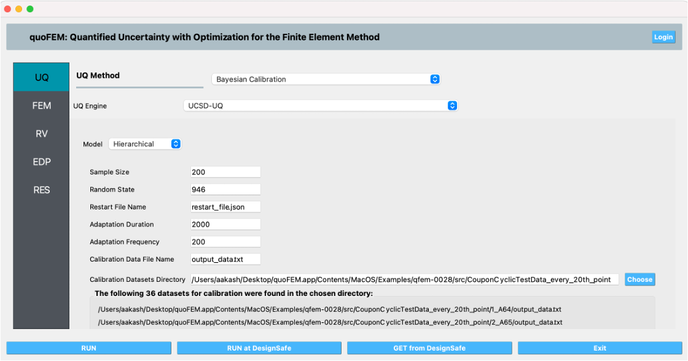 Hierarchical Model, as well as fields for entering Sample Size, Random State, Restart File Name, Adaptation Duration, Frequency, Calibration Data File Name, and Calibration Datasets Directory. Below the input fields, there's a notification that states "The following 36 datasets for calibration were found in the chosen directory", followed by file paths. At the bottom, there are buttons for running the analysis and getting data from DesignSafe, as well as an exit button.
   :figclass: align-center
   :width: 600
   
   Inputs in the UQ panel

2. Next in the **FEM** panel , select **OpenSees** and populate the **Input Script** field by choosing the path to the model file.

.. _figHBMFEM:

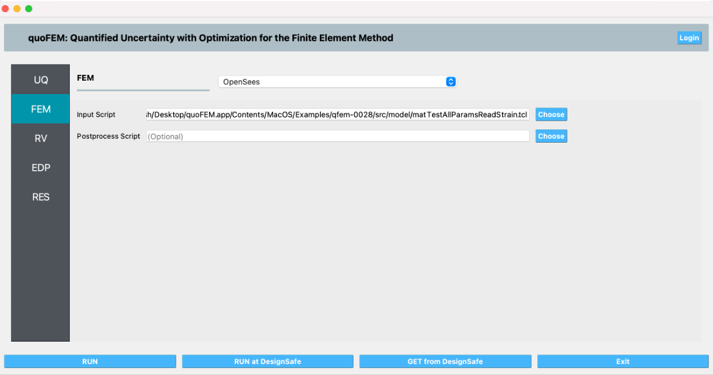re are buttons at the bottom for running the analysis and options to interact with DesignSafe, a cyberinfrastructure for natural hazards engineering.
   :figclass: align-center
   :width: 600
   
   Inputs in the FEM panel

3. Select the **RV** tab from the input panel. This panel should be pre-populated with the names of the variables that were defined in the model scripts. If not, press the **Add** button to create a new field to define the input random variable. Enter the same variable name, as required in the model script. For this example, choose the Normal probability distribution for all the random variables and enter the parameter values for each distribution as shown in the figures below:

.. _figHBMRV1:

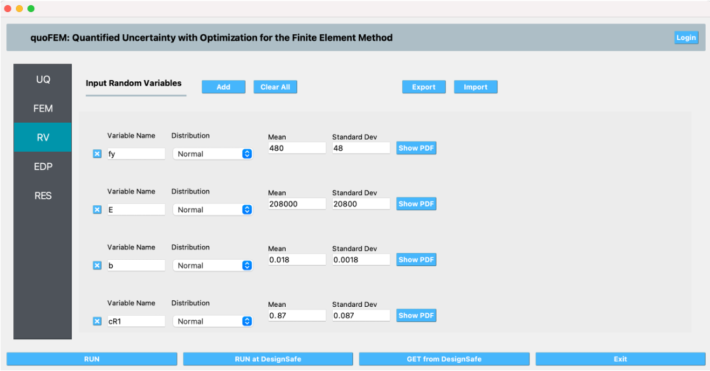and their mean and standard deviation values. Buttons for "Add," "Clear All," "Export," and "Import" are available above the list, and at the bottom, there are buttons for "RUN," "RUN at DesignSafe," "GET from DesignSafe," and "Exit." The left sidebar shows active tabs for UQ, FEM, RV, EDP, and RES highlighted in different shades of blue and gray.
   :figclass: align-center
   :width: 600

.. _figHBMRV2:

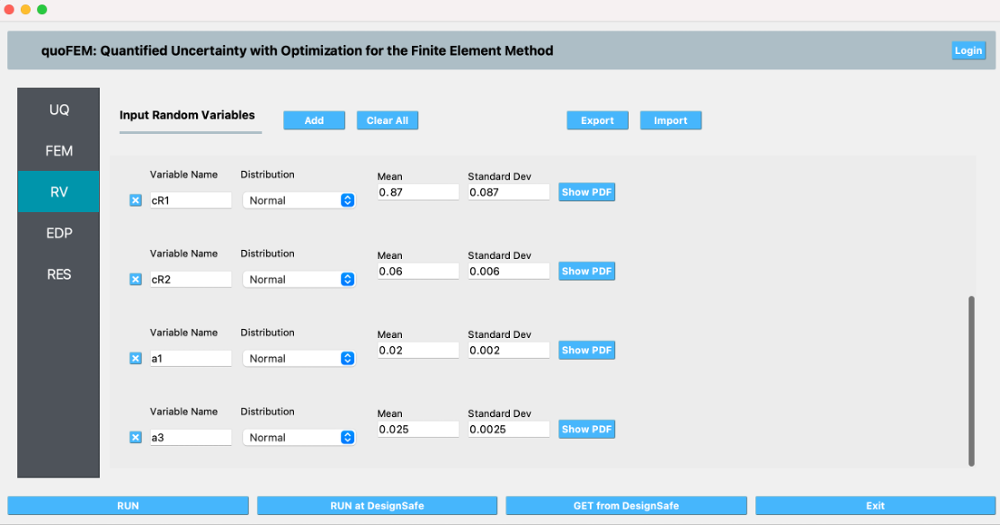 deviation values. Buttons for 'Add,' 'Clear All,' 'Export,' and 'Import' are visible. At the bottom, 'RUN,' 'RUN at DesignSafe,' 'GET from DesignSafe,' and 'Exit' buttons are present. The left sidebar includes tabs labeled 'UQ,' 'FEM,' 'RV,' 'EDP,' and 'RES.' The overall theme of the interface is blue and gray.
   :figclass: align-center
   :width: 600
   
   Inputs in the RV panel

4. In the **EDP** panel create the output quantities corresponding to each of the 36 experiments with a descriptive name, as shown in the figures below:

.. _figHBMEDP1:

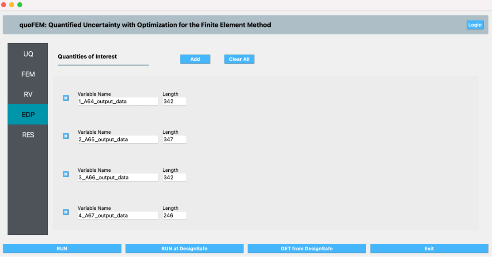 "Quantities of Interest" with a list of variables where each variable has a name like A64_output_data and an associated length value. Three buttons at the bottom of the interface read "RUN", "RUN at DesignSafe", and "GET from DesignSafe", alongside an "Exit" button.
   :figclass: align-center
   :width: 600

.. _figHBMEDP2:

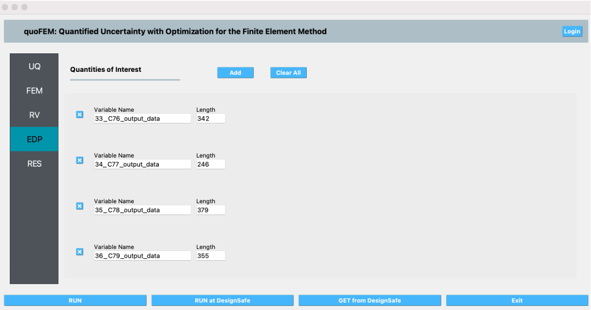uttons for "RUN", "RUN at DesignSafe", "GET from DesignSafe", and "Exit" are at the bottom.
   :figclass: align-center
   :width: 600
   
   Inputs in the EDP panel

5. Click on the **Run** button. This will create the necessary input files to perform a Bayesian calibration of the hierarchical model, run the analysis, and display the results when the analysis is completed. The results produced are sample values drawn from the distribution that represents the aleatory uncertainty in the estimated material parameters from each of the datasets. 

The **Summary** tab shows the mean, standard deviation, and coefficient of variation of each of the seven parameters of the material model that were inferred in this example.

.. _figHBMRES1:

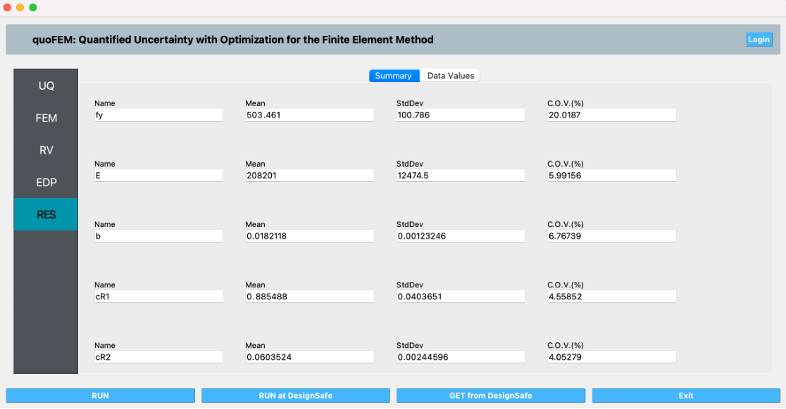orresponding statistical data such as mean, standard deviation, and coefficient of variation (C.O.V.%). A sidebar on the left highlights the RES (Results) section. There are buttons for 'Run,' 'Run at DesignSafe,' 'GET from DesignSafe,' and 'Exit' at the bottom.
   :figclass: align-center
   :width: 600

.. _figHBMRES2:

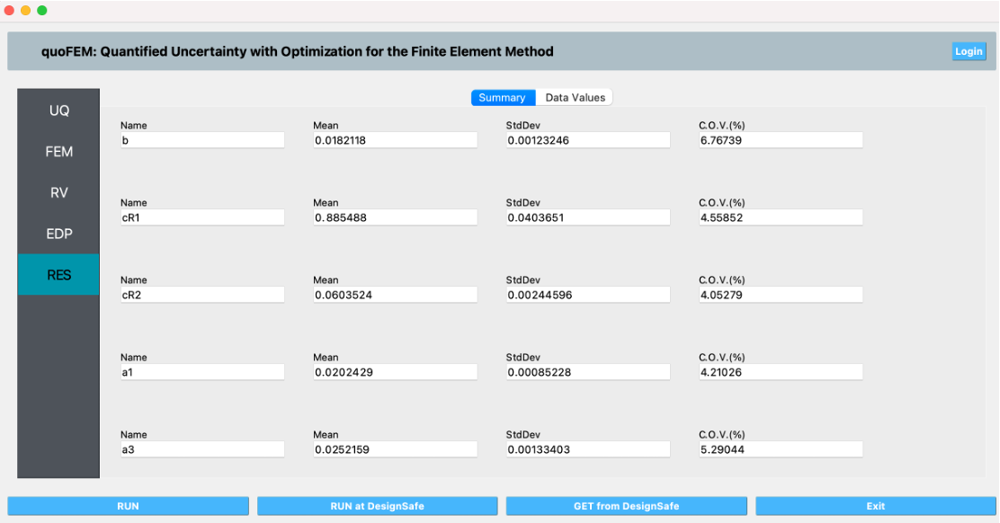'cR2,' 'a1,' and 'a3' show numerical values for Mean, Standard Deviation (StdDev), and Coefficient of Variation (C.O.V. in %). At the bottom, buttons labeled 'RUN,' 'RUN at DesignSafe,' 'GET from DesignSafe,' and 'Exit' are visible. A vertical navigation menu on the left includes options 'UQ,' 'FEM,' 'RV,' 'EDP,' and a highlighted 'RES.' The overall color scheme features shades of blue, gray, and white.
   :figclass: align-center
   :width: 600

   Results in the RES panel summary tab

In the **Data Values** tab of the **RES** panel, a chart and a table with all the sample values are shown. By clicking on the data inside the columns of the chart with the left or right mouse button, different chart types are created and shown in the chart area on the left. 

.. _figHBMRES3:

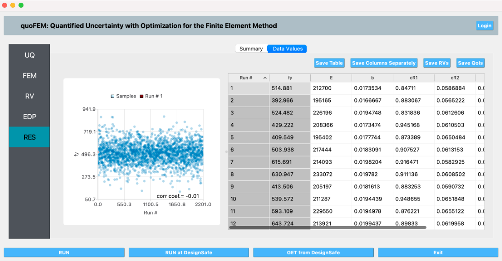dicates almost no correlation with a correlation coefficient of -0.01. The top of the screen displays tabs labeled 'Summary' and 'Data Values', and there are buttons below for 'Save Table', 'Save Columns Separately', 'Save RVs', and 'Save QoIs'. The left side menu shows options UQ, FEM, RV, EDP, and RES, with RES highlighted in blue. At the bottom, there are buttons for 'RUN', 'RUN at DesignSafe', 'GET from DesignSafe', and 'Exit'.
   :figclass: align-center
   :width: 600

.. _figHBMRES4:

.. figure:: figures/RES4.png
   :align: center
   :alt: A screenshot of the quoFEM web interface, displaying a scatter plot and a data table as part of a simulation result. The scatter plot on the left shows a collection of blue dots with varying intensity indicating density and an annotation of the correlation coefficient (corr coef= 0.68). To the right is a data table with columns titled Run #, fy, E, b, cR1, and cR2 filled with numerical values. The application includes menu items like 'Summary' and 'Data Values', and buttons for options like 'Save Table', 'Save Columns Separately', and 'Save Rows'. On the left sidebar, highlighted options such as UQ, FEM, RV, EDP, and RES are shown, with RES selected. There are also 'RUN', 'RUN at DesignSafe', 'GET from DesignSafe', and 'Exit' buttons at the bottom of the interface.
   :figclass: align-center
   :width: 600

   Data values tab in the RES panel

.. _lblHBMRestart:

Files for restarting the analysis
---------------------------------

In addition to the results displayed in the RES panel in quoFEM, JSON files with the state of the chain at every step of the sampling algorithm are saved in a directory called ``sampling_results`` within the ``tmp.SimCenter`` directory inside the jobs directory specified in the quoFEM Preferences menu. Any of these files can be used to resume the sampling, by copying the file to the directory containing the model files and specifying its name in the Restart File Name field in the UQ panel.

.. warning::
   The ``tmp.SimCenter`` directory is cleared every time the ``RUN`` button is clicked in quoFEM. So, if you want to restart the analysis using one of the sampling results files outlined above, make sure to copy the results file to a location outside the ``tmp.SimCenter`` directory at the end of the analysis.

.. _figHBMPreferences:

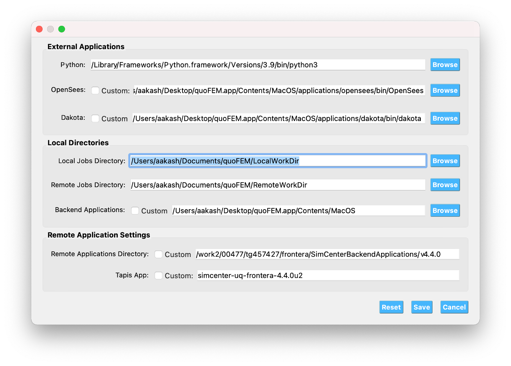 options for backend and remote applications with 'Browse' buttons for navigating to file paths on a MacOS system. There is also a 'Reset', 'Save', and 'Cancel' button at the bottom of the window.
   :figclass: align-center
   :width: 600

   Jobs directory in the Preferences panel

.. _figHBMRES5:

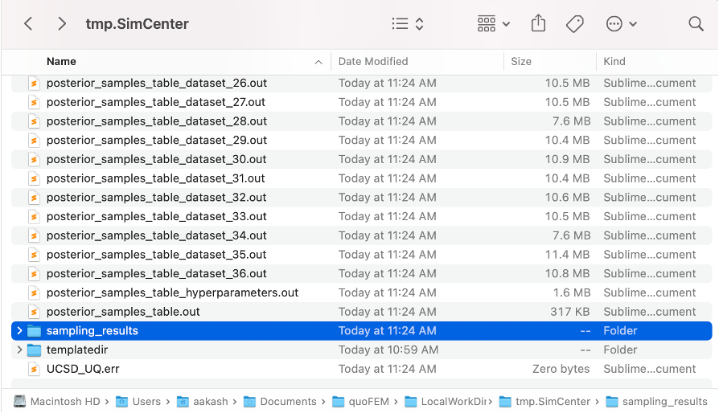" and "posterior_samples_table.out," all modified today at 11:24 AM, and are of various sizes, mostly around 10.5 MB and indicated as Sublime...cument. There's also a highlighted folder named "sampling_results" modified today at 11:24 AM and a "templatedir" folder modified at 10:59 AM. The path shows the folder is in the user "aakash" 's Documents under the "quoFEM > LocalWorkDir > tmp.SimCenter > sampling_results." The operating system appears to be macOS, as suggested by the interface design.
   :figclass: align-center
   :width: 600

.. _figHBMRES6:

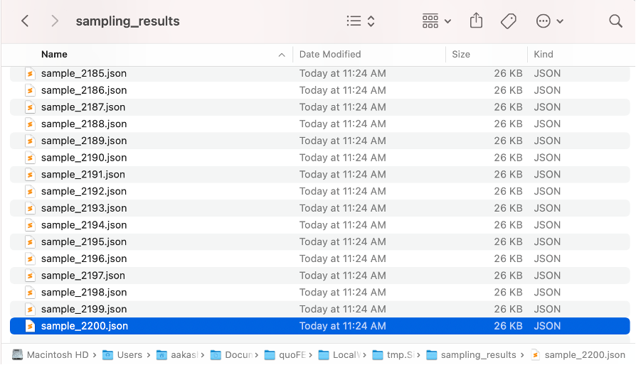:24 AM'. One file, 'sample_2200.json', is highlighted indicating it has been selected. The file path at the bottom shows "Macintosh HD > Users > [Username] > Documents > [Folder Name] > tmp.Si > sampling_results > sample_2200.json".
   :figclass: align-center
   :width: 600

   Sampling results files that can be used to restart the analysis

.. [Carreño2020]
   R. Carreño, K.H. Lotfizadeh, J.P. Conte, J.I. Restrepo, Material Model Parameters for the Giuffrè-Menegotto-Pinto Uniaxial Steel Stress-Strain Model, *J. Struct. Eng.* 146 (2020) 04019205. https://doi.org/10.1061/(ASCE)ST.1943-541X.0002505.

