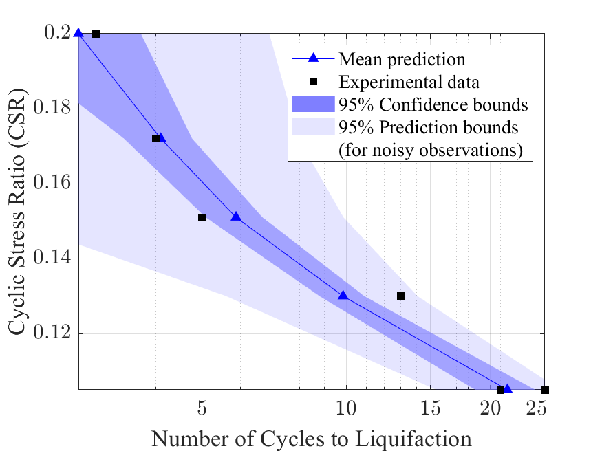
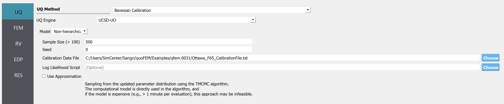
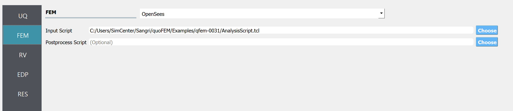
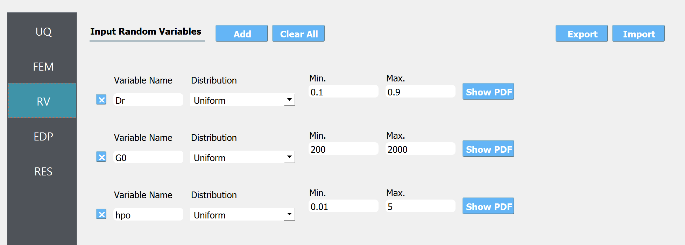
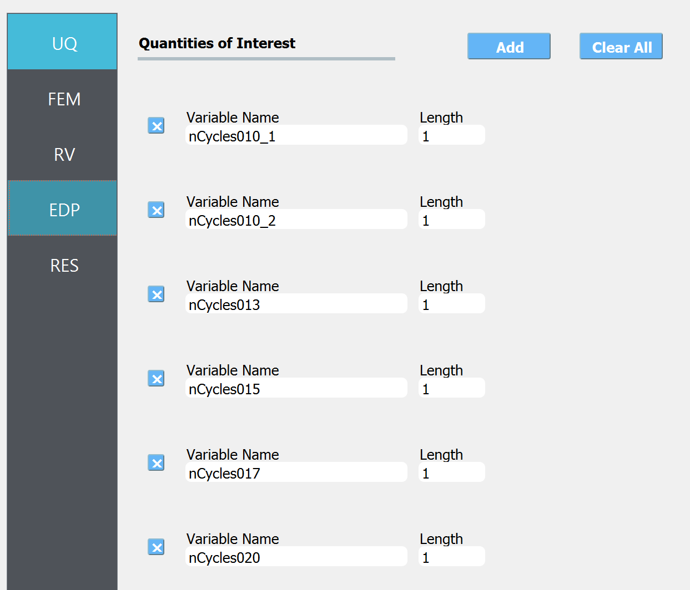
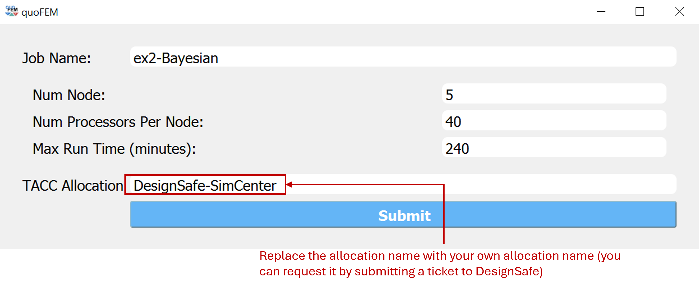
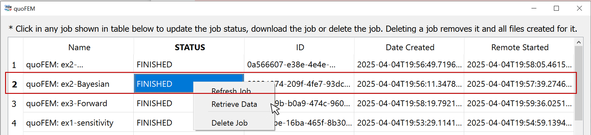
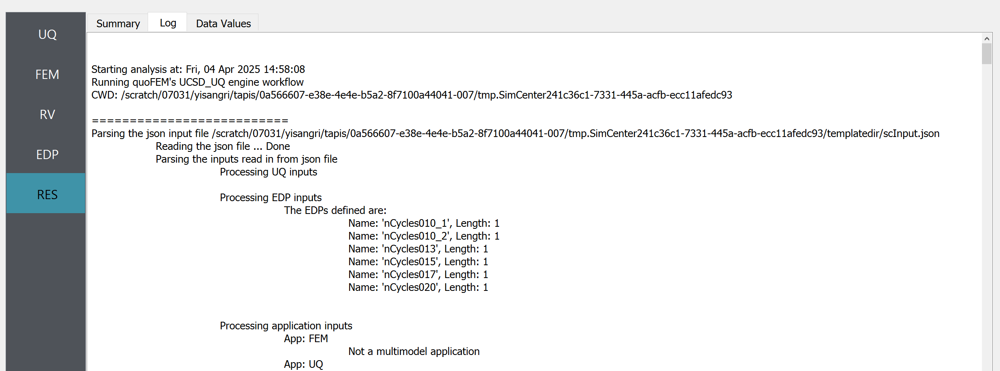
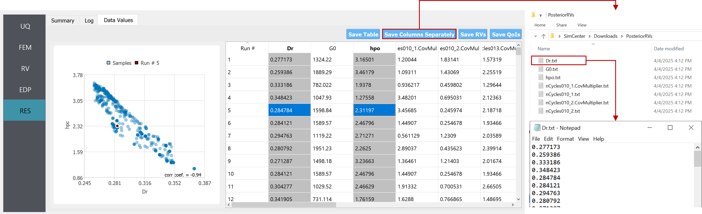
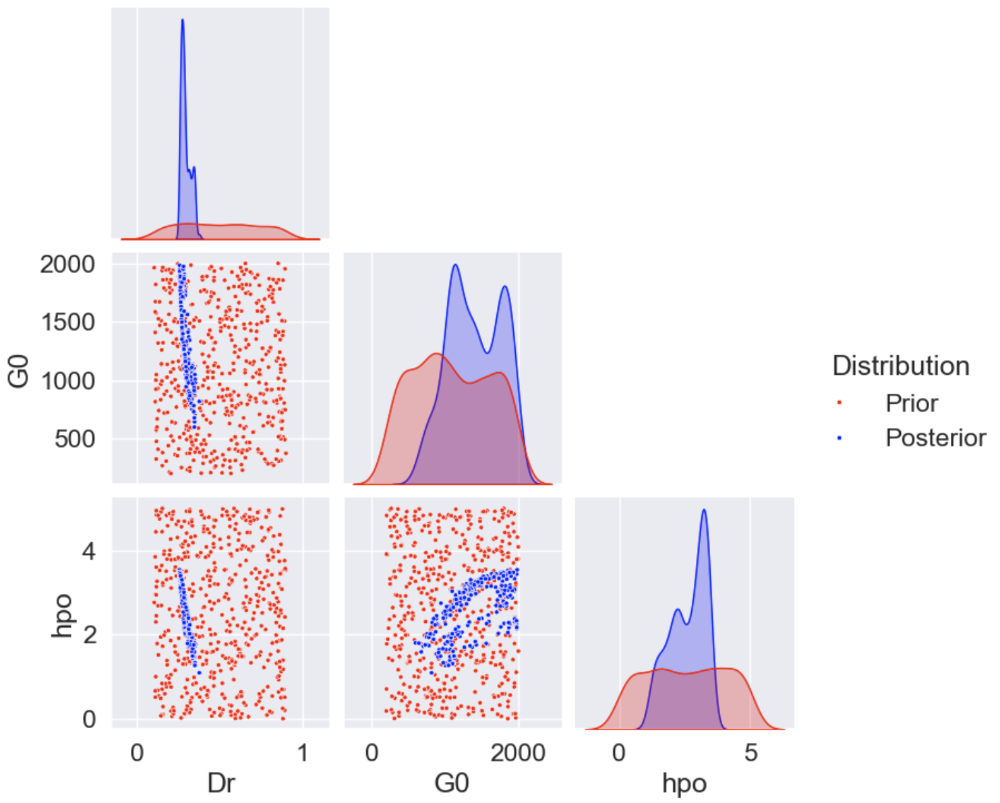

.. _qfem-0031:

PM4Sand - Bayesian Calibration using Cyclic Direct Simple Shear Test Data
======================================================================================================

+---------------+----------------------------------------------+
| Problem files | :github:`Github <Examples/qfem-0031/>`       |
+---------------+----------------------------------------------+

Related Examples
--------------------
This page is a part of the PM4Sand example series, focusing on Step 2 **Bayesian Calibration**. Steps 1 and 3 can be found below:

* General description and Step 1: :ref:`qfem-0033`
* Step 3: :ref:`qfem-0032`

Problem description 
--------------------
Consider now the observations of the Cyclic Direct Simple Shear (CyDSS) experiment in below table, that are publicly available on the DesignSafe data depot. The observed count of cycles at different Cyclic Shear Stress Ratio (CSR) values can be predicted by the simulation model. Bayesian analysis assumes that the discrepancy between the optimal model prediction and experiments can be described as a Gaussian noise, capturing various inaccuracies such as inherent uncertainty in the phenomenon, the imperfection of our simulation model, and measurement error. 

.. list-table:: Table 1: Cyclic Shear Stress Ratio (CSR) vs. Number of Cycles to Onset of Liquefaction
   :widths: 25 25
   :header-rows: 1

   * - Cyclic Shear Stress Ratio (CSR)
     - Number of Cycles to Onset of Liquefaction
   * - 0.105
     - 26
   * - 0.105
     - 21
   * - 0.130
     - 13
   * - 0.151
     - 5
   * - 0.172
     - 4
   * - 0.200
     - 3

The prior distribution of the parameters is in the below Table. 

.. list-table:: Table 2: Prior distribution of parameters
   :widths: 15 20 20
   :header-rows: 1

   * - Parameter
     - Distribution
     - Range
   * - Dr
     - Uniform
     - 0.1 - 0.6
   * - Go
     - Uniform
     - 200 - 2000
   * - hpo
     - Uniform
     - 0.01 - 5

The goal is to obtain the samples of the posterior distribution of PM4Sand parameters that will closely reproduce the experimental results while accounting for the model and measurement uncertainties. Following best practices, the algorithm introduces inverse Gamma priors with the shape parameter alpha = 3 and scale parameter beta = 2 for the measurement variances. The posterior sample of the three PM4Sand parameters is obtained using the transitional Markov chain Monte Carlo (TMCMC) sampling technique that is available in the UCSD-UQ engine. This is an expensive calculation that greatly benefits from the available HPC resources at DesignSafe.

Files required
--------------
* Calibration data file (:qfem-0031:`Ottawa_F65_CalibrationFile.txt <../qfem-0031/src/Ottawa_F65_CalibrationFile.txt>`). The file contains 6 values representing the number of cycles to onset of liquefaction, given different CSR values, according to Table 1:

   .. literalinclude:: ../qfem-0031/src/Ottawa_F65_CalibrationFile.txt
      :language: txt

* An opensees simulation model that reproduces the CyDSS test for CSR of [0.105, 0.105, 0.130, 0.151, 0.172, 0.200]: :qfem-0031:`AnalysisScript.tcl <../qfem-0031/src/AnalysisScript.tcl>` and :qfem-0031:`DSS_quad_DispControlModified.tcl <../qfem-0031/src/DSS_quad_DispControlModified.tcl>` 

UQ workflow
-----------

The steps involved are as follows:

1. Start the application and the **UQ** panel will be highlighted. Select ``Bayesian Calibration`` and ``USCD-UQ``. Import the calibration file.

2. Next select the **FEM** panel from the input panel selection. This will default to the **OpenSees** FEM engine. In the **Input Script** field, enter the path to the ``AnalysisScript.tcl`` file or select **Choose** and navigate to the file. Only the main file needs to be imported and other supplementary files can be located at the same directory.

3. Next select the **RV** tab from the input panel and define prior distributions. 

4. In the **QoI** panel denote that the output variable names. The length of the entries mush sum up to six, matching the length of simulation model output and the length of observation dataset.

5. Once ready, let us run the job remotely on DesignSafe HPC cloud computer. Note that you can also run the job locally, but it will take several hours, depending on the computer spec. The remote run will take only a few minutes. To run a remote job, the user first need to request a job allocation by submitting a ticket at DesignSafe website. Navigate to `DesignSafe webpage <https://www.designsafe-ci.org/>`_, click ``Help`` - ``Submit`` a Ticket, and request an allocation to run SimCenter tools. Once the allocation name is identified, the user can run the analysis by clicking the **RUN at DesignSafe** button and filling in the below entries.

   RUN at DesignSafe window 

| It is recommended to request more than 3 nodes (i.e. more than 120 processors) to obtain the results within a few minutes. Once the job is successfully submitted, you can check the job status by clicking "GET from DesignSafe" button. Once the job status appears ``FINISHED``, left-click the corresponding row and click **Retrieve Data**

   GET from DesignSafe window 

6. The final samples of the posterior distribution are be displayed at RES tab. The **Summary** tab displays the summary statistics of the posterior parameter/predictive distributions. The **Log** tab displays the log message from the analysis. The **Data Values** tab shows the samples from the target posterior distribution. 

.. figure:: figures/qfem0031-RES1.png
   :align: center
   :figclass: align-center 

   RES (Summary) tab

   RES (Log) tab

   RES (Data Values) tab

Under the **Data Values** tab, click **Save Columns Separately** button to save the samples of each RV of the posterior distribution. This can later be imported into quoFEM to replace the definition of random variables.

Post-processing script
--------------------------------------------------

The detailed and intermediate analysis results can be retrieved from the remote working directory. The remote working directory can be found by looking at preference windows, which can be found by clicking ``file``-``preference`` in the quoFEM menu bar. For example, the file named 'dakotaTab.out' contains the posterior sample values shown in the **Data Values** tab in the user interface RES tab and 'dakotaTabPrior.out' contains the samples from the prior distribution. You can create your own visualization script using these files. Below is an example of such a python script, that plots the pair-wise scatter plots of the samples to understand the shape of the posterior distribution and especially, the correlation between the samples. Note that ``{YOUR/PATH/TO/REMOTEWORKDIR}`` in line 4 should be replaced with your remote working directory, found in your preference window.
   
.. code-block:: python  
   :linenos:

   import pandas as pd
   import seaborn as sns

   Path_to_RemoteWorkDir = r"{YOUR/PATH/TO/REMOTEWORKDIR}"

   # Replace these filenames with the results from your run
   prior_file = Path_to_RemoteWorkDir+"/results/dakotaTabPrior.out"
   posterior_file = Path_to_RemoteWorkDir+"/results/dakotaTab.out"

   data_post = pd.read_csv(posterior_file, delimiter = '\t', usecols = [2,3,4])
   data_post['Distribution'] = 'Posterior'
   data_pri = pd.read_csv(prior_file, delimiter = '\t', usecols = [2,3,4])
   data_pri['Distribution'] = 'Prior' 

   sns.set(font_scale=1.5)
   combine = pd.concat([data_pri,data_post], ignore_index=True)
   g = sns.pairplot(combine, hue = "Distribution", markers=".", corner=True, palette={'Prior':'red', 'Posterior':'blue'})

   PM4Sand model parameters sampled from the joint prior and posterior distribution

Please visit DesignSafe `use case gallery <https://designsafe-ci.org/user-guide/usecases/arduino/usecase_quoFEM/>`_  to find more information on
 (i) running quoFEM on DesignSafe through jupyter-notebook (without using graphical user interface)
 (ii) postprocess the results using jupyer-notebook
   
