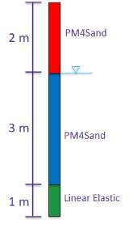
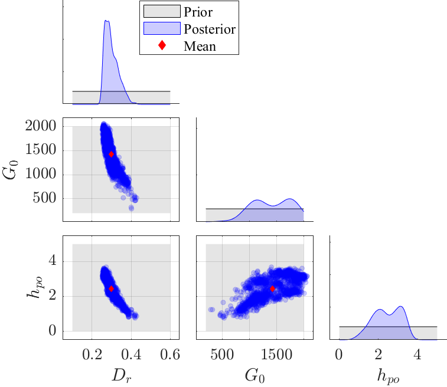
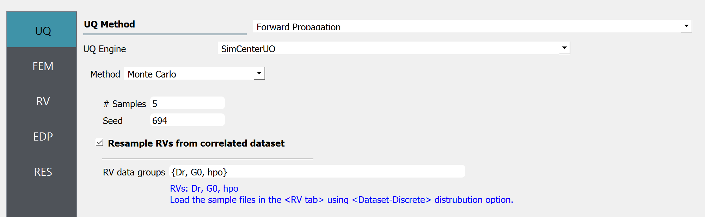
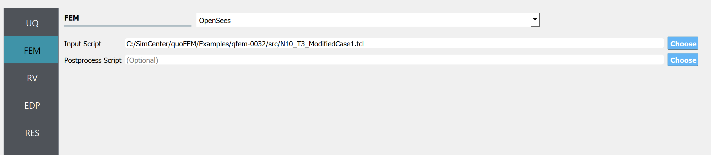
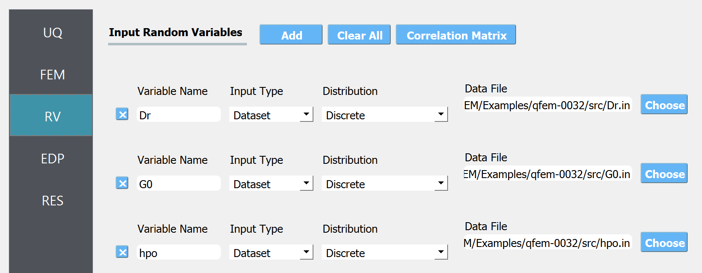
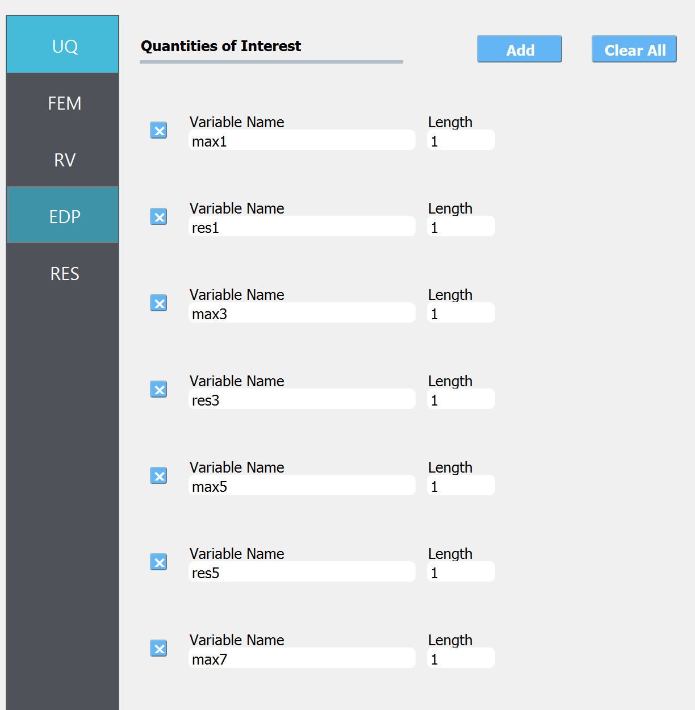
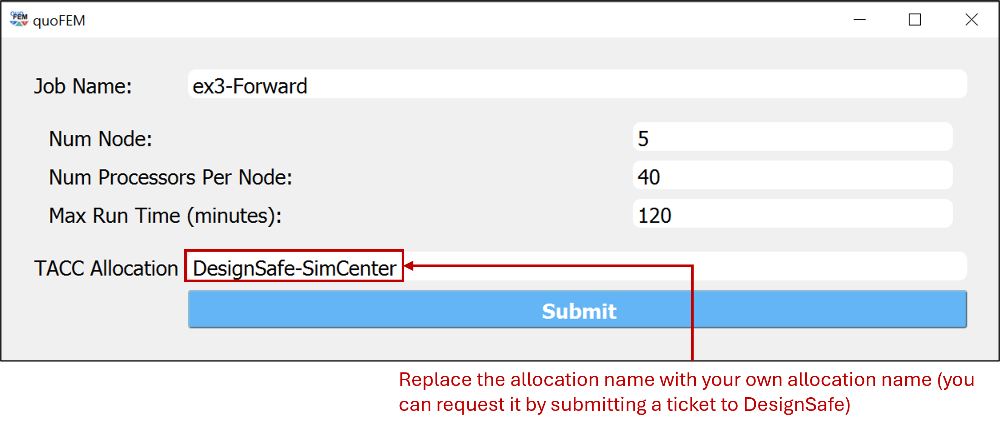
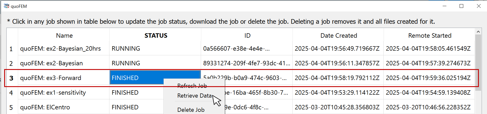
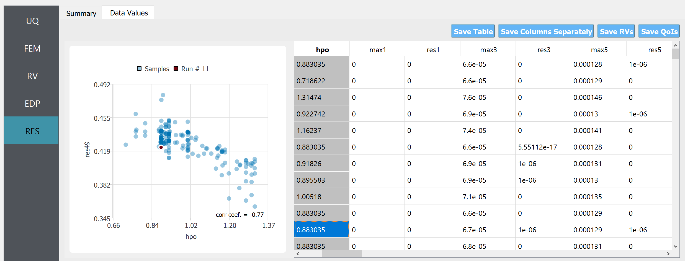

.. _qfem-0032:

Forward Propagation of PM4Sand using samples of random variables
===============================================================

+---------------+----------------------------------------------+
| Problem files | :github:`Github <Examples/qfem-0032/>`       |
+---------------+----------------------------------------------+

Related Examples
--------------------
This page is a part of the PM4Sand example series, focusing on Step 3 **Forward Propagation**. Steps 1 and 2 can be found below:

* General description and Step 1: :ref:`qfem-0033`
* Step 2: :ref:`qfem-0031`

Problem description 
--------------------
A forward propagation analysis is helpful to characterize how parametric uncertainty propagates to the simulation results. For this purpose, it is good practice to run such an analysis and characterize the effect of uncertainties on application-specific quantities of interest before practically applying these parameter values in a simulation for decision making. In this example, we will predict the uncertainty (arising from the uncertainty in the PM4Sand parameters) in the lateral spreading response of a site subjected to an earthquake (Loma Prieta Gilroy Array #2) with peak ground acceleration of 0.37 g. The soil column model shown in the image is introduced in which the liquefiable layer in the middle is modeled using PM4Sand and the other parts are assumed to remain elastic throughout the shaking.

   Schematic of 1D soil layer with liquefiable soil used in the forward propagation analysis.

Files required
--------------

* An opensees soil column model for simulating lateral spreading response of a site subjected to an earthquake: :qfem-0032:`N10_T3_ModifiedCase1.tcl <../qfem-0032/src/N10_T3_ModifiedCase1.tcl>` 

* In this example, instead of defining the random variables by the distribution type and corresponding hyper-parameters, we will directly import the samples of the random variables. In our case, the samples are obtained as the results of Bayesian calibration example (:ref:`qfem-0031`) in this PM4Sand example series: :qfem-0032:`Dr.in <../qfem-0032/src/Dr.in>` , :qfem-0032:`G0.in <../qfem-0032/src/G0.in>` , :qfem-0032:`hpo.in <../qfem-0032/src/hpo.in>`. An example visualization of posterior samples is shown below.

   PM4Sand model parameters sampled from the joint posterior distribution

UQ workflow
-----------

The steps involved are as follows:

1. Start the application and the **UQ** panel will be highlighted. Select **Forward Propagaion** and then **SimCenterUQ**. Note that only SimCenterUQ engine allows the users to define RVs through the realization samples. Also in order to maintain the correlation between sample realizations across different RVs (Dr, G0, and, hpo) set **RV datagroups** to be {Dr, G0, hpo}. 

   UQ tab

2. Next select the **FEM** panel from the input panel selection. This will default to the **OpenSees** FEM engine. In the **Input Script** field, enter the path to the ``N10_T3_ModifiedCase1.tcl`` file or select **Choose** and navigate to the file. 

   FEM tab

3. Next select the **RV** tab from the input panel. For each RV, select input type to be ``Dataset`` and distribution to be ``Discrete``. Then import the datafile obtained by Bayesian calibration in example: :ref:`qfem-0031`.

   RV tab

4. In the **EDP** panel create entries for the quantities of interest. The total length should match the length of the simulation outcome, that will be written in the `results.out` file.

   EDP tab

5. Next click on the **RUN at DesignSafe** button, to run the job on cloud HPC computer. To do this, the user first need to request a job allocation by submitting a ticket at DesignSafe website. Navigate to `DesignSafe webpage <https://www.designsafe-ci.org/>`_, click ``Help`` - ``Submit a Ticket``, and request an allocation to run SimCenter tools. Once the allocation name is identified, the user can run the analysis by filling in the below entries.

   RUN at DesignSafe window 

It is recommended to request more than 5 nodes (i.e. more than 200 processors) to obtain the results within a few minutes. Once the job is successfully submitted, you can check the job status by clicking **GET from DesignSafe** button. Once the job status appears ``FINISHED``, left-click the corresponding row of the table and click **Retrieve Data**

   GET from DesignSafe window 

6. The forward propagation results should be loaded at RES tab. The below scatter can be viewed in ``Data Values`` tab. 

   RES tab

Post-processing script
------------------------

The detailed and intermediate analysis results can be retrieved from the remote working directory. The remote working directory can be found by looking at preference windows, by clicking ``file``-``preference`` in the quoFEM menu bar. For example, the file named 'dakotaTab.out' contains the sample values shown in the **Data Values** tab in the user interface RES tab. You can create your own visualization script using this file. Below is an example of such a python script, that plots the uncertainty across the depth of the soil column. Replace ``{YOUR/PATH/TO/REMOTEWORKDIR}`` in line 5 with your remote working directory, found in your preference window.
   
.. code-block:: python  
   :linenos:

   import numpy as np
   import matplotlib.pyplot as plt
   import pandas as pd

   Path_to_RemoteWorkDir = r"{YOUR/PATH/TO/REMOTEWORKDIR}"
   samples = np.genfromtxt(Path_to_RemoteWorkDir + "/results/dakotaTab.out", skip_header = 1)
   depth = np.linspace(0.0, 6.0, 25)

   plt.figure(figsize=(8,12))

   maxdisp_tmp = samples[:,5::2]
   maxdisp = maxdisp_tmp - maxdisp_tmp[:, 0].reshape((-1, 1))

   # Finding mean max disp curve
   maxdispmean = np.mean(maxdisp, axis = 0)
   plt.grid(which = 'major', linewidth = '0.25');
   plt.grid(which = 'minor', linewidth = '0.25');
   plt.xticks(fontsize = 12)
   plt.yticks(fontsize = 12)
   plt.ylim(0,6)
   plt.xlim(-0.1,0.5)
   plt.xlabel("Max Disp. (m)", fontsize = 18)
   plt.ylabel("Depth (m)", fontsize = 18)
   plt.title("Vertical profile", fontsize = 20)
   for x in range(len(samples)):
       plt.plot(maxdisp[x,:], depth, c = "gray", alpha = 0.25)
   plt.plot(maxdispmean, depth, c = "black", linewidth = 3, label='Max. residual disp. \nmean profile')
   plt.legend(fontsize=18)

.. figure:: figures/qfem0032-fig3.png
   :align: center
   :figclass: align-center
   :name: fig3
   :width: 25%

   Predicted earthquake response of soil column

The results of 500 simulations are shown above. The mean and standard deviation of the residual displacement at the surface level (6 m) are 0.24 m and 0.02 m, respectively. Depending on the application, the uncertainty in these results can be considered reasonably low. The sample of the predictive distribution shown on the top of the vertical profile can further be utilized in 
reliability and risk assessment workflows

Please visit DesignSafe `use case gallery <https://designsafe-ci.org/user-guide/usecases/arduino/usecase_quoFEM/>`_  to find more information on
 (i) running quoFEM on DesignSafe through jupyter-notebook (without using graphical user interface)
 (ii) postprocess the results using jupyer-notebook
   
