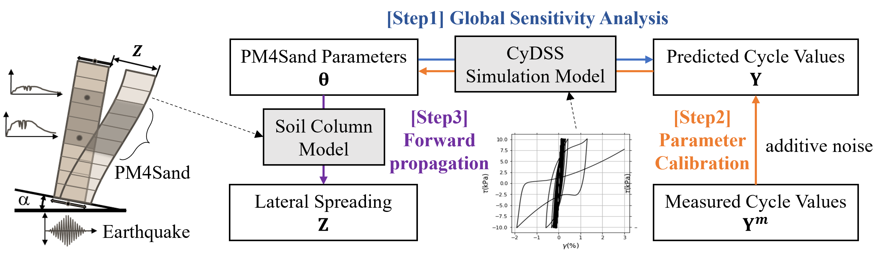
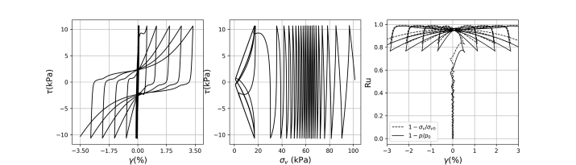
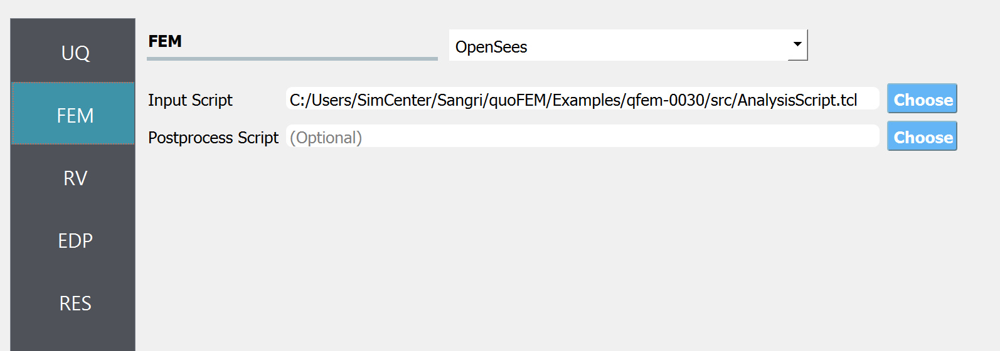
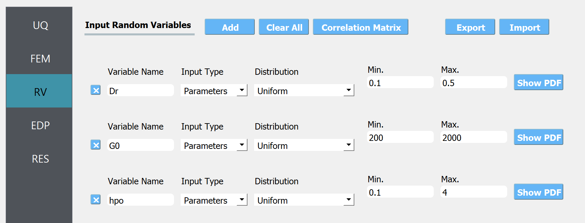
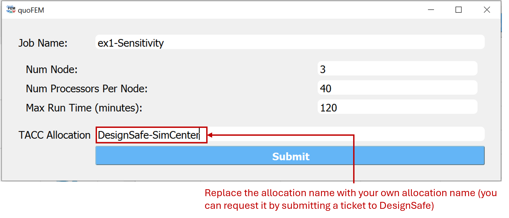
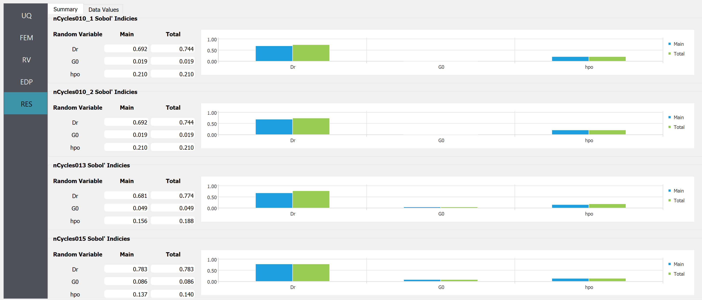
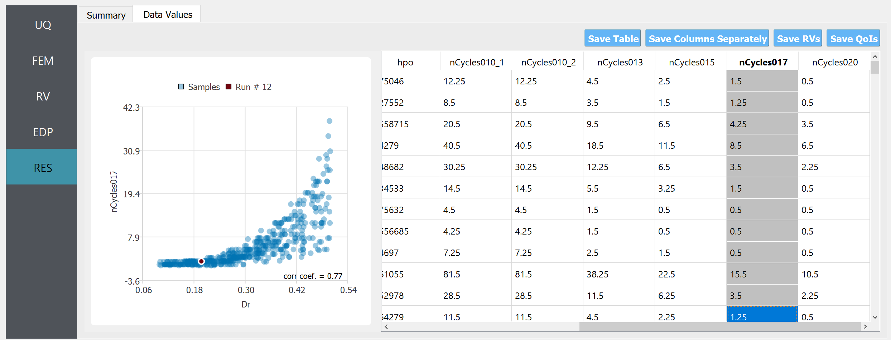

.. _qfem-0033:

PM4Sand - Sensitivity Analysis
===============================================================

+---------------+----------------------------------------------+
| Problem files | :github:`Github <Examples/qfem-0033/>`       |
+---------------+----------------------------------------------+

Outline
-------

This is the first example of the **PM4Sand example series**. In this example series, we demonstrate several UQ techniques (sensitivity analysis, Bayesian calibration, and forward propagation) using the PM4Sand constitutive model [Liu1986]_
[Liu1986]_, a liquefaction-capable soil model in OpenSees. This complex material model is often calibrated using a small number of experimental results which yields imperfect information about its parameters. This leads to uncertain model predictions. Quantifying such uncertainties and inspecting the uncertainty bounds of model predictions can provide more information about the importance of each model parameter. Recognizing these uncertainties can incentivize more sophisticated modeling and calibration techniques that can better utilize the available data from experiments to reduce these bounds and provide more robust and higher fidelity simulations.

The PM4Sand constitutive model has 24 parameters. Among them, apparent relative density *Dr*, shear modulus coefficient *Go*, and contraction rate parameter *hpo*, are known to be important for predicting liquefaction responses. Therefore, these three parameters *Dr, Go*, and *hpo* are considered in the UQ analyses and their prior distributions are assumed to be uniform distributions with the ranges shown in Table 1. These prior distributions shall capture a plausible wide range that includes all possible parameter values for the target soils. The experimental data will be used to constrain this wide range to the domain that best describes the behavior exhibited by the specimen during the experiments.

.. list-table:: Table 1: Parameter Distributions
   :widths: 15 20 20
   :header-rows: 1

   * - Parameter
     - Distribution
     - Range
   * - Dr
     - Uniform
     - 0.1 - 0.6
   * - Go
     - Uniform
     - 200 - 2000
   * - hpo
     - Uniform
     - 0.01 - 5

In this example series, the amount of reduction in the uncertainty in PM4Sand parameters calibrated to Cyclic Direct Simple Shear (CyDSS) test data is inspected [Morales2021]_ [Ziotopoulou2013]_, and the resulting uncertainty is propagated in an earthquake excitation simulation of a soil column. Three steps of UQ analyses, schematically shown in the below figure, are presented:

   Three steps of UQ analyses

.. [Boulanger2017]
   Boulanger, R.W., Ziotopoulou, K.: PM4Sand (Version 3.1): A sand plasticity model for earthquake engineering applications. Department of Civil and Environmental Engineer-ing, University of California, Davis, Davis, CA, Report UCD/CGM-17/01 (2017)
.. [Chen2021]
   Chen, L., Arduino, P.: Implementation, verification, and validation of the PM4Sand model in OpenSees. Pacific Earthquake Engineering Research (PEER) Center, Universi-ty of California, Berkeley, Berkeley, USA, Report 2021/02 (2021)
.. [Morales2021]
   Morales, B., Humire, F., Ziotopoulou, K.: Data from: Cyclic Direct Simple Shear Test-ing of Ottawa F50 and F65 Sands (Feb. 1st, 2021). Distributed by Design Safe-CI Data Depot. https://doi.org/10.17603/ds2-eahz-9466. Accessed 28 June 2021
.. [Ziotopoulou2013]
   Ziotopoulou, K., Boulanger, R.W.: Calibration and implementation of a sand plasticity plane strain model for earthquake engineering applications. Soil Dynamics and Earth-quake Engineering. 53, 268–280 (2013).

Note that this example can be used to reproduced the contents in the published conference papers.

.. [Yi2022]
   Yi, S., Satish, A. B., Nair, A. S., Arduino, P., Zsarnóczay, A., & McKenna, F. : Sensitivity Analysis and Bayesian Calibration of OpenSees Models Using quoFEM. In Eurasian Conference on OpenSees (pp. 63-72). Cham: Springer Nature Switzerland.(2022, July) `link <https://link.springer.com/chapter/10.1007/978-3-031-30125-4_6>`_
.. [Satish2021]
   Satish, A. B., Yi, S. R., Nair, A. S., & Arduino, P.: Probabilistic Calibration and Prediction of Seismic Soil Liquefaction Using quoFEM. In Conference on Performance-based Design in Earthquake. Geotechnical Engineering (pp. 1700-1707). Cham: Springer International Publishing. (2022, August). `link <https://link.springer.com/chapter/10.1007/978-3-031-11898-2_152>`_

A Jupyter-notebook version of this tutorial is available at DesignSafe `use case gallery <https://designsafe-ci.org/user-guide/usecases/arduino/usecase_quoFEM/>`_.

Related Examples
--------------------
This page is a part of the PM4Sand example series, focusing on Step 1 **Sensitivity analysis**. Steps 2 and 3 can be found below:

* Step 2: :ref:`qfem-0031`
* Step 3: :ref:`qfem-0032`

Problem description 
--------------------

.. note:: This example takes several hours to run on local desktop. It is recommended to run it on DesignSafe with more than 3 nodes. To do this, the user first need to request a job allocation by submitting a ticket at DesignSafe website. Navigate to `DesignSafe webpage <https://www.designsafe-ci.org/>`_, click ``Help`` - ``Submit a Ticket``, and request an allocation to run SimCenter tools.

The sensitivity analysis is performed for a simulation model that reproduces the CyDSS test shown in below Figures. The output quantity of interest is the number of cycles until the onset of liquefaction. The onset of liquefaction is defined as the time step when the shear strain shown in the below image exceeds 3.5%. Liquefaction capacity is affected by the initial shear stress typically characterized by the cyclic shear stress ratio (CSR; i.e., ratio of horizontal cyclic shear stress to vertical consolidation stress). In this sensitivity analysis, a CSR of [0.105, 0.130, 0.151, 0.172, 0.200] are considered. 

.. figure:: figures/qfem0033-fig1.png
   :alt: Image description
   :name: fig1
   :align: center

   Single element FE model used in sensitivity analysis and Bayesian calibration

   Simulated cyclic stress-strain curve (left); stress path during the simulated cyclic direct simple shear test (center); evolution of pore water pressure ratio during the simulated CyDSS test (right)

Files required
--------------
An opensees simulation model that reproduces the CyDSS test for CSR of [0.105, 0.130, 0.151, 0.172, 0.200]: :qfem-0033:`AnalysisScript.tcl <../qfem-0033/src/AnalysisScript.tcl>` and :qfem-0033:`DSS_quad_DispControlModified.tcl <../qfem-0033/src/DSS_quad_DispControlModified.tcl>` 

UQ workflow
-----------

The steps involved are as follows:

1. Start the application and the **UQ** panel will be highlighted. Select Sensitivity Analysis. Any of the two engines can be selected and their algorithmic difference can be found in the :ref:`user manual<lblUQ>` or technical manual. Let's select SimCenterUQ.

.. figure:: figures/qfem0033-UQ.png
   :align: center
   :figclass: align-center

2. Next select the **FEM** panel from the input panel selection. This will default to the **OpenSees** FEM engine. In the **Input Script** field, enter the path to the ``AnalysisScript.tcl`` file or select **Choose** and navigate to the file. Only the main file (:qfem-0033:`AnalysisScript.tcl <../qfem-0033/src/AnalysisScript.tcl>`) need to be imported and other supplementary files can be located at the same directory.

   FEM tab

3. Next select the **RV** tab from the input panel, and choose uniform distributions with the provided ranges.

   RV tab

4. In the **EDP** panel denote that the output variables. 

.. figure:: figures/qfem0033-QoI.png
   :align: center
   :figclass: align-center
   :width: 50%

   EDP tab

5. Once ready, let us run the job remotely on DesignSafe HPC cloud computer. Note that you can also perform the analysis locally, but it will take several hours, depending on the computer spec. The remote run will take only a few minutes. To run a remote job, the user first need to request a job allocation by submitting a ticket at DesignSafe website. Navigate to `DesignSafe webpage <https://www.designsafe-ci.org/>`_, click ``Help`` - ``Submit`` a Ticket, and request an allocation to run SimCenter tools. Once the allocation name is identified, the user can run the analysis by clicking the **RUN at DesignSafe** button and filling in the below entries.

   RUN at DesignSafe window 

It is recommended to request more than 3 nodes (i.e. more than 120 processors) to obtain the results within a few minutes. Once the job is successfully submitted, you can check the job status by clicking "GET from DesignSafe" button. Once the job status appears ``FINISHED``, left-click the corresponding row and click **Retrieve Data**

.. figure:: figures/qfem0033-DS2.png
   :align: center
   :figclass: align-center 
   :width: 80%

   GET from DesignSafe window 

6. The sensitivity analysis results should be displayed at RES tab.

   RES tab (1)

   RES tab (2)

Post-processing script
--------------------------------------------------

Please visit DesignSafe `use case gallery <https://designsafe-ci.org/user-guide/usecases/arduino/usecase_quoFEM/>`_  to find more information on
 (i) running quoFEM on DesignSafe through jupyter-notebook (without using graphical user interface)
 (ii) postprocess the results using jupyer-notebook
