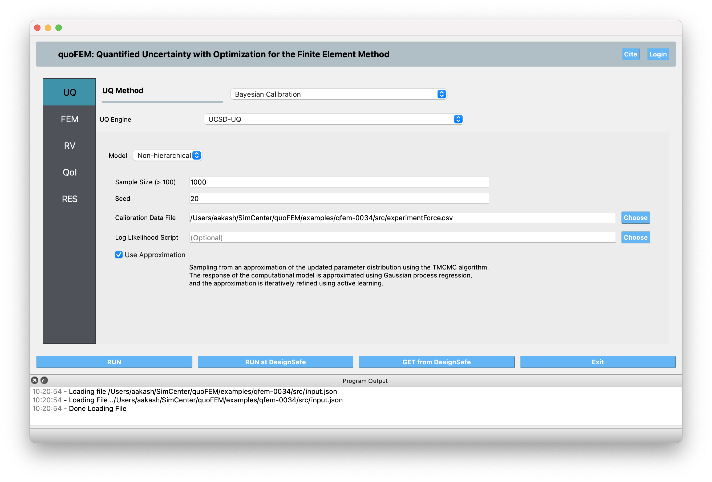
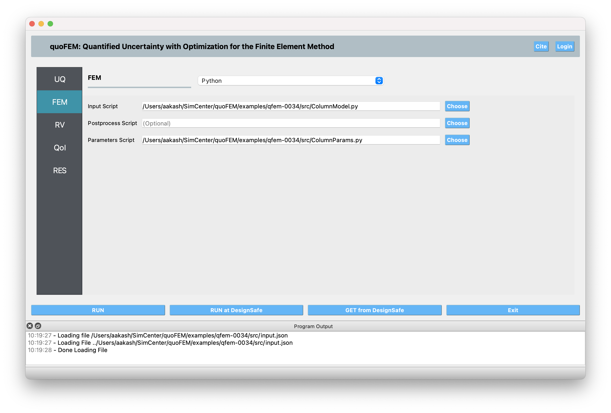
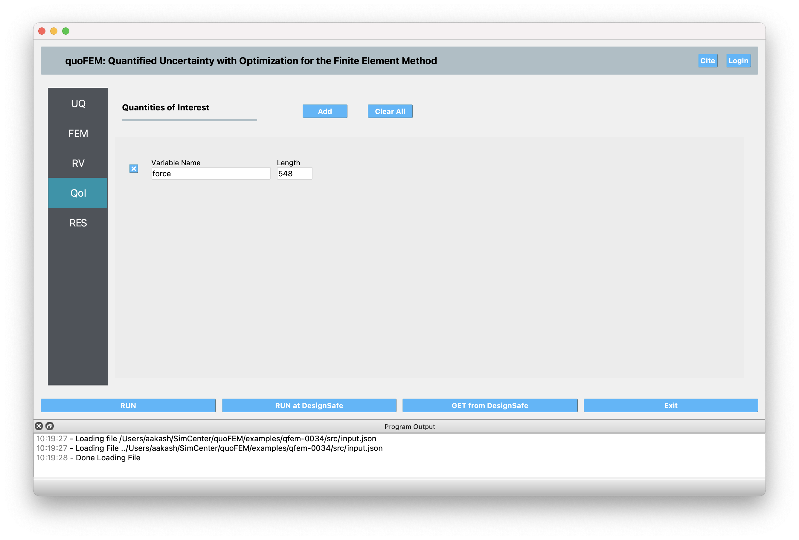

.. _qfem-0034:

Bayesian Calibration of a Reinforced Concrete Column Using Experimental Cyclic Data
===================================================================================

+---------------+----------------------------------------------+
| Problem files | :github:`Github <Examples/qfem-0034/>`       |
+---------------+----------------------------------------------+

.. _rc_column_calibration:

Problem Description
-------------------

This example demonstrates the use of Bayesian calibration to identify three key parameters of a reinforced concrete column model using experimental force-displacement data from a cyclic loading test. The calibration process estimates parameter values and quantifies their uncertainty by comparing model predictions with observed experimental behavior.

.. note::
   *Files used in this example:*
   
   * ``input.json``: quoFEM configuration file
   * ``ColumnModel.py``: OpenSeesPy structural analysis script  
   * ``ColumnParams.py``: Parameter definitions for calibration
   * ``experimentDisp.csv``: Experimental displacement time history
   * ``experimentForce.csv``: Experimental force measurements for calibration

.. **Objectives:**

.. * Calibrate three material/section parameters of an RC column model using TMCMC
.. * Utilize experimental cyclic loading data for model validation
.. * Quantify parameter uncertainty through posterior distributions
.. * Assess model performance in reproducing experimental force-displacement response

**Background:**

The structural model represents a cantilever reinforced concrete column subjected to cyclic lateral loading under constant axial force. The column exhibits nonlinear behavior including concrete cracking, plastic hinge formation, and hysteretic energy dissipation. Accurate parameter identification is crucial for reliable seismic performance assessment of similar structural systems.

Model Description
-----------------

Structural Model
~~~~~~~~~~~~~~~~

The reinforced concrete column is modeled in OpenSeesPy using a lumped plasticity approach with the following characteristics:

* **Geometry**: 0.4m x 0.4m cross-section, 1.6m height (cantilever)
* **Loading**: 744 kN constant axial load + cyclic lateral displacement
* **Modeling approach**: Elastic beam-column element with plastic hinge at base
* **Material model**: Hysteretic material for moment-rotation behavior
* **Secondary effects**: P-Delta geometric transformation included

Model Parameters to be Calibrated
~~~~~~~~~~~~~~~~~~~~~~~~~~~~~~~~~~

The following three parameters are selected for calibration based on their influence on the force-displacement response:

1. **crack_factor** (Stiffness reduction factor):
   
   * Physical significance: Ratio of cracked to uncracked section moment of inertia
   * Prior distribution: Uniform(0.05, 0.8)
   * Units: Dimensionless
   * Default value: 0.2

2. **Mp** (Positive yield moment):
   
   * Physical significance: Positive yield moment of plastic hinge
   * Prior distribution: Uniform(100, 500)
   * Units: kN-m
   * Default value: 330 kN-m

3. **Mc** (Positive capping moment):
   
   * Physical significance: Positive peak moment capacity of plastic hinge
   * Prior distribution: Uniform(100, 500)
   * Units: kN-m
   * Default value: 240 kN-m

Experimental Data
~~~~~~~~~~~~~~~~~

The calibration data consists of force-displacement measurements from cyclic testing:

* **Loading protocol**: Displacement-controlled cyclic loading with increasing amplitude
* **Measured quantities**: Lateral force and top displacement
* **Data points**: 548 displacement steps and corresponding force measurements
* **Response characteristics**: Hysteretic behavior with strength degradation

quoFEM Setup
------------
The calibration is performed using quoFEM with the following configuration:

Step 1: UQ Tab - Bayesian Calibration Settings
~~~~~~~~~~~~~~~~~~~~~~~~~~~~~~~~~~~~~~~~~~~~~~

1. **Method**: Bayesian Calibration
2. Choose **UQ Engine**: UCSD-UQ
3. Choose **Model**: Non-hierarchical (this selects the TMCMC algorithm for posterior sampling)
4. **Algorithm Parameters**:
   
   * Sample Size: 1000
   * Seed: 20

5. **Calibration Data File**:

   * Data File: experimentForce.csv

6. **Use Approximation**:

   * Set this to checked to enable surrogate-aided Bayesian calibration

Step 2: Forward Model (FEM) Tab
~~~~~~~~~~~~~~~~~~~~~~~~~~~~~~~

1. **FEM**: Python
2. **Input Script**: Full path to ColumnModel.py
3. **Parameters Script**: Full path to ColumnParams.py

Step 3: Input Random Variables (RV) Tab
~~~~~~~~~~~~~~~~~~~~~~~~~~~~~~~~~~~~~~~

Define the prior distribution for the three parameters to be calibrated:

.. code-block:: none

   RV1: 
   - Variable Name: crack_factor
   - Distribution: Uniform
   - Min.: 0.05
   - Max.: 0.8

   RV2: 
   - Variable Name: Mp
   - Distribution: Uniform
   - Min.: 100
   - Max.: 500

   RV3: 
   - Variable Name: Mc
   - Distribution: Uniform
   - Min.: 100
   - Max.: 500

.. figure:: figures/RV.png
   :align: center
   :figclass: align-center

Step 4: Output Quantities of Interest (QoI) Tab
~~~~~~~~~~~~~~~~~~~~~~~~~~~~~~~~~~~~~~~~~~~~~~~

Define the response quantities to match against experimental data:

.. code-block:: none

   QoI1: 
   - Variable Name: force
   - Length: 548 (matching experimental data points)

Step 5: Execution
~~~~~~~~~~~~~~~~~

Click the **RUN** button to start the calibration process on your local machine. Or, click the **RUN at DesignSafe** button to submit the job to DesignSafe-CyberInfrastructure and utilize the parallel computing resources provided by DesignSafe.

