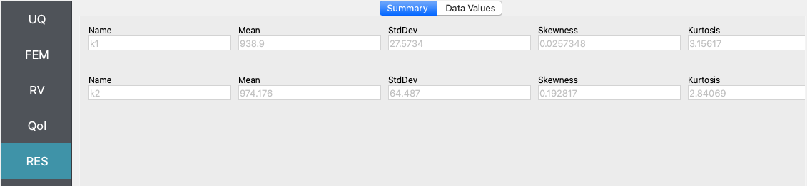
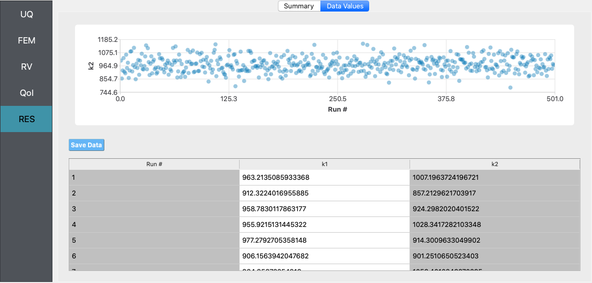
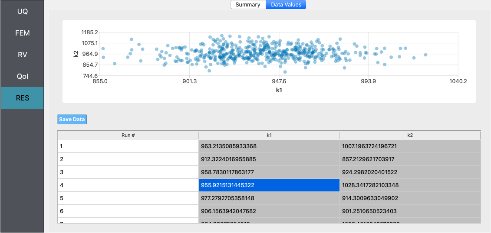
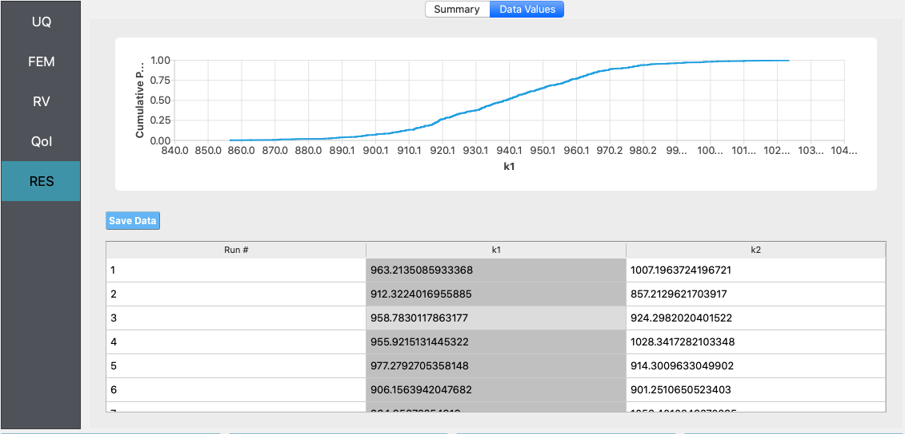

Steel Frame: Bayesian Calibration using TMCMC
=============================================

+---------------+--------------------+
| Problem files | :qfem-14:`/`       |
+---------------+--------------------+

Outline
-------

In this example, Bayesian estimation is used to estimate the lateral story
stiffnesses of the two stories of a simple steel frame, given data about 
its mode shapes and frequencies. The transitional Markov chain Monte Carlo 
algorithm is used to obtain samples from the posterior probability distribution 
of the lateral story stiffnesses.

Problem description
-------------------

Provided by Professor Joel Conte and his doctoral students Maitreya
Kurumbhati and Mukesh Ramancha from UC San Diego, this example looks at
the following simplified finite element model of a steel building.

.. figure:: qfem-0014.png
   :align: center
   :figclass: align-center
   :width: 400

Each floor slab of the building is made of composite metal deck and is
supported on four steel columns. The story heights are measured at
:math:`10'` and in plan the side lengths measure :math:`33'-4"` by
:math:`30'`. Properties of the steel columns are taken deterministically
with an elastic modulus of :math:`29,000 \ \mathrm{ksi}`, area of
:math:`110 \ \mathrm{in}^2`, and principal moment of inertial
(:math:`I_{yy}`) of :math:`1190 \ \mathrm{ in}^4`. The story stiffnesses 
``k1`` and ``k2`` are both equal to :math:`958.61 \ \mathrm{kips/in}`.

For modelling purposes, the four columns are assumed fixed at the base and the beams connecting
them are assumed to be rigid. From eigenvalue analysis, the first two vibration periods of the
structure are determined to be :math:`0.19 \ \mathrm{sec}` and :math:`0.09 \ \mathrm{sec}`. 
The first eigenvalue :math:`\lambda_{1}` is :math:`1084.06 \ \mathrm{rad/{s^2}}` and the second 
component of the first eigenvector :math:`\phi_{12}` is :math:`1.41 \ \mathrm{inch}`, where the 
eigenvector is normalized so that the first component :math:`\phi_{11} = 1`.
Using these properties, the following set of mode shapes and frequencies
are generated by applying random perturbations to the analytic modal
properties in order to simulate field data that might be obtained using
a method for structural system identification:

.. math::

   \begin{array}{l}
   \lambda_{1}^{(1)}=1025.21, \quad &\lambda_{1}^{(2)}=1138.11, \quad &\lambda_{1}^{(3)}=1099.39, \quad &\lambda_{1}^{(4)}=1002.41, \quad &\lambda_{1}^{(5)}=1052.69 \\
   \phi_{12}^{(1)}=1.53, \quad &\phi_{12}^{(2)}=1.24, \quad &\phi_{12}^{(3)}=1.38, \quad &\phi_{12}^{(4)}=1.50, \quad &\phi_{12}^{(5)}=1.35
   \end{array}

In this example, it is assumed that the story stiffnesses for the first and second story (``k1`` and ``k2`` respectively) are unknown. The goal is to use the simulated data of eigenvalue and eigenvector measurements to obtain the posterior probability distribution of the story stiffnesses by Bayesian calibration. We will employ the Transitional Markov Chain Monte Carlo (TMCMC) algorithm, which is also known as Sequential Monte Carlo, to sample from the posterior joint probability distribution of ``k1`` and ``k2``.

We define the following prior probability distributions for the unknown quantities of interest:

1. First story stiffness, ``k1``: **Uniform**
   distribution with a lower bound :math:`(L_B)` of :math:`766.89 \ \mathrm{kips/in}`, and an upper bound :math:`(U_B)`
   of :math:`2108.94 \ \mathrm{kips/in}`,

2. Second story stiffness, ``k2``: **Uniform**
   distribution with a lower bound :math:`(L_B)` of :math:`383.44 \ \mathrm{kips/in}`, and an upper bound :math:`(U_B)`
   of :math:`1150.33 \ \mathrm{kips/in}`.

A Gaussian likelihood model is employed. This is done by assuming that the error between the finite element prediction of the modal properties and the simulated measurement data follows a bivariate Normal/Gaussian distribution with independent components. Here, the standard deviation of the error is assumed to be known, and equal to :math:`5\%` of the true eigenvalue and eigenvector values. The components of the error vector are assumed to be statistically independent and identically distributed. 

Files required
--------------
The exercise requires two script files - an OpenSees script file which builds the finite element model and conducts the analysis, and a Python script file which post-processes the output from the finite element analysis. The user should download these file and place it in a *new* folder. The post-processing script calculates the log-likelihood that the input values of the story stiffness produced the set of measurement data. 

1. :qfem-0014:`model.tcl <src/model.tcl>`

.. literalinclude:: ../qfem-0014/src/model.tcl

.. note::
   This tcl script creates a file called ``results.out`` when it runs. This file contains the first eigenvalue and the second component of the first eigenvector obtained from finite element analysis of the structure. 
   

2. :qfem-0014:`postProcessing.py <src/postProcessing.py>`

.. literalinclude:: ../qfem-0014/src/postProcessing.py
   :language: python

.. warning::

   Do not place the files in your root, downloads, or desktop folder as when the application runs it will copy the contents on the directories and subdirectories containing these files multiple times. If you are like me, your root, Downloads or Documents folders contains and awful lot of files.

Solving the problem using quoFEM
--------------------------------

The steps involved are as follows:

1. Start the application and the **UQ** panel will be highlighted. In the **UQ Engine** drop down menu, select the **UCSD_UQ** engine. In the **Method** category drop down menu the **Transitional Markov chain Monte Carlo** option will be highlighted. In the **Log Likelihood Script** field, enter the path to the script which computes the log-likelihood (i.e., the file called ``postProcessing.py`` in this example), or select **Choose** and navigate to the file. Enter the number of samples desired to be drawn from the posterior distribution in the **# Samples** field.

.. figure:: figures/quo-14-UQ.png
   :align: center
   :figclass: align-center

2. Next select the **FEM** panel from the input panel selection. This will default to the **OpenSees** FEM engine. In the **Input Script** field, enter the path to the ``model.tcl`` file or select **Choose** and navigate to the file. 

.. figure:: figures/quo-14-FEM.png
   :align: center
   :figclass: align-center

3. Next select the **RV** tab from the input panel. This panel should be pre-populated with two random variables named ``k1`` snd ``k2``. If not, press the **Add** button twice to create two fields to define the input random variables. Enter the same variable names (``k1`` and ``k2``), as required in the ``model.tcl`` script. 

For each variable, specify the prior probability distribution - from the **Distribution** drop down menu, select **Uniform** and then provide the lower bounds and upper bounds shown in the figure below. 

.. figure:: figures/quo-14-RV.png
   :align: center
   :figclass: align-center

4. The **QoI** panel can be left blank for this example and for problems using the **UCSD_UQ** engine.

5. Next click on the **Run** button. This will cause the backend application to launch the **UCSD_UQ** engine, which performs Bayesian calibration using the TMCMC algorithm. When done the **RES** tab will be selected and the results will be displayed as shown in the figure below. The results show the first four moments of the posterior marginal probability distribution of ``k1`` and ``k2``.

If the user selects the **Data Values** tab in the results panel, they will be presented with both a graphical plot and a tabular listing of the data.

Various views of the graphical display can be obtained by left and right clicking in the columns of the tabular data. 

   

If a singular column of the tabular data is pressed with both right and left buttons a histogram and CDF will be displayed, as shown in figure below.

.. figure:: ../qfem-0014/figures/quo-14-RES-DataValues3.png
   :align: center
   :figclass: align-center

